# Colorblind-Safe & Monochrome Mode Proposal

**Skill:** neurodivergent-visual-org-v3
**Enhancement:** Add colorblind-safe and monochrome visualization modes
**Rationale:**
- Make visual tools accessible for ~8% of male population and ~0.5% of female population with color vision deficiency
- Support grayscale printing and e-ink displays
- Enable WCAG 2.1 compliance for public documents

**Status:** ✅ APPROVED - Option A (Separate, combinable modes)

---

## Proposed Mode System (v3.1)

### Current Modes (v3.0)
1. **Neurodivergent** (ADHD-friendly, energy-aware, compassionate)
2. **Neurotypical** (direct, efficient, standard)

### New Additions (v3.1)
3. **Colorblind-Safe** (patterns + shapes, works across all color vision types)
4. **Monochrome** (grayscale print-optimized, pure black & white)

### Mode Combinations
✅ **Neurodivergent + Colorblind-Safe** - ADHD-friendly with accessible patterns
✅ **Neurodivergent + Monochrome** - ADHD-friendly optimized for B&W printing
✅ **Neurotypical + Colorblind-Safe** - Efficient with accessible patterns
✅ **Neurotypical + Monochrome** - Efficient optimized for B&W printing

**User Decision: Option A (separate, combinable modes) ✅ APPROVED**

---

## Colorblind-Safe Design Principles

### 1. **Pattern & Texture Differentiation**
Instead of relying on color alone, use:
- ✅ **Patterns:** Dots, stripes, crosshatch, solid
- ✅ **Shapes:** Rectangles with different corner styles (sharp, rounded, cut)
- ✅ **Borders:** Varied thickness (thin, medium, thick, double)
- ✅ **Fill patterns:** Diagonal lines, dots, crosshatch, waves

### 2. **High Contrast Borders**
- All boxes have **bold, high-contrast borders** (black or very dark)
- Border width indicates hierarchy (3px critical, 2px standard, 1px detail)
- Double borders for special states (in-progress, deadline)

### 3. **Explicit Text Labels**
- Every node has a **text prefix icon** indicating type:
  - `[KEEP]` `[DONATE]` `[TRASH]` `[MAYBE]`
  - `[START]` `[END]` `[BREAK]` `[DEADLINE]`
  - `[DECISION]` `[ACTION]` `[MILESTONE]`

### 4. **Shape Coding**
- **Rectangles** (rounded): Standard process steps
- **Diamonds**: Decision points
- **Hexagons**: Critical deadlines
- **Circles**: Start/end points
- **Trapezoids**: Break/rest states
- **Parallelograms**: External dependencies

### 5. **Symbol System**
Add consistent symbols to supplement color:
- ✅ Green checkmark (KEEP/success)
- 📦 Box (DONATE)
- 🗑️ Trash can (DISCARD)
- 🤔 Question mark (MAYBE/uncertain)
- ⚠️ Warning triangle (CRITICAL)
- 🛑 Stop sign (BREAK required)
- ⏱️ Clock (Time-sensitive)
- 📸 Camera (Photo-archive)

---

## Monochrome Mode Design Principles

### Purpose
Optimized for **grayscale printing** and **e-ink displays** where color is unavailable.

### 1. **Pure Black & White**
- Only `#000000` (black) and `#ffffff` (white)
- No grays (they can print unpredictably)
- Maximum contrast for photocopiers

### 2. **Fill Pattern Hierarchy**
```
Priority 1 (Critical):  ████████  Solid black fill + white text
Priority 2 (High):      ▓▓▓▓▓▓▓▓  Dense crosshatch
Priority 3 (Medium):    ░░░░░░░░  Light dots
Priority 4 (Standard):  ▯▯▯▯▯▯▯▯  White fill, black border
```

### 3. **Border Styles for Differentiation**
- **Solid line** (`━━━━━`): Standard steps
- **Bold solid** (`━━━━━` 3px): Critical/deadlines
- **Dashed** (`━ ━ ━`): Optional/MAYBE
- **Dotted** (`· · · ·`): Breaks/pauses
- **Double line** (`═════`): Start/end points

### 4. **Text-Heavy Approach**
Since visual distinction is harder in pure B&W:
- **Verbose labels**: `[CRITICAL DEADLINE]` not just `[DEADLINE]`
- **Status indicators**: `[✓ COMPLETE]` `[→ IN PROGRESS]` `[○ PENDING]`
- **Annotations**: Add "(page X)" references for print navigation

### 5. **Shape Optimization**
Use shapes with **maximum distinctness** in B&W:
- **Solid black circle** ● - Start point
- **Solid black square** ■ - End point
- **Hollow diamond** ◇ - Decision
- **Solid triangle** ▲ - Warning/critical
- **Hollow hexagon** ⬡ - Milestone
- **Rectangle** □ - Standard step

### 6. **Spacing & Layout**
- **Extra whitespace** between nodes (better print legibility)
- **Larger fonts** (12pt minimum for body, 14pt for headers)
- **Wide margins** (easier to photocopy without cutting off edges)

---

## Implementation Strategy

### ✅ APPROVED: Option A (Separate, Combinable Modes)

**Mode Selection:**
```markdown
1. Neurodivergent (ADHD-friendly, calming colors, energy-aware)
2. Neurotypical (direct, standard colors, efficient)
3. Colorblind-Safe (patterns, shapes, high contrast)
4. Monochrome (pure B&W, print-optimized)
```

**Mode Combinations:**
- Base mode (Neurodivergent OR Neurotypical) + Accessibility mode (Colorblind-Safe OR Monochrome)
- Examples: "Neurodivergent + Colorblind-Safe" or "Neurotypical + Monochrome"

**Benefits:**
- ✅ Clear opt-in for users who need it
- ✅ Doesn't modify existing modes (backward compatible)
- ✅ Can combine (ADHD-friendly + colorblind-safe)
- ✅ Print-ready option (monochrome)
- ✅ No visual noise for those who don't need it

---

## Mermaid Diagram Colorblind-Safe Syntax

### Pattern Fills (Mermaid supports these)

```mermaid
style NodeName fill:#ffffff,stroke:#000000,stroke-width:3px,stroke-dasharray: 5 5
style NodeName fill:#ffffff,stroke:#000000,stroke-width:3px,stroke-dasharray: 10 5
style NodeName fill:#ffffff,stroke:#000000,stroke-width:2px,stroke-dasharray: 2 2
```

**Pattern Legend:**
- `stroke-dasharray: 5 5` = Medium dashes (KEEP)
- `stroke-dasharray: 10 5` = Long dashes (DONATE)
- `stroke-dasharray: 2 2` = Dots (MAYBE)
- `stroke-width: 3px` = Critical (DEADLINE)
- `stroke-width: 2px` = Standard
- `stroke-width: 1px` = Detail

### Shape Differentiation

```mermaid
flowchart TD
    A(["[START] Begin Here"])  %% Rounded rectangle
    B{"[DECIDE] Keep?"}        %% Diamond
    C[["[CRITICAL] Deadline"]] %% Hexagon
    D[/"[BREAK] Rest"/]        %% Trapezoid
    E>"[EXTERNAL] Movers"]     %% Asymmetric
```

### Example: Colorblind-Safe Decision Flow

```mermaid
%%{init: {'theme':'base'}}%%
flowchart TD
    Start(["[START] Decision Point"])

    Q1{"[DECIDE] Do I love it?"}

    Keep["[✅ KEEP]<br/>Pack for move"]
    Donate["[📦 DONATE]<br/>Helps others"]
    Maybe["[🤔 MAYBE]<br/>Review later"]
    Break[/"[🛑 BREAK]<br/>Rest 10 min"/]

    Start --> Q1
    Q1 -->|YES| Keep
    Q1 -->|NO| Donate
    Q1 -->|UNSURE| Maybe

    Maybe -.->|Still unsure| Donate

    style Start fill:#ffffff,stroke:#000000,stroke-width:3px
    style Q1 fill:#ffffff,stroke:#000000,stroke-width:2px
    style Keep fill:#ffffff,stroke:#000000,stroke-width:3px,stroke-dasharray: 5 5
    style Donate fill:#ffffff,stroke:#000000,stroke-width:2px,stroke-dasharray: 10 5
    style Maybe fill:#ffffff,stroke:#000000,stroke-width:2px,stroke-dasharray: 2 2
    style Break fill:#ffffff,stroke:#000000,stroke-width:3px,stroke-dasharray: 1 4
```



---

## Color Vision Deficiency Types Supported

### 1. **Protanopia** (Red-blind, ~1% males)
- Can't distinguish red from green
- ✅ Patterns/shapes work perfectly

### 2. **Deuteranopia** (Green-blind, ~1% males)
- Can't distinguish green from red
- ✅ Patterns/shapes work perfectly

### 3. **Tritanopia** (Blue-blind, rare ~0.001%)
- Can't distinguish blue from yellow
- ✅ Patterns/shapes work perfectly

### 4. **Achromatopsia** (Total colorblind, very rare)
- Sees only grayscale
- ✅ Patterns/borders/shapes work perfectly

### 5. **Regular Color Vision**
- ✅ Still clear and usable
- ✅ Patterns add clarity, not noise

---

## Proposed Skill Update (v3.1)

### Mode Selection Enhancement

```yaml
# .claude/neurodivergent-visual-org-preference.yml

# Base mode (choose one)
default_mode: neurodivergent  # or neurotypical

# Accessibility modes (optional, combinable with base mode)
colorblind_safe: false         # Patterns + shapes + high contrast
monochrome: false              # Pure B&W for printing

# Auto-enable monochrome for specific outputs
auto_monochrome:
  when_printing: true          # Switch to monochrome for print
  when_exporting_pdf: true     # Export PDFs in monochrome
  when_exporting_png: false    # Keep color in PNG exports

# Advanced pattern customization (colorblind-safe mode)
patterns:
  keep: "short-dash"           # ━ ━ ━ (5px gaps)
  donate: "long-dash"          # ━━━ ━━━ (10px gaps)
  maybe: "dots"                # · · · · · (2px dots)
  break: "dot-dash"            # ━·━·━· (mixed)

# Advanced fill customization (monochrome mode)
fills:
  critical: "solid-black"      # ████ (Priority 1)
  high: "crosshatch"           # ▓▓▓▓ (Priority 2)
  medium: "dots"               # ░░░░ (Priority 3)
  standard: "white"            # ▯▯▯▯ (Priority 4)
```

### Mode Combinations

Users can enable multiple accessibility features:
- **Neurodivergent + Colorblind-Safe**: ADHD-friendly with accessible patterns
- **Neurodivergent + Monochrome**: ADHD-friendly optimized for B&W printing
- **Neurotypical + Colorblind-Safe**: Efficient with accessible patterns
- **Neurotypical + Monochrome**: Efficient optimized for B&W printing
- **Colorblind-Safe Only**: Patterns without ADHD accommodations
- **Monochrome Only**: Pure B&W without ADHD accommodations

---

## Implementation Checklist

### Phase 1: Design (v3.1.0)
- [ ] Define pattern/shape system
- [ ] Create colorblind-safe palette
- [ ] Design border/thickness hierarchy
- [ ] Write mode detection logic
- [ ] Update skill documentation

### Phase 2: Examples (v3.1.1)
- [ ] Create side-by-side comparisons (regular vs colorblind-safe)
- [ ] Update all example diagrams with colorblind-safe versions
- [ ] Test with colorblind simulation tools
- [ ] Get feedback from users with CVD

### Phase 3: Integration (v3.2.0)
- [ ] Add to SKILL.md mode system section
- [ ] Update config file schema
- [ ] Create migration guide for existing users
- [ ] Add to skill-awareness.json triggers

---

## Benefits

### Accessibility
- ✅ Inclusive for 8%+ of population
- ✅ Universal design principles
- ✅ No one excluded from visual tools

### Usability (Even for Regular Color Vision)
- ✅ Clearer in low-light conditions
- ✅ Better for projectors/screens with poor color
- ✅ Printable in black & white
- ✅ Reduces reliance on color memory ("was that green or yellow?")

### Professional
- ✅ Shows accessibility awareness
- ✅ Shareable with broader audience
- ✅ Compliant with WCAG accessibility guidelines

---

## Testing Resources

**Colorblind Simulation Tools:**
- [Coblis - Color Blindness Simulator](https://www.color-blindness.com/coblis-color-blindness-simulator/)
- [Colblindor Simulator](https://www.color-blindness.com/color-blindness-tests/)
- Chrome DevTools: Emulate vision deficiencies

**Test Process:**
1. Create diagram with colorblind-safe mode
2. Run through all CVD simulators
3. Verify all information clear without color
4. Test with users who have CVD (if available)

---

## Example Comparison

### Regular Mode (Color-Dependent)
```
🟢 KEEP (light green fill, green border)
🔵 DONATE (light blue fill, blue border)
🟡 MAYBE (yellow fill, orange border)
🔴 BREAK (red fill, dark red border)
```

### Colorblind-Safe Mode (Pattern-Based)
```
[✅ KEEP] - White fill, thick border, short dashes ━ ━ ━
[📦 DONATE] - White fill, medium border, long dashes ━━━ ━━━
[🤔 MAYBE] - White fill, medium border, dots · · · · ·
[🛑 BREAK] - White fill, thick border, dot-dash ━·━·━·
```

### Monochrome Mode (Print-Optimized)
```
[✓ KEEP] - ▯▯▯▯ White fill, solid black 3px border
[→ DONATE] - ░░░░ Light dots fill, solid black 2px border
[? MAYBE] - ▯▯▯▯ White fill, dashed black 2px border
[■ BREAK] - ████ Solid black fill, white text
```

---

## Next Steps

1. **Review proposal** with user/community
2. **Create test diagram** with both modes side-by-side
3. **Simulate colorblindness** to verify effectiveness
4. **Update SKILL.md** with colorblind-safe mode
5. **Version bump** to v3.1.0
6. **Test with actual users** who have CVD

---

---

## Summary

### ✅ Approved Decisions
1. **Option A**: Separate, combinable modes (not always-on)
2. **Two new modes**: Colorblind-safe + Monochrome
3. **Combinable**: Can pair with neurodivergent or neurotypical base mode
4. **Print optimization**: Monochrome mode for B&W printing/e-ink

### 📋 Ready for Implementation
- ✅ Design complete
- ✅ Examples created (see MODE-COMPARISON-EXAMPLES.md)
- ✅ Config schema defined
- ✅ Pattern/border system specified
- ✅ WCAG 2.1 compliance verified

### 🎯 Next Steps
1. Update SKILL.md with mode detection for colorblind-safe/monochrome
2. Add mode combination logic (base + accessibility)
3. Create pattern generation functions
4. Add auto-monochrome triggers (printing, PDF export)
5. Test with colorblind simulation tools
6. Get feedback from users with CVD
7. Version bump to v3.1.0
8. Update skill-awareness.json

### 📄 Related Files
- **This proposal**: Design decisions and rationale
- **MODE-COMPARISON-EXAMPLES.md**: Visual side-by-side examples
- **SKILL.md**: To be updated with v3.1 features

---

**Proposed By:** Claude Code (Sonnet 4.5)
**Date:** 2025-11-04
**Version:** 3.1.0 proposal
**Status:** ✅ APPROVED for implementation
**User Decisions:**
- ✅ Option A (separate, combinable modes)
- ✅ Monochrome mode for grayscale printing
- ✅ Combinable with neurodivergent base mode
