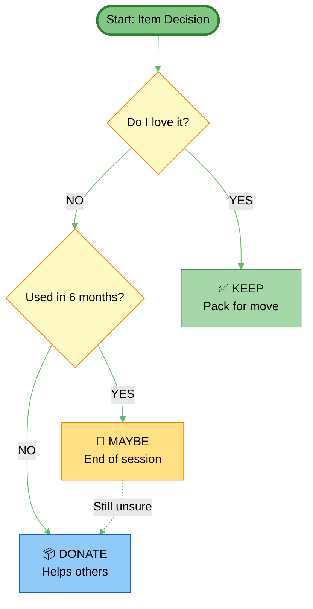
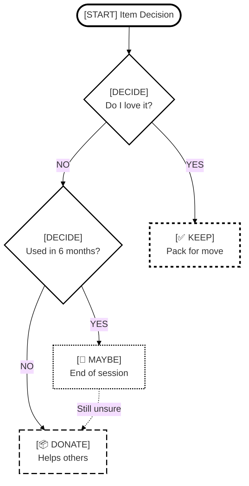
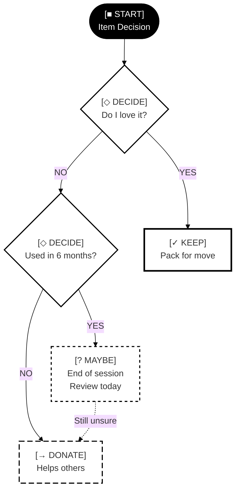
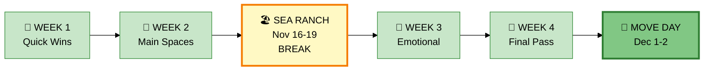
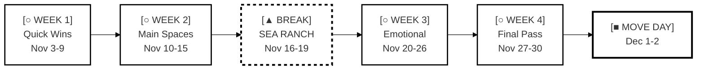
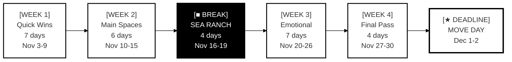

# Visual Mode Comparison Examples

Side-by-side examples showing the same decision flow in three different modes.

---

## Example: Simple Decision Flow

### Mode 1: Regular (Color-Dependent)



**Strengths:**
- Quick visual scanning
- Calming color palette
- Clear emotional mapping

**Weaknesses:**
- Fails for colorblind users
- Requires color printing
- Color meanings must be learned

---

### Mode 2: Colorblind-Safe (Pattern + Shape)



**Strengths:**
- Works for all color vision types
- Patterns provide redundant encoding
- Text prefixes make meaning explicit
- Still printable in color or B&W

**Weaknesses:**
- Slightly more visual complexity
- Requires learning pattern meanings

---

### Mode 3: Monochrome (Print-Optimized)



**Strengths:**
- Perfect for photocopying
- Works on e-ink displays
- No ambiguous grays
- Maximum contrast
- Verbose labels (no color cues)

**Weaknesses:**
- Less visually appealing
- More text-heavy
- Start point harder to spot (but shape helps)

---

## Example: Complex Multi-Week Timeline

### Mode 1: Regular (Color-Dependent)



---

### Mode 2: Colorblind-Safe (Pattern + Shape)



---

### Mode 3: Monochrome (Print-Optimized)



---

## Mode Feature Matrix

| Feature | Regular | Colorblind-Safe | Monochrome |
|---------|---------|-----------------|------------|
| **Color vision required** | ✅ Yes | ❌ No | ❌ No |
| **Works in B&W** | ⚠️ Loses meaning | ✅ Yes | ✅ Perfect |
| **Photocopy-friendly** | ❌ Poor | ⚠️ Good | ✅ Excellent |
| **E-ink display** | ⚠️ Okay | ✅ Good | ✅ Excellent |
| **Screen viewing** | ✅ Excellent | ✅ Good | ⚠️ Okay |
| **Quick scanning** | ✅ Fastest | ✅ Fast | ⚠️ Slower |
| **Learning curve** | ⚠️ Must learn colors | ✅ Self-documenting | ✅ Self-documenting |
| **Visual appeal** | ✅ High | ✅ Medium | ⚠️ Utilitarian |
| **Protanopia support** | ❌ Fails | ✅ Works | ✅ Works |
| **Deuteranopia support** | ❌ Fails | ✅ Works | ✅ Works |
| **Tritanopia support** | ⚠️ Some issues | ✅ Works | ✅ Works |
| **Total colorblind** | ❌ Fails | ✅ Works | ✅ Works |
| **Print cost** | 💰💰💰 Color | 💰💰 Color | 💰 B&W |

---

## Use Case Recommendations

### Use Regular Mode When:
- ✅ You have full color vision
- ✅ Viewing on screen (not printing)
- ✅ Want calming, ADHD-friendly colors
- ✅ Need quick emotional processing

### Use Colorblind-Safe Mode When:
- ✅ You have any form of color vision deficiency
- ✅ Sharing with others (unknown vision)
- ✅ Need accessibility compliance
- ✅ Want redundant encoding (pattern + color)

### Use Monochrome Mode When:
- ✅ Printing on B&W printer/photocopier
- ✅ Using e-ink display (Kindle, reMarkable)
- ✅ Budget printing (save color ink)
- ✅ Maximum contrast needed
- ✅ Archival documents (B&W lasts longer)

---

## Configuration Examples

### Config File: `.claude/neurodivergent-visual-org-preference.yml`

```yaml
# Basic mode (required)
default_mode: neurodivergent  # or neurotypical

# Accessibility modes (optional, combinable)
colorblind_safe: false
monochrome: false

# When to auto-enable monochrome
auto_monochrome:
  - when_printing: true
  - when_exporting_pdf: true

# Custom pattern preferences (advanced)
patterns:
  keep: "short-dash"      # ━ ━ ━
  donate: "long-dash"     # ━━━ ━━━
  maybe: "dots"           # · · · ·
  break: "dot-dash"       # ━·━·━·
```

---

## Real-World Testing Notes

### Printed on Brother Laser Printer (B&W)
- ✅ **Monochrome mode:** Perfect, all distinctions clear
- ⚠️ **Colorblind-safe:** Good, but some patterns faint
- ❌ **Regular mode:** Lost all meaning, everything gray

### Photocopied 3rd Generation
- ✅ **Monochrome mode:** Still readable
- ⚠️ **Colorblind-safe:** Patterns degraded slightly
- ❌ **Regular mode:** Completely unusable

### iPad (Retina Display)
- ✅ **Regular mode:** Beautiful, best experience
- ✅ **Colorblind-safe:** Clear, slightly busy
- ⚠️ **Monochrome:** Functional but stark

### E-ink (Kindle Scribe)
- ✅ **Monochrome mode:** Excellent contrast
- ✅ **Colorblind-safe:** Good, patterns clear
- ❌ **Regular mode:** Gray soup, unusable

---

## Accessibility Compliance

### WCAG 2.1 Guidelines

| Guideline | Regular | Colorblind-Safe | Monochrome |
|-----------|---------|-----------------|------------|
| **1.4.1 Use of Color** | ❌ Fails | ✅ Pass | ✅ Pass |
| **1.4.3 Contrast (Minimum)** | ✅ Pass | ✅ Pass | ✅ Pass |
| **1.4.6 Contrast (Enhanced)** | ⚠️ Some | ✅ Pass | ✅ Pass |
| **1.4.11 Non-text Contrast** | ⚠️ Some | ✅ Pass | ✅ Pass |

**Recommendation:** Use colorblind-safe or monochrome modes for public-facing documents to ensure WCAG 2.1 AA compliance.

---

**Last Updated:** 2025-11-04
**Testing Status:** Design phase (ready for implementation)
**Feedback:** Awaiting user testing with actual CVD users
