# Neurodivergent Visual Organization

A Claude Code skill that creates visual organizational tools designed for neurodivergent thinking patterns. Transform overwhelming tasks into clear, compassionate, actionable visualizations.

## What This Skill Does

Creates Mermaid diagrams optimized for neurodivergent brains:
- **Task Breakdowns** - Turn "this is too much" into 3-10 minute micro-steps
- **Decision Trees** - Navigate analysis paralysis with structured choices
- **Project Maps** - See dependencies and phases clearly
- **Current State Boards** - Know what's on your plate right now
- **Time-Boxing Tools** - Work with time blindness, not against it
- **Habit Builders** - Start tiny, build momentum
- **Accountability Support** - Body doubling and check-in structures
- **Focus Regulation** - Pre-task calm-down and recovery protocols

## Core Principles

This skill is built on these neurodivergent-friendly principles:

✅ **Compassionate Language** - No "just do it" or "should be easy"
✅ **Realistic Time Estimates** - Includes buffer time and energy costs
✅ **Micro-Steps** - 3-10 minute chunks that feel doable
✅ **Anti-Perfectionism** - "Done" is concrete and achievable
✅ **Energy-Aware** - Acknowledges spoons, not just time
✅ **Progress Celebration** - Starting counts, not just finishing
✅ **Permission to Modify** - You can change these tools

## Installation

### For Claude Code Users

1. Install the superpowers plugin (if not already installed):
```bash
# In Claude Code
/plugin marketplace add obra/superpowers-marketplace
/plugin install superpowers@superpowers-marketplace
```

2. Add this skill to your superpowers skills directory:
```bash
cd ~/.claude/plugins/cache/superpowers/skills/
git clone https://github.com/JackReis/neurodivergent-visual-org.git
```

3. Restart Claude Code or reload plugins

### Manual Installation

Copy the skill directory to your Claude Code plugins:
```bash
cp -r neurodivergent-visual-org ~/.claude/plugins/cache/superpowers/skills/
```

## Usage

The skill activates automatically when you express needs like:
- "I don't know where to start"
- "This task is overwhelming"
- "I'm stuck between options"
- "What should I focus on?"
- "I have too many things"

You can also invoke it explicitly:
```
/skill neurodivergent-visual-org
```

## Examples

### Task Breakdown Example

**You:** "I need to clean my apartment but it's so messy I don't know where to start"

**Claude generates:**

```mermaid
gantt
    title Apartment Cleaning - 15 Min Phases
    dateFormat HH:mm
    axisFormat %H:%M

    section Quick Wins (Start Here!)
    Grab visible trash + cups          :milestone, 09:00, 3m
    Collect dishes to kitchen          :09:03, 5m

    section Kitchen (⚡ Medium Energy)
    Load dishwasher                    :09:08, 8m
    Wipe counters                      :09:16, 5m

    section Living Room (☕ Break After)
    Clear coffee table                 :09:21, 7m
    Vacuum main area                   :09:28, 10m
```


### Decision Tree Example

**You:** "Should I take this new job offer or stay at my current job?"

**Claude generates:** A weighted decision matrix showing both options scored across your priorities (salary, work-life balance, growth opportunities, commute, etc.) with space to add your own weights.

### Current State Board Example

**You:** "I have too many things on my plate and can't figure out what to do first"

**Claude generates:** A triage flowchart that sorts tasks into "truly urgent", "important but not urgent", "maybe later", and "need clarity" with specific next actions for each category.

## Pattern Types

### 8 Reference Libraries Included

1. **task-breakdowns.md** - Linear timelines, branching breakdowns, energy-aware sequences
2. **decision-tools.md** - Decision trees, weighted matrices, elimination filters
3. **project-maps.md** - Phase maps, dependency diagrams, MVP breakdowns
4. **current-state-boards.md** - Kanban boards, priority matrices, context tracking
5. **time-boxing.md** - Pomodoro technique, time-blocked days, energy mapping
6. **habit-building.md** - Tiny habits, routine sequences, habit stacking
7. **accountability-support.md** - Body doubling, check-ins, support networks
8. **focus-regulation.md** - Pre-task calm-down, sensory tools, recovery protocols

## Who This Is For

This skill is designed for:
- People with ADHD, autism, or other neurodivergent conditions
- Anyone experiencing executive dysfunction
- People with time blindness or decision paralysis
- Anyone who feels overwhelmed by tasks or projects
- People building habits or routines
- Anyone who needs external structure for focus

## Contributing

This skill was created to help the neurodivergent community. Contributions are welcome!

### Ways to Contribute

- **Report Issues** - Found a pattern that doesn't work? Let us know.
- **Suggest Patterns** - Have a visualization that helps you? Share it!
- **Improve Language** - Help make the skill more compassionate and accessible.
- **Add Examples** - Real-world examples help others.

### Contributing to Superpowers Marketplace

To contribute this skill to the official superpowers plugin:

1. Fork the [superpowers-marketplace](https://github.com/obra/superpowers-marketplace) repository
2. Add this skill to the `skills/` directory
3. Submit a pull request
4. Follow the superpowers contribution guidelines

## License

MIT License - See [LICENSE](LICENSE) file for details.

## Acknowledgments

Built with compassion for the neurodivergent community. Special thanks to:
- The ADHD and autism communities for sharing what actually helps
- The Claude Code team for building an accessible AI development environment
- The superpowers plugin for creating a framework for shareable skills

## Support

- **Issues**: [GitHub Issues](https://github.com/JackReis/neurodivergent-visual-org/issues)
- **Discussions**: [GitHub Discussions](https://github.com/JackReis/neurodivergent-visual-org/discussions)

## Related Resources

- [Superpowers Plugin](https://github.com/obra/superpowers-marketplace)
- [Claude Code](https://claude.ai/code)
- [Mermaid Diagram Syntax](https://mermaid.js.org/)

---

**Remember:** There's no "right" way to use these tools. Adapt them to what works for your brain. Starting is the hardest part, and you're already here. 💙
