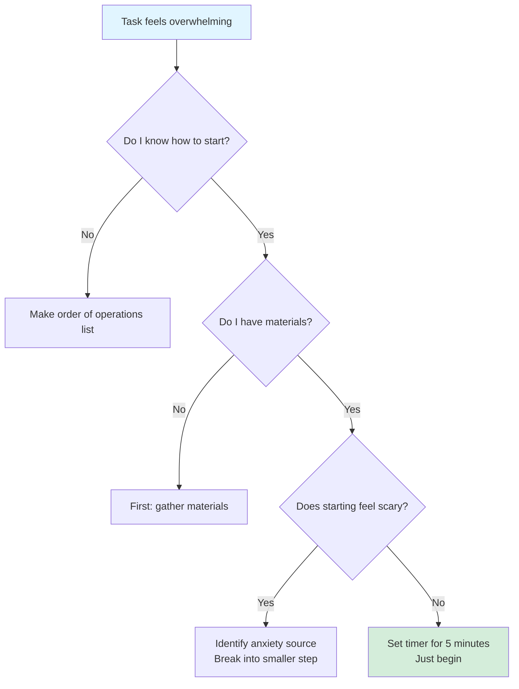
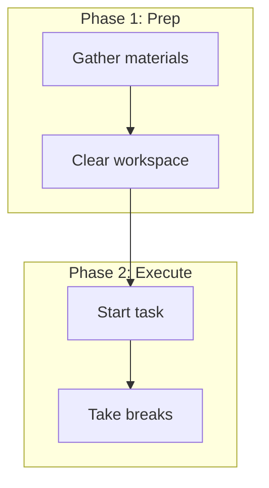
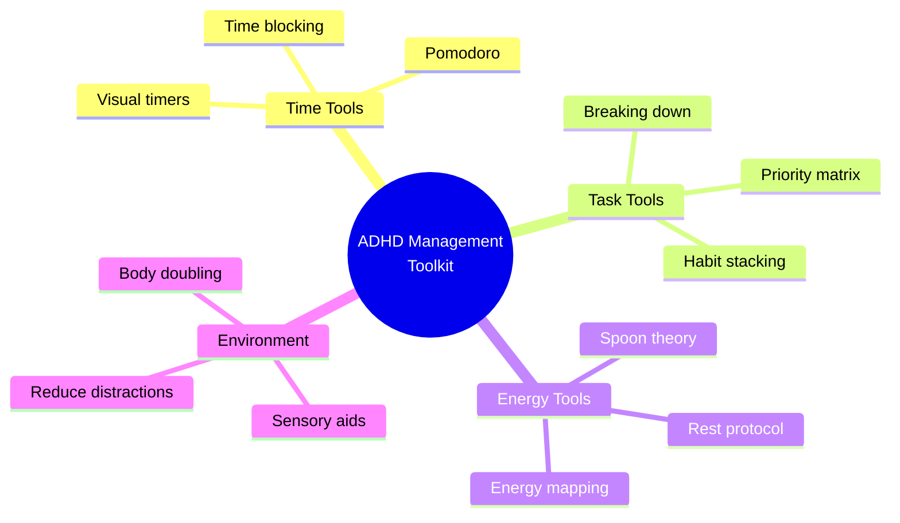
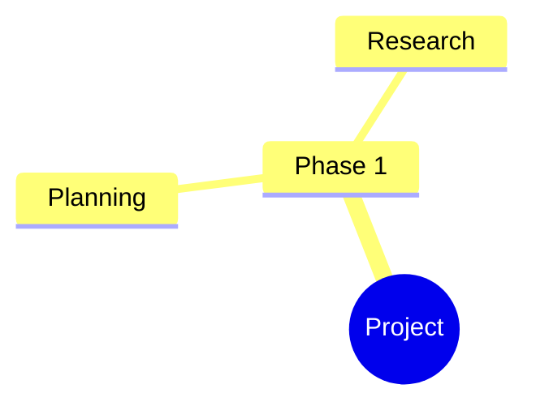
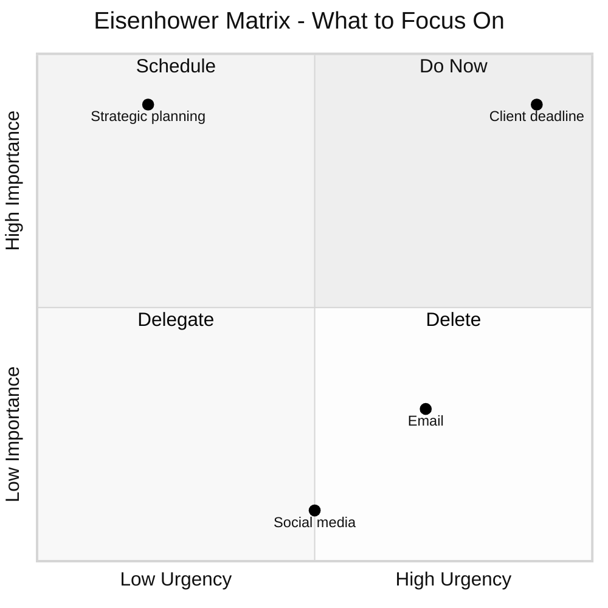
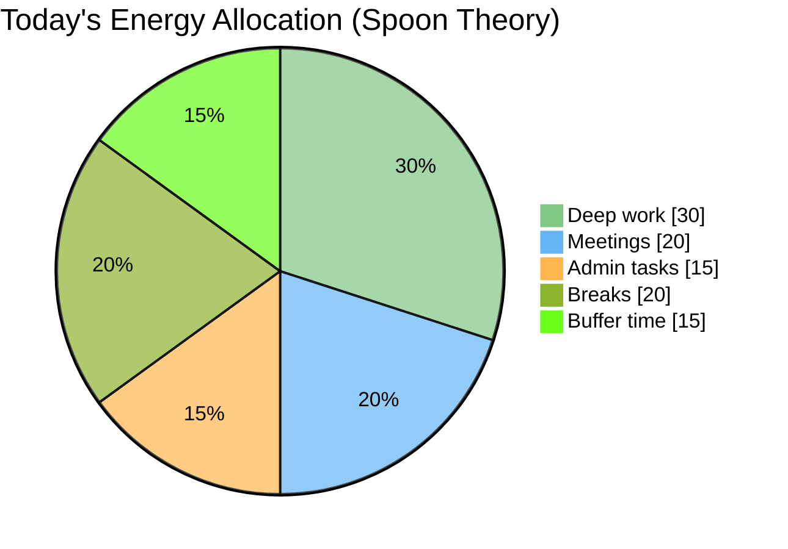
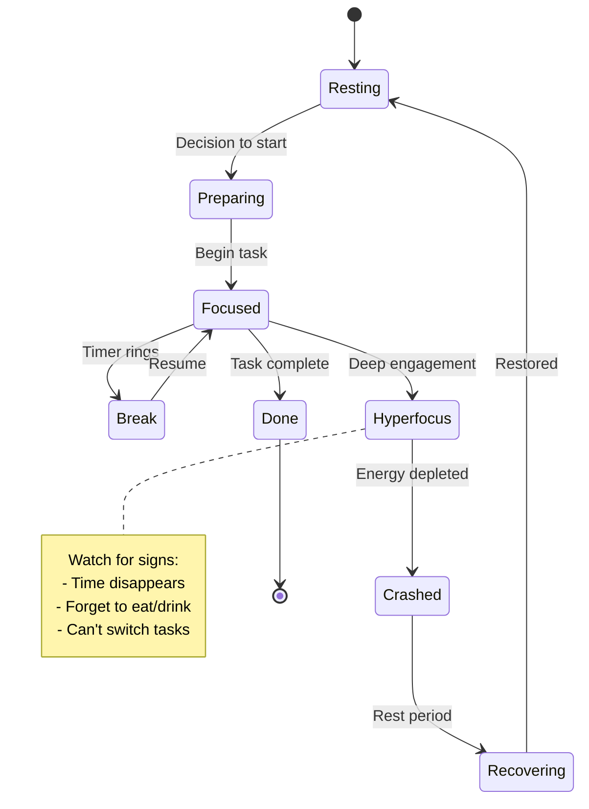
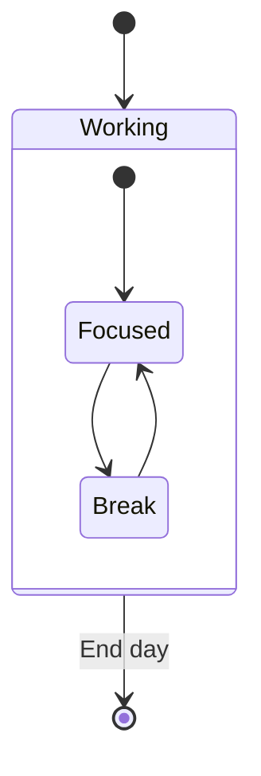
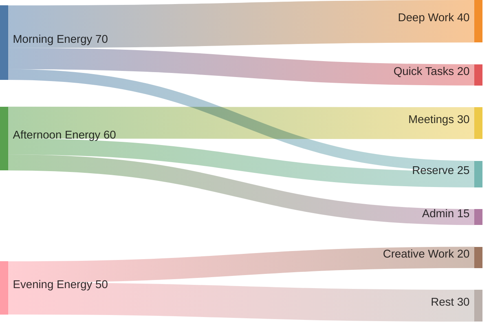

## Mode System (v3.0)

This skill supports three modes to adapt to different cognitive styles:

### Mode Selection

**1. Auto-Detect (Default)**
- Analyzes user language for distress signals ("overwhelmed", "paralyzed", "stuck")
- Detects mentions of neurodivergent conditions or executive dysfunction
- Defaults to neurodivergent mode when ambiguous (inclusive design)

**2. Explicit Mode Request**
- User says: "Use neurotypical mode" or "Use ADHD mode"
- Persists for current conversation unless changed

**3. Configuration File**
- User creates: `.claude/neurodivergent-visual-org-preference.yml`
- Sets default mode, time multipliers, chunk sizes

### Mode Characteristics

| Aspect | Neurodivergent Mode | Neurotypical Mode |
|--------|---------------------|-------------------|
| Chunk size | 3-5 items | 5-7 items |
| Time estimates | 1.5-2x with buffer | Standard |
| Task granularity | 3-10 min micro-steps | 15-30 min tasks |
| Language | Compassionate, validating | Direct, efficient |
| Colors | Calming (blues/greens) | Standard themes |
| Energy scaffolding | Explicit (spoons, breaks) | Minimal |

### Backward Compatibility

v3.0 defaults to neurodivergent mode to maintain v2.0 behavior. Users must explicitly enable neurotypical mode.

## Mode Detection Algorithm

**Step 1: Check for explicit mode request**
```python
if "neurotypical mode" in user_message.lower():
    mode = "neurotypical"
elif "adhd mode" or "neurodivergent mode" in user_message.lower():
    mode = "neurodivergent"
```

**Step 2: Check configuration file**
```python
if mode is None and config_file_exists():
    mode = load_user_preference()
```

**Step 3: Auto-detect from language**
```python
distress_signals = ["overwhelmed", "paralyzed", "stuck", "can't decide",
                   "don't know where to start", "too much"]
neurodivergent_mentions = ["adhd", "autism", "executive dysfunction",
                          "time blindness", "decision paralysis"]
energy_mentions = ["spoons", "burned out", "exhausted", "no energy"]

if any(signal in user_message.lower() for signal in
       distress_signals + neurodivergent_mentions + energy_mentions):
    mode = "neurodivergent"
```

**Step 4: Default to neurodivergent (inclusive)**
```python
if mode is None:
    mode = "neurodivergent"  # Backward compatible with v2.0
```

# Neurodivergent Visual Organization

Create visual organizational tools that make invisible work visible and reduce cognitive overwhelm. This skill generates Mermaid diagrams optimized for neurodivergent thinking patterns, leveraging research-backed design principles that work WITH ADHD brain wiring rather than against it.

## Why Visual Tools Work for ADHD Brains

Visual aids externalize executive function by:
- **Converting abstract concepts** (time, energy, priorities) into concrete visual formats
- **Reducing working memory load** by moving information from internal to external scaffolding
- **Combating "out of sight, out of mind"** through persistent visual presence
- **Leveraging visual-spatial strengths** while compensating for working memory deficits
- **Providing immediate feedback** that ADHD brains need for sustained engagement
- **Making time tangible** to address time blindness (a core ADHD deficit)

Research shows altered early sensory processing in ADHD (P1 component deficits), making thoughtful visual design critical for reducing sensory load and improving focus.

## When to Use This Skill

Use when the user:
- Feels overwhelmed by a task or project ("I don't know where to start")
- Needs to break down something complex into steps
- Is stuck making a decision or mentions analysis paralysis
- Asks "what should I focus on?" or "what's on my plate?"
- Mentions executive dysfunction, time blindness, or decision fatigue
- Wants to see how tasks connect or depend on each other
- Needs to track progress across multiple things
- Says something feels "too big" or "too much"
- Requests help with routines, habits, or time management
- Needs energy tracking or spoon theory visualization
- Wants to understand system states or process flows

## Core Principles

**Always apply these neurodivergent-friendly principles:**
- Use compassionate, non-judgmental language (never "just do it" or "should be easy")
- Give realistic time estimates with buffer (use 1.5-2x what seems reasonable)
- Acknowledge energy costs, not just time (consider spoon theory)
- Break tasks into 3-10 minute micro-steps (smaller than you think)
- Include "you can modify this" permission statements (combat perfectionism)
- Celebrate starting, not just finishing (task initiation is a real achievement)
- Make "done" concrete and achievable (vague goals create paralysis)
- Show progress, not just what's left (focus on accomplishments)
- Limit information to 3-5 chunks per section (working memory constraint)
- Use calming color palettes (blues, greens, muted tones)
- Provide generous white space (reduce visual overwhelm)
- Create clear visual hierarchy (size, color, contrast)

## Neurodivergent-Friendly Design Standards

### Color Psychology for ADHD

**Primary Palette (Use These)**
- **Blues and greens** in soft, muted tones - promote tranquility and focus
- **Muted browns** - provide grounding without stimulation
- **Soft pastels** (light blues, lavenders, pale greens) - reduce visual stress
- **Muted yellows** (sparingly) - boost energy without overstimulation

**Avoid**
- Bright reds, oranges, intense yellows - increase hyperactivity/agitation
- Bright saturated colors - cause sensory overload
- Clashing color combinations - create visual stress

**Implementation**
- Use `forest` theme (green-based) or `neutral` theme (muted earth tones)
- Apply 60-30-10 rule: 60% calming background, 30% secondary, 10% accent
- Maintain 4.5:1 contrast ratio minimum (WCAG compliance)
- Never rely on color alone - pair with icons, patterns, or text labels

### Information Density Management

**Miller's Law + ADHD Considerations**
- Working memory holds 5-7 chunks (neurotypical) or 3-5 chunks (ADHD)
- Stay at lower end (3-5 chunks) to prevent cognitive overload
- Increased cognitive load reduces ADHD performance more severely

**Practical Limits**
- **Flowcharts**: 15-20 nodes maximum before splitting into multiple diagrams
- **Mindmaps**: 3-4 levels deep maximum
- **Pie charts**: 6-8 slices for readability
- **Lists**: No more than 2 lists of 3-5 items per diagram
- **Sections**: Use timeline/journey sections to chunk events logically

**Implementation**
- Break complex diagrams into digestible sections
- Use progressive disclosure (show relevant info upfront, details on demand)
- Provide TL;DR sections at beginning of complex diagrams
- Include generous white space between elements

### Visual Hierarchy Principles

**Size Contrast** (must be dramatic for ADHD attention)
- H1 significantly larger than H2, which is notably larger than body text
- Important nodes visibly larger than standard nodes
- Use `classDef` to style critical elements distinctly

**Priority Signaling**
- Distinguish important information through bold or color
- Use visual highlights for critical numbers or elements
- Separate each instruction clearly
- Implement color-coded systems for immediate visual feedback

**Avoid**
- Competing visual elements fighting for attention
- Auto-playing animations or flashy effects (extremely distracting)
- Blinking or flashing elements
- More than 2 fonts per diagram

## Comprehensive Mermaid Diagram Selection Guide

Mermaid 11.12.1 offers **22 diagram types**. Choose based on cognitive need:

### Executive Function & Task Management

| User Need | Best Diagram Type | When to Use |
|-----------|------------------|-------------|
| "I don't know where to start" | **Flowchart** (decision tree) | Diagnose task initiation blocks |
| "This task is overwhelming" | **Gantt chart** or **Timeline** | Break into sequential phases with time |
| "How are tasks connected?" | **Flowchart** (dependencies) | Show prerequisite relationships |
| "What's the order of operations?" | **Timeline** or **State diagram** | Sequential progression with states |
| "Track project phases" | **Gantt chart** | Complex projects with dependencies |

### Decision-Making & Prioritization

| User Need | Best Diagram Type | When to Use |
|-----------|------------------|-------------|
| "I can't decide between options" | **Quadrant chart** | 2-dimensional comparison (Eisenhower Matrix) |
| "Need to weigh factors" | **Flowchart** (decision tree) | Branching logic with validation |
| "What should I focus on first?" | **Quadrant chart** | Urgent/Important matrix |
| "Too many things on my plate" | **Pie chart** | Visualize proportional allocation |
| "Comparing multiple aspects" | **User journey** | Track satisfaction across dimensions |

### Organization & Current State

| User Need | Best Diagram Type | When to Use |
|-----------|------------------|-------------|
| "What's on my plate?" | **Kanban** (if available) | Track To Do/Doing/Done states |
| "Show task status" | **State diagram** | Visualize item states and transitions |
| "Organize by category" | **Mindmap** | Non-linear brainstorming and categorization |
| "See the big picture" | **Mindmap** | Hierarchical overview of complex topic |
| "Track multiple projects" | **Gantt chart** | Parallel timelines with milestones |

### Time & Energy Management

| User Need | Best Diagram Type | When to Use |
|-----------|------------------|-------------|
| "Make time visible" | **Timeline** with sections | Combat time blindness with visual periods |
| "Plan my day/week" | **Gantt chart** | Time-blocked schedule with buffer |
| "Track energy patterns" | **Pie chart** or **XY chart** | Spoon theory visualization |
| "Pomodoro planning" | **Timeline** | Show focus/break cycles visually |
| "Energy allocation" | **Sankey diagram** | Show energy flow across activities |

### Habits & Routines

| User Need | Best Diagram Type | When to Use |
|-----------|------------------|-------------|
| "Build a morning routine" | **Flowchart** or **Timeline** | Sequential steps with time estimates |
| "Habit stacking" | **Flowchart** | Show trigger → action chains |
| "Track habit progress" | **User journey** | Satisfaction scores across habit stages |
| "Visual routine chart" | **Timeline** with sections | Color-coded daily schedule |

### Systems & Processes

| User Need | Best Diagram Type | When to Use |
|-----------|------------------|-------------|
| "How does this system work?" | **State diagram** | Show system states and transitions |
| "Process flow" | **Flowchart** | Step-by-step procedures |
| "Data/resource flow" | **Sankey diagram** | Visualize flow and distribution |
| "Relationships between entities" | **ER diagram** or **Mindmap** | Show connections and structure |
| "Architecture/structure" | **Architecture diagram** (beta) | System components with icons |

## Detailed Syntax Guide for Priority Types

### Flowcharts: Decision Trees & Task Breakdown

**Syntax Basics**


**Node Shapes**
- `[]` Rectangle - standard task/statement
- `()` Rounded rectangle - softer, process step
- `{}` Diamond - decision point (yes/no question)
- `[[]]` Subroutine shape - sub-process
- `[()]` Stadium shape - start/end point
- `{{}}` Hexagon - preparation step

**Arrows & Labels**
- `-->` Simple arrow
- `-->|label|` Labeled arrow
- `-.->` Dotted arrow (optional path)
- `==>` Thick arrow (emphasis)

**Subgraphs for Chunking**


**Best Practices**
- Limit to 15-20 nodes before splitting
- Use subgraphs to chunk information (3-5 chunks)
- Include validation and reassurance in nodes
- Make decision diamonds clear yes/no questions
- Add encouraging statements in terminal nodes

### Mindmaps: Non-Linear Brainstorming

**Syntax Basics**


**Key Rules**
- **Start with `mindmap`** keyword
- **Root node** in double parentheses `((text))`
- **Indentation defines hierarchy** - relative spacing only
- **Maximum 3-4 levels deep** to prevent overwhelm
- **Markdown support**: `**bold**`, `*italic*`, `<br/>` for line breaks

**Node Shapes**
- Default text (no delimiters)
- `[Square]`
- `(Rounded)`
- `((Circle))`
- `)Cloud(`
- `{{Hexagon}}`

**Icons** (⚠️ **breaks in GitHub**)


**Best Practices**
- Match ADHD's non-linear thinking patterns
- Use for brainstorming where all ideas appear simultaneously
- Keep branches to 3-5 items each (Miller's Law)
- Avoid icons if sharing on GitHub
- Use consistent indentation (2 or 4 spaces)

### Timelines: Making Time Tangible

**Syntax Basics**
```mermaid
%%{init: {'theme':'forest'}}%%
timeline
    title My Day - Time Blocked for ADHD
    section Morning (High Energy)
    7:00 AM : Wake up routine
           : Medication + breakfast
    8:00 AM : Deep work block
           : Most important task
    section Midday (Medium Energy)
    12:00 PM : Lunch + movement break
    1:00 PM : Meetings + collaboration
    section Afternoon (Variable Energy)
    3:00 PM : Admin tasks
           : Email + light work
    5:00 PM : Wrap up + tomorrow prep
```

**Critical Rules**
- Start with `timeline` keyword
- Optional: `title Your Title` on second line
- **All events before first `section` are IGNORED**
- Format: `TimePeriod : Event1` or `TimePeriod : Event1 : Event2`
- Each event starts with colon on new line
- Time periods accept **any text** (not just numbers): "Q1 2024", "Phase 1", "Morning"

**Sections for Color Coding**
- Use `section Section Name` to group time periods
- Without sections: each period gets its own rainbow color
- With sections: all periods in section share section's color
- Sections provide natural information chunking

**Comments** (⚠️ **weird behavior**)
- `%%` renders as visible text (despite syntax highlighting)
- Use `#` for true inline comments
- Best to avoid comments in timelines

**Best Practices**
- Use sections to chunk events by energy level or day phase
- Make time periods visible (address time blindness directly)
- Include buffer time between events
- Use `<br/>` for line breaks within events
- Color-code by energy: high (green), medium (yellow), low (blue)

### Quadrant Charts: Priority Matrices

**Syntax Basics**


**Quadrant Numbering** (⚠️ **clockwise from top-right**)
- `quadrant-1`: Top-right (high x, high y)
- `quadrant-2`: Top-left (low x, high y)
- `quadrant-3`: Bottom-left (low x, low y)
- `quadrant-4`: Bottom-right (high x, low y)

**Data Points**
- Format: `Point Name: [x, y]`
- **Coordinates must be 0-1** (0 = left/bottom, 1 = right/top)
- Styling: `Point:::className: [x, y]` or inline `radius: 12, color: #ff3300`

**Axis Configuration**
- Single side: `x-axis Label`
- Two sides: `x-axis Left --> Right`
- Same for y-axis

**Best Practices**
- Perfect for Eisenhower Matrix (urgent/important)
- Limit to 8-12 points for readability
- Use for 2-dimensional comparisons
- Clearly label what each quadrant means
- Provides clear action categories (eliminates analysis paralysis)

### Pie Charts: Proportional Visualization

**Syntax Basics**


**Key Rules**
- Start with `pie` keyword
- `showData` on second line (optional) displays values + percentages
- Title: `title Title Text` (quotes optional)
- Data: `"Label" : Value` - labels in double quotes, positive numbers only
- Limit to 6-8 slices for readability

**Color Assignment** (⚠️ **by size, not order**)
- Colors assigned largest to smallest percentage
- `pie1` = largest slice, `pie2` = second largest, etc.
- Configure via `themeVariables` in directive

**Best Practices**
- Excellent for spoon theory / energy visualization
- Show proportional time allocation
- Visualize work distribution across categories
- No more than 8 slices (cognitive load)
- Use for "how am I spending my time/energy?" questions

### State Diagrams: System States & Transitions

**Syntax Basics**


**Key Rules**
- Use `stateDiagram-v2` (not v1)
- `[*]` represents start/end points
- Define states: simple `Moving` or `state Moving` or `Still: Description`
- Transitions: `State1 --> State2: Event label`
- Notes: `note right of State` (or left, right, left of)

**Composite States** (nested)


**Advanced Features**
- **Choice nodes**: `state choice <<choice>>` for branching
- **Fork/Join**: `<<fork>>` and `<<join>>` for parallel states
- **Concurrency**: `--` separator between parallel groups

**⚠️ Common Errors**
- Cannot style `[*]` start/end states
- Lowercase "end" as state name breaks diagram (use "End" or "END")
- Cannot transition between internal states of different composites

**Best Practices**
- Track work/focus states and transitions
- Show ADHD-specific states (hyperfocus, crashed, recovering)
- Include notes with coping strategies
- Visualize system states for technical understanding
- Make abstract process flows concrete

### Sankey Diagrams: Flow Visualization

**Syntax Basics**


**Critical Rules**
- Start with **YAML frontmatter config** (not directive style)
- Use `sankey-beta` keyword (not `sankey`)
- **CSV format**: `source,target,value` (exactly 3 columns)
- Names with commas: wrap in double quotes `"Name, Inc",Target,10`
- Literal quotes: use double pairs `"He said ""Hi""",Target,5`
- Values must be positive numbers (decimals OK)

**Configuration** (in frontmatter only)
```yaml
config:
  sankey:
    showValues: true          # Display numbers on links
    linkColor: 'gradient'     # 'source', 'target', 'gradient', or hex
    nodeAlignment: 'justify'  # 'justify', 'center', 'left', 'right'
    width: 800               # Diagram width in pixels
    height: 600              # Diagram height in pixels
```

**⚠️ Critical Limitations**
- **No Unicode/non-ASCII characters** (Czech, Japanese, etc.) - causes parse failures
- No title syntax support
- No node aliases
- Node reordering can create unnecessary crossings
- Directive-style `%%{init: {}}%%` config causes errors
- Beta status means syntax may change

**Best Practices**
- Visualize energy flow across activities (spoon theory)
- Show resource distribution and allocation
- Track where time/effort goes
- Make invisible energy expenditure visible
- Use for "where does all my time go?" questions

### User Journey Maps: Experience Tracking

**Syntax Basics**
```mermaid
journey
    title Building a New Habit - ADHD Journey
    section Week 1: Setup
        Choose tiny habit: 5: Me
        Set up reminder: 4: Me, App
        First attempt: 3: Me
    section Week 2: Struggle
        Forget to do it: 2: Me
        Add visual cue: 4: Me
        Start seeing progress: 4: Me
    section Week 3: Momentum
        Feels automatic: 5: Me
        Missing feels weird: 5: Me
```

**Key Rules**
- Start with `journey` keyword
- Optional: `title Your Title`
- Sections: `section Section Name`
- Tasks: `Task Name: <score>: <actors>` (precise format)
- **Scores must be 1-5 integers**:
  - 1 = very negative
  - 2 = negative
  - 3 = neutral
  - 4 = positive
  - 5 = very positive
- Actors comma-separated (optional)

**⚠️ Common Errors**
- Scores outside 1-5 range break rendering
- Incorrect colon placement in format
- Forgetting to indent tasks under sections

**Best Practices**
- Track satisfaction across habit-building phases
- Show emotional journey of ADHD management
- Visualize experience across project stages
- 5-point scale reduces decision complexity (good for ADHD)
- Validates struggle periods (week 2 dip is normal)

## Troubleshooting Common Errors

### Indentation Issues
**Problem**: Generic errors in mindmaps, composites, Kanban
**Solution**: 
- Use consistent indent (2 or 4 spaces)
- Check relative indentation levels carefully
- Remember: actual amount doesn't matter, only relative difference

### Reserved Words
**Problem**: Diagram breaks when using "end"
**Solution**: Use "End", "END", or any capitalization variant

### Special Characters
**Problem**: Quotes, commas, unicode characters break rendering
**Solution**:
- Use `""` for literal double quotes
- Wrap comma-containing text in double quotes
- **Avoid unicode** in Sankey diagrams (no workaround)
- Use HTML entities: `#` + character code

### Configuration Errors
**Problem**: Config doesn't apply or causes errors
**Solution**:
- **Sankey requires YAML frontmatter** (not directives)
- Most other diagrams use `%%{init: {}}%%` directives
- `showData` in pie charts must be on line 2
- Remove `::icon()` syntax for GitHub compatibility

### Version Compatibility
**Problem**: Diagram feature not rendering
**Solution**:
- Packet diagrams: v11.0.0+
- Architecture diagrams: v11.1.0+
- Sankey diagrams: v10.3.0+
- Beta features may change syntax
- Test in Mermaid Live Editor (mermaid.live) first

### Points Disappear in Quadrant Charts
**Problem**: Data points not showing
**Solution**: 
- Ensure coordinates are between 0-1
- Check quadrant numbering (clockwise from top-right)

### Timeline Events Missing
**Problem**: Events don't appear
**Solution**: 
- ALL events before first `section` are ignored
- Add a section before any events

## Workflow: Creating Effective Neurodivergent Visualizations

### Step 1: Understand the Need & Gather Context

Ask clarifying questions if needed:
- What specifically feels overwhelming?
- What's the desired outcome?
- What's the time frame (if any)?
- What's your current energy level?
- Have you tried to start? What stopped you?

**Listen for key phrases:**
- "I don't know where to start" → Task initiation block (flowchart diagnosis)
- "Too many things" → Overwhelm (quadrant chart or Kanban)
- "I can't decide" → Analysis paralysis (decision tree or matrix)
- "Time disappears" → Time blindness (timeline or Gantt)
- "No energy" → Spoon theory (pie chart or Sankey)

### Step 2: Select Diagram Type

Based on the cognitive need, choose the appropriate diagram type from the comprehensive guide above. Consider:

**Information Processing Need:**
- **Sequential thinking** → Timeline, Gantt, Flowchart
- **Hierarchical organization** → Mindmap, State diagram
- **Comparison** → Quadrant chart, Pie chart
- **Flow tracking** → Sankey, User journey
- **Status management** → State diagram, Kanban

**Cognitive Load:**
- **High overwhelm** → Simple flowchart (≤10 nodes), Timeline with 3 sections
- **Medium complexity** → Mindmap (3 levels), Quadrant chart (≤10 points)
- **Detail needed** → Gantt chart, Sankey, User journey

### Mode-Aware Template Selection

After determining user need and mode:

1. **Load template from mode-specific directory:**
   - Neurodivergent: `templates/neurodivergent/[pattern].md`
   - Neurotypical: `templates/neurotypical/[pattern].md`

2. **Apply mode characteristics:**
   - Chunk size limits
   - Time estimate multipliers
   - Language style
   - Color schemes

3. **Generate diagram:**
   - Use Mermaid syntax from template
   - Customize with user-specific content
   - Apply mode-appropriate styling

**Example:**
```
User: "I need to clean my apartment but don't know where to start" (auto-detect → neurodivergent)
Pattern: task-breakdown
Template: templates/neurodivergent/task-breakdown.md
Characteristics: 3-5 minute tasks, compassionate language, energy indicators
```

### Step 3: Apply Neurodivergent Design Principles

Before generating the diagram, plan for:

**Color & Theme**
- Use `forest` or `neutral` theme for calming palette
- Limit to 3-4 colors maximum
- Apply 60-30-10 rule
- Ensure 4.5:1 contrast ratio

**Information Density**
- Chunk into 3-5 sections maximum
- Limit nodes/points per section to 5-7 items
- Use white space generously
- Add TL;DR if complex

**Language**
- Compassionate phrasing (no "just" or "should")
- Realistic time estimates (1.5-2x)
- Acknowledge energy costs
- Include validation statements
- Provide permission to modify

**Visual Hierarchy**
- Make important nodes notably larger
- Use `classDef` for styling priority items
- Clear next actions in distinct color
- Progress indicators where applicable

### Step 4: Generate Visualization

Create the Mermaid diagram following the selected pattern. Customize with:
- User's specific tasks/options/context
- Realistic time estimates (be generous!)
- Energy indicators (⚡ symbols or spoon counts)
- Compassionate, validating language
- Clear, concrete next actions
- Progress markers (celebrate what's done)

**Always use the Mermaid validation tool to render the diagram.**

### Step 5: Provide Context & Support

After showing the diagram, include:

**Explanation**
- How to read/use the diagram
- What each section/color represents
- Where to start (concrete first step)

**Permission & Flexibility**
- "You can modify this however works for you"
- "This is a starting point, not a rigid rule"
- "It's okay to skip steps or adjust times"

**Validation & Encouragement**
- "Starting is genuinely the hardest part - you're not weak"
- "Task initiation difficulty is executive dysfunction, not laziness"
- "Breaking this down is progress in itself"

**Offer Integration**
- "Would you like me to save this to your Obsidian vault?"
- "Want me to create a follow-up diagram for [next step]?"
- "Need help breaking down any of these steps further?"

## Integration with Obsidian & Note-Taking

If the user wants to save visualizations:

1. Use `obsidian:create` tool to create a new note
2. Include helpful context above the diagram:
   ```markdown
   # Project Breakdown - [Project Name]
   
   Created: [Date]
   Energy level when created: [Level]
   
   ## How to use this
   [Brief instructions]
   
   ## The Breakdown
   [Mermaid code block]
   
   ## Next Actions
   - [ ] [First concrete step]
   
   ## Notes
   [Space for adjustments]
   ```
3. Use clear, descriptive filenames: "Task Breakdown - Apartment Cleaning.md"
4. Suggest tagging: #adhd-tools, #task-breakdown, etc.

## Switching Modes Mid-Conversation

Users can request mode changes:

**To neurotypical mode:**
- "Can you make this more high-level?"
- "Use neurotypical mode for this diagram"
- "Make it more efficient/compact"

**To neurodivergent mode:**
- "Break this down more"
- "I'm feeling overwhelmed, can you simplify?"
- "Use ADHD-friendly mode"

**What changes when switching:**
1. Regenerate current diagram with new mode template
2. Adjust chunk sizes and time estimates
3. Update language style
4. Apply new color scheme
5. Explain what changed and why

## Reference Files (Additional Patterns)

The skill includes detailed reference files with specific patterns:

- **references/task-breakdowns.md** - Linear timelines, branching breakdowns, energy-aware sequences
- **references/decision-tools.md** - Decision trees, weighted matrices, elimination filters
- **references/project-maps.md** - Phase maps, dependency diagrams, MVP breakdowns
- **references/current-state-boards.md** - Kanban boards, priority matrices, context tracking
- **references/time-boxing.md** - Pomodoro technique, time-blocked days, focus sessions, energy mapping
- **references/habit-building.md** - Tiny habits, routine sequences, habit stacking, momentum tracking
- **references/accountability-support.md** - Body doubling, check-ins, support networks, crisis protocols
- **references/focus-regulation.md** - Pre-task calm-down, sensory tools, emotional regulation, recovery

**Read relevant reference files for specific proven patterns and examples.**

## Anti-Patterns to Avoid

### Design Anti-Patterns
❌ Too many nodes/elements (>20 in flowchart, >8 in pie chart)
❌ More than 4-5 information chunks per section
❌ Bright, clashing colors or high-saturation palettes
❌ Competing visual elements fighting for attention
❌ Auto-playing animations or flashy effects
❌ Insufficient white space causing visual overwhelm
❌ Text walls without chunking or hierarchy

### Language Anti-Patterns
❌ Judgmental phrases: "just do it", "should be easy", "simply"
❌ Unrealistic time estimates (underestimate by 50%+)
❌ Vague goals: "work on project" (too abstract)
❌ Perfectionist standards: "must complete all steps"
❌ No acknowledgment of energy costs
❌ Making everything urgent/high-priority (creates paralysis)

### Process Anti-Patterns
❌ Creating diagrams without usage instructions
❌ Forgetting to validate with Mermaid tool before sharing
❌ Not offering to save to Obsidian/notes
❌ Skipping permission statements about modification
❌ Providing no encouragement or validation
❌ Creating one-size-fits-all solutions
❌ Ignoring user's current energy level

### Technical Anti-Patterns
❌ Using icons `::icon()` in GitHub-bound diagrams
❌ Directive config for Sankey diagrams
❌ Unicode characters in Sankey diagrams
❌ Lowercase "end" as state name
❌ Timeline events before first section
❌ Quadrant coordinates outside 0-1 range
❌ Forgetting `showData` on line 2 for pie charts

## Example Usage Scenarios

### Scenario 1: Task Initiation Paralysis

**User:** "I need to clean my apartment but it's so messy I don't know where to start"

**Claude's Approach:**
1. Recognize **task initiation block** (classic executive dysfunction)
2. Choose **flowchart** (decision tree to diagnose the block) or **timeline** (break into phases)
3. Apply principles:
   - Break into 10-15 minute chunks
   - Start with "quick wins" (visible progress)
   - Include decision points: "Do I have cleaning supplies?"
   - Use `forest` theme (calming green)
   - Add validation: "Feeling overwhelmed is valid"
4. Generate diagram with specific rooms/tasks
5. Render with Mermaid tool
6. Provide context: "Start with just ONE quick win - seeing progress helps motivation"
7. Offer to save to Obsidian

### Scenario 2: Decision Paralysis

**User:** "Should I take this new job offer or stay at my current job? I've been thinking about it for weeks and can't decide"

**Claude's Approach:**
1. Recognize **analysis paralysis** (decision fatigue)
2. Ask about key factors that matter to them
3. Choose **quadrant chart** (2-dimensional comparison) or **flowchart** (decision tree with validation)
4. Apply principles:
   - Limit to 5-7 key factors (prevent overwhelm)
   - Use neutral theme (reduce emotional reactivity)
   - Include validation: "Big decisions are hard - breaking it down helps"
   - Clear action categories per quadrant
5. Generate diagram with their specific priorities
6. Include reflection prompt: "Notice which quadrant has more clustering?"
7. Offer to create follow-up diagram exploring gut feeling

### Scenario 3: Overwhelmed by Multiple Tasks

**User:** "I have too many things on my plate and can't figure out what to do first"

**Claude's Approach:**
1. Recognize **overwhelm + priority paralysis**
2. Choose **quadrant chart** (Eisenhower Matrix) or **pie chart** (see proportions)
3. Apply principles:
   - Sort into 4 clear categories (Do Now, Schedule, Delegate, Delete)
   - Use calming colors with clear differentiation
   - Limit to 10-12 tasks visible at once
   - Include permission: "Not everything has to be done today"
4. Create Eisenhower Matrix showing tasks by urgency/importance
5. Provide clear next actions: "Start with just ONE from 'Do Now' quadrant"
6. Validate: "Having too much is real - this isn't a personal failure"
7. Offer to break down the "Do Now" task further if needed

### Scenario 4: Time Blindness Struggle

**User:** "My day just disappears and I never get my important work done. Time management tools don't work for me"

**Claude's Approach:**
1. Recognize **time blindness** (core ADHD deficit)
2. Choose **timeline** (make time visible) or **Gantt chart** (time-blocked day)
3. Apply principles:
   - Use sections for energy levels (Morning: high, Afternoon: medium)
   - Include buffer time between tasks (1.5x estimate)
   - Color-code by task type (deep work, admin, breaks)
   - Realistic 2-3 hour deep work block maximum
4. Generate time-blocked day with visible time periods
5. Include validation: "Time blindness is neurological, not a character flaw"
6. Provide usage tip: "Set phone alarms for section transitions"
7. Offer to track actual vs. estimated time to reveal patterns

### Scenario 5: Habit Building Difficulty

**User:** "I want to start exercising but I always forget or can't get myself to do it"

**Claude's Approach:**
1. Recognize **habit initiation + memory challenges**
2. Choose **flowchart** (habit stacking) or **user journey** (track experience)
3. Apply principles:
   - Start with "tiny habit" (2 minutes of stretching, not 30-minute workout)
   - Attach to existing habit: "After I brush teeth → 2 push-ups"
   - Include setup phase: "Put yoga mat by bed the night before"
   - Track satisfaction scores showing Week 2 dip is normal
4. Generate habit stacking flowchart or journey map
5. Validate: "Brains need 30-90 days for habits - Week 2 always sucks"
6. Provide tip: "Visual cue (mat by bed) bypasses working memory"
7. Offer follow-up: weekly journey tracking to show progress

### Scenario 6: Spoon Theory / Energy Management

**User:** "I'm always exhausted and don't know why I have no energy for things I need to do"

**Claude's Approach:**
1. Recognize **energy depletion** without awareness of expenditure
2. Choose **pie chart** (energy allocation) or **Sankey diagram** (energy flow)
3. Apply principles:
   - Visualize different spoon types (executive, social, sensory, focus)
   - Show where energy goes (make invisible visible)
   - Use calming colors with distinct categories
   - Include recovery/reserve allocation
4. Generate spoon allocation pie chart for typical day
5. Validate: "ADHD brains use more energy for 'simple' tasks"
6. Provide insight: "Notice how much goes to masking/compensation?"
7. Offer follow-up: weekly energy pattern tracking to identify drains

## Research Foundation

This skill is built on:

**ADHD Neuroscience**
- Cognitive-Energetic Model (effort, arousal, activation, vigilance)
- Working memory constraints (3-5 chunks for ADHD vs 5-7 neurotypical)
- P1 component deficits in early visual processing
- Time perception distortions (time blindness)

**Visual Processing Research**
- Visual aids externalize executive function
- Working memory offloading improves performance
- Visual-spatial strengths in ADHD populations
- Pattern recognition as compensatory strategy

**Cognitive Load Theory**
- Increased load reduces ADHD performance more severely
- Chunking reduces working memory demands
- Progressive disclosure manages attention
- Predictable layouts reduce cognitive friction

**Design Principles**
- WCAG accessibility guidelines (4.5:1 contrast)
- Miller's Law (5±2 chunks, adjusted for ADHD)
- Gestalt principles (proximity, similarity)
- Nielsen Norman Group findings (79% scan vs read)

## Community Resources

Active neurodivergent community innovation:
- **Reddit r/ADHD** - User-shared tools and patterns
- **ADDitude Magazine** - Research-backed strategies
- **CHADD** - Evidence-based resources
- **Neurodivergent-founded apps**: Tiimo, RoutineFlow, Lunatask

**Key Insight**: Designing for cognitive accessibility creates better experiences for everyone. Visual diagrams that work for ADHD brains represent excellent information design universally.

## Version History

- **v2.0** (Current): Comprehensive Mermaid 11.12.1 syntax, research-backed neurodivergent design principles, troubleshooting guide, expanded diagram types
- **v1.0**: Initial release with basic patterns and reference files

---

## Quick Reference Card

**When user says...** → **Use this diagram type**

- "I don't know where to start" → Flowchart (decision tree)
- "This is overwhelming" → Timeline or Gantt (break into phases)
- "I can't decide" → Quadrant chart (Eisenhower Matrix)
- "What should I focus on?" → Quadrant chart or Pie chart
- "Too many things" → Kanban or State diagram
- "Time disappears" → Timeline (make time visible)
- "No energy" → Pie or Sankey (spoon theory)
- "How does this work?" → State diagram or Flowchart
- "Build a habit" → Flowchart (habit stacking) or User journey
- "Plan my day" → Timeline or Gantt (time-blocked)

**Always:**
✅ Use calming colors (forest/neutral theme)
✅ Limit to 3-5 chunks per section
✅ Be compassionate and realistic
✅ Validate with Mermaid tool
✅ Provide usage instructions
✅ Offer to save to Obsidian

**Never:**
❌ Judgmental language ("just" or "should")
❌ Unrealistic time estimates
❌ Too many nodes/elements
❌ Bright clashing colors
❌ Skip encouragement and validation