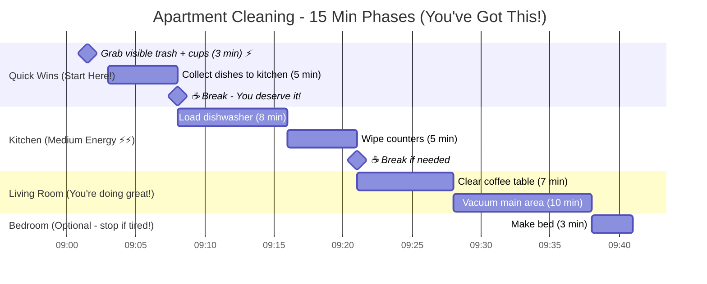
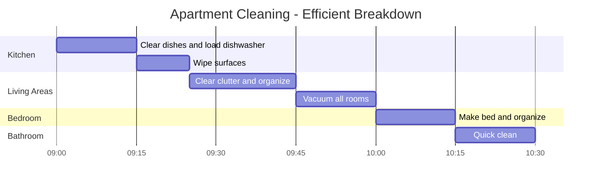
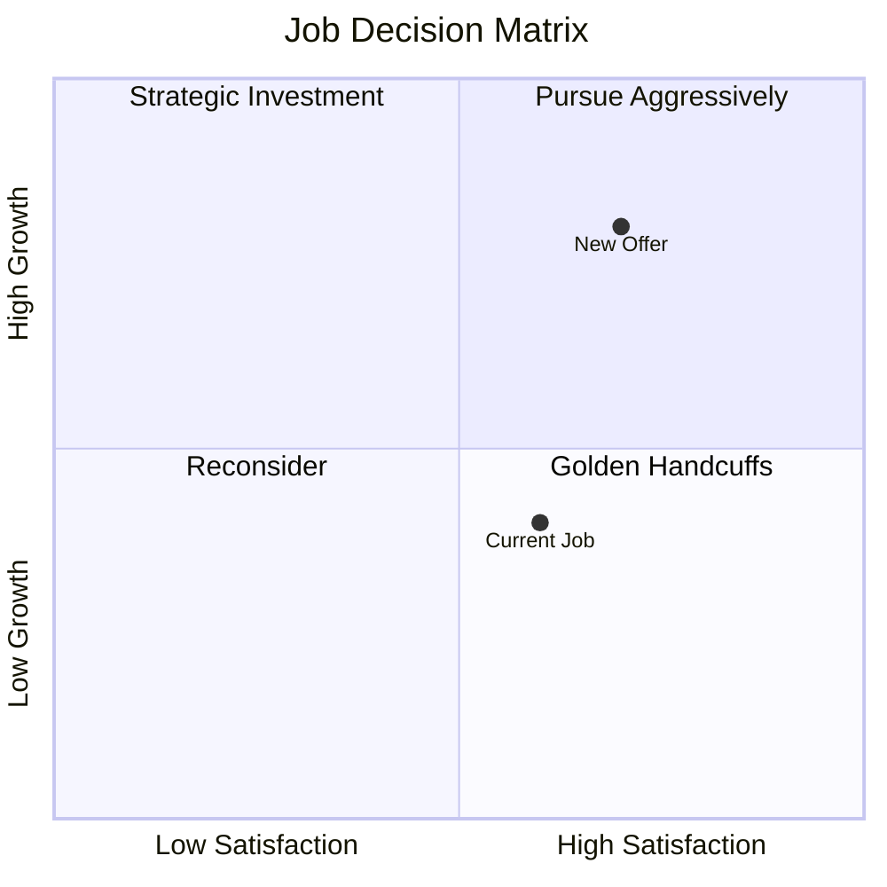
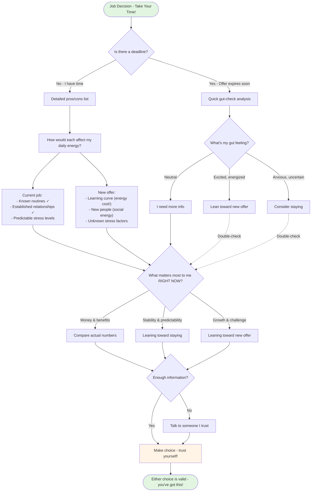

# Mode Comparison Examples

## Example 1: Apartment Cleaning Task

### User Request
"I need to clean my apartment but it's so messy I don't know where to start"

**Auto-Detect Result:** Neurodivergent mode (keywords: "so messy", "don't know where to start")

### Neurodivergent Mode Output



**Language:** "You've Got This!", "You deserve it!", "You're doing great!", "Optional - stop if tired!"

**Time estimates:** 3-10 minute micro-steps with breaks

**Energy indicators:** ⚡ symbols, explicit break points

**Permission:** "Optional", "if needed", "stop if tired"

### Neurotypical Mode Output



**Language:** Direct, task-focused

**Time estimates:** 15-20 minute tasks, standard duration

**Energy indicators:** None (assumes sustained focus)

**Permission:** None (assumes self-directed execution)

---

## Example 2: Career Decision

### User Request
"Should I take this new job offer or stay at my current job?"

**Auto-Detect Result:** Neurotypical mode (no distress signals, straightforward decision request)

### Neurotypical Mode Output



**Factors to evaluate:**
1. Salary and compensation
2. Growth opportunities
3. Work-life balance
4. Team and culture fit
5. Career trajectory
6. Location and commute

**Recommendation:** Score each factor 1-10 for both options, weight by importance, calculate total.

### Neurodivergent Mode Output (if requested)



**Language:** "Take Your Time!", "Trust yourself!", "Either choice is valid"

**Energy awareness:** Explicit energy cost analysis for transitions

**Permission:** Multiple valid paths, acknowledges uncertainty is okay

**Scaffolding:** Includes "talk to someone I trust" step

---

## Example 3: Mode Switching Mid-Conversation

### Initial Request (Auto-Detect → Neurodivergent)
User: "I'm overwhelmed by this project and don't know where to start"

*Claude generates neurodivergent mode diagram with micro-steps, compassionate language, energy indicators*

### User Requests Switch
User: "This is great for me, but can you also make a neurotypical version for my team presentation?"

### Response
"Absolutely! I'll create a neurotypical mode version optimized for team presentation. This will be more compact, use standard time estimates, and professional language suitable for stakeholders.

Here's the neurotypical mode version..."

*Claude generates neurotypical mode diagram: efficient, professional, standard granularity*

"**What changed:**
- Task granularity: 3-10 min → 15-30 min tasks
- Language: Compassionate → Direct and professional
- Time estimates: Buffer removed (1.5x → 1.0x)
- Energy scaffolding: Removed (assumes team has executive function)
- Color scheme: Calming → Standard professional

**You now have:**
1. Neurodivergent version for your personal planning
2. Neurotypical version for team presentation

Both represent the same project - just optimized for different audiences!"
```
