# Accountability & Support Planning

## Overview

Accountability patterns help create external support systems that work WITH neurodivergent brains. Includes body doubling, check-ins, and knowing when/how to reach out.

## When to Use

- User mentions working alone feels impossible
- User asks about accountability partners or body doubling
- User struggles to start tasks without external pressure
- User mentions isolation or needing company
- User asks "how do I stay accountable?"
- User needs help knowing when to ask for support

## Pattern: Body Doubling Session Plan

Use when user wants to try body doubling (working alongside someone).

```mermaid
flowchart TD
    Start[Want to try body doubling?] --> Why[Why it works:<br/>Presence = external regulation<br/>Mirror neurons = motivation<br/>Parallel play for adults]
    
    Why --> Find{Find a body double}
    
    Find -->|Friend/partner| Personal[In person OR video call<br/>They work on their thing<br/>You work on yours]
    Find -->|Online community| Virtual[Body doubling apps:<br/>Focusmate<br/>Flow Club<br/>Caveday<br/>Study streams]
    Find -->|No one available| Self[Self-doubling:<br/>Work in cafe<br/>Library<br/>Public space]
    
    Personal --> Setup[Setup the session]
    Virtual --> Setup
    Self --> Setup
    
    Setup --> Rules[Session rules:<br/>5 min: Check in<br/>Share what you're working on<br/>45-50 min: Work silently<br/>5 min: Check out<br/>Share what you did]
    
    Rules --> During[During session:<br/>• No chatting during work time<br/>• Camera on if virtual<br/>• Minimal interaction<br/>• Parallel presence only]
    
    During --> Works{Does it help?}
    
    Works -->|Yes| Regular[Schedule regular sessions<br/>Works best with consistency]
    Works -->|Not sure| Try[Try 3 sessions<br/>before deciding]
    Works -->|No| Other[Try other support:<br/>Time-boxing<br/>Accountability check-ins<br/>Working in public]
    
    Regular --> Tips[Tips for success:<br/>• Same time helps<br/>• Match energy levels<br/>• Okay to do different tasks<br/>• End on time]
    
    style Start fill:#e1f5ff
    style Why fill:#fff3cd
    style Tips fill:#d4f1d4
```

[🎨 Edit Flowchart in mermaid.live](https://mermaid.live/edit#flowchart%20TD%0A%20%20%20%20Start%5BWant%20to%20try%20body%20doubling%3F%5D%20--%3E%20Why%5BWhy%20it%20works%3A%3Cbr%2F%3EPresence%20%3D%20external%20regulation%3Cbr%2F%3EMirror%20neurons%20%3D%20motivation%3Cbr%2F%3EParallel%20play%20for%20adults%5D%0A%20%20%20%20%0A%20%20%20%20Why%20--%3E%20Find%7BFind%20a%20body%20double%7D%0A%20%20%20%20%0A%20%20%20%20Find%20--%3E%7CFriend%2Fpartner%7C%20Personal%5BIn%20person%20OR%20video%20call%3Cbr%2F%3EThey%20work%20on%20their%20thing%3Cbr%2F%3EYou%20work%20on%20yours%5D%0A%20%20%20%20Find%20--%3E%7COnline%20community%7C%20Virtual%5BBody%20doubling%20apps%3A%3Cbr%2F%3EFocusmate%3Cbr%2F%3EFlow%20Club%3Cbr%2F%3ECaveday%3Cbr%2F%3EStudy%20streams%5D%0A%20%20%20%20Find%20--%3E%7CNo%20one%20available%7C%20Self%5BSelf-doubling%3A%3Cbr%2F%3EWork%20in%20cafe%3Cbr%2F%3ELibrary%3Cbr%2F%3EPublic%20space%5D%0A%20%20%20%20%0A%20%20%20%20Personal%20--%3E%20Setup%5BSetup%20the%20session%5D%0A%20%20%20%20Virtual%20--%3E%20Setup%0A%20%20%20%20Self%20--%3E%20Setup%0A%20%20%20%20%0A%20%20%20%20Setup%20--%3E%20Rules%5BSession%20rules%3A%3Cbr%2F%3E5%20min%3A%20Check%20in%3Cbr%2F%3EShare%20what%20you%27re%20working%20on%3Cbr%2F%3E45-50%20min%3A%20Work%20silently%3Cbr%2F%3E5%20min%3A%20Check%20out%3Cbr%2F%3EShare%20what%20you%20did%5D%0A%20%20%20%20%0A%20%20%20%20Rules%20--%3E%20During%5BDuring%20session%3A%3Cbr%2F%3E%E2%80%A2%20No%20chatting%20during%20work%20time%3Cbr%2F%3E%E2%80%A2%20Camera%20on%20if%20virtual%3Cbr%2F%3E%E2%80%A2%20Minimal%20interaction%3Cbr%2F%3E%E2%80%A2%20Parallel%20presence%20only%5D%0A%20%20%20%20%0A%20%20%20%20During%20--%3E%20Works%7BDoes%20it%20help%3F%7D%0A%20%20%20%20%0A%20%20%20%20Works%20--%3E%7CYes%7C%20Regular%5BSchedule%20regular%20sessions%3Cbr%2F%3EWorks%20best%20with%20consistency%5D%0A%20%20%20%20Works%20--%3E%7CNot%20sure%7C%20Try%5BTry%203%20sessions%3Cbr%2F%3Ebefore%20deciding%5D%0A%20%20%20%20Works%20--%3E%7CNo%7C%20Other%5BTry%20other%20support%3A%3Cbr%2F%3ETime-boxing%3Cbr%2F%3EAccountability%20check-ins%3Cbr%2F%3EWorking%20in%20public%5D%0A%20%20%20%20%0A%20%20%20%20Regular%20--%3E%20Tips%5BTips%20for%20success%3A%3Cbr%2F%3E%E2%80%A2%20Same%20time%20helps%3Cbr%2F%3E%E2%80%A2%20Match%20energy%20levels%3Cbr%2F%3E%E2%80%A2%20Okay%20to%20do%20different%20tasks%3Cbr%2F%3E%E2%80%A2%20End%20on%20time%5D%0A%20%20%20%20%0A%20%20%20%20style%20Start%20fill%3A%23e1f5ff%0A%20%20%20%20style%20Why%20fill%3A%23fff3cd%0A%20%20%20%20style%20Tips%20fill%3A%23d4f1d4%0A)

**What body doubling is NOT:**
- Not collaboration (you work separately)
- Not socializing (minimal talking)
- Not teaching/helping (just presence)
- Not pressure (gentle accountability)

**What it IS:**
- Parallel work
- Borrowed motivation
- External regulation
- Warm companionship

## Pattern: Accountability Check-In Schedule

Use when user wants regular check-ins but not constant body doubling.

[🎨 Edit Flowchart in mermaid.live](https://mermaid.live/edit#flowchart%20LR%0A%20%20%20%20subgraph%20Monday%5B%22%20Monday%20Morning%22%5D%0A%20%20%20%20%20%20%20%20M1%5BPlan%20week%3Cbr%2F%3E10%20min%5D%0A%20%20%20%20%20%20%20%20M2%5BShare%20plan%20with%3Cbr%2F%3Eaccountability%20partner%3Cbr%2F%3E5%20min%5D%0A%20%20%20%20end%0A%20%20%20%20%0A%20%20%20%20subgraph%20Daily%5B%22%20Each%20Day%22%5D%0A%20%20%20%20%20%20%20%20D1%5BMorning%3A%3Cbr%2F%3EWhat%27s%20the%20ONE%20thing%3Cbr%2F%3Efor%20today%3F%3Cbr%2F%3EText%20or%20post%3Cbr%2F%3E2%20min%5D%0A%20%20%20%20%20%20%20%20D2%5BEvening%3A%3Cbr%2F%3EDid%20you%20do%20it%3F%3Cbr%2F%3EWhat%20got%20in%20the%20way%3F%3Cbr%2F%3EText%20or%20post%3Cbr%2F%3E2%20min%5D%0A%20%20%20%20end%0A%20%20%20%20%0A%20%20%20%20subgraph%20Friday%5B%22%20Friday%20Evening%22%5D%0A%20%20%20%20%20%20%20%20F1%5BWeekly%20review%3A%3Cbr%2F%3EWhat%20worked%3F%3Cbr%2F%3EWhat%20didn%27t%3F%3Cbr%2F%3EAdjust%20next%20week%3Cbr%2F%3E15%20min%5D%0A%20%20%20%20%20%20%20%20F2%5BShare%20with%20partner%3Cbr%2F%3EOr%20journal%3Cbr%2F%3E5%20min%5D%0A%20%20%20%20end%0A%20%20%20%20%0A%20%20%20%20Monday%20--%3E%20Daily%20--%3E%20Daily%20--%3E%20Daily%20--%3E%20Daily%20--%3E%20Friday%0A%20%20%20%20%0A%20%20%20%20Partner%5BAccountability%20partner%3Cbr%2F%3Echecks%20your%20posts%3Cbr%2F%3EYou%20check%20theirs%3Cbr%2F%3ENo%20judgment%2C%3Cbr%2F%3Ejust%20presence%5D%20-.-%3E%20Monday%0A%20%20%20%20%0A%20%20%20%20style%20Monday%20fill%3A%23e1f5ff%0A%20%20%20%20style%20Daily%20fill%3A%23fff3cd%0A%20%20%20%20style%20Friday%20fill%3A%23fef3c7%0A)

**Accountability partner guidelines:**
- NOT a manager or supervisor
- Someone also working on their goals
- Reciprocal support
- Check in on schedule
- Celebrate wins together
- No shame about struggles

**Where to find accountability partners:**
- ADHD online communities
- Friends with similar goals
- Coworkers (if appropriate)
- Paid accountability coaches
- Group programs

## Pattern: When to Reach Out Decision Tree

Use when user struggles knowing when to ask for help vs. figure it out alone.

```mermaid
flowchart TD
    Stuck[Feeling stuck/<br/>struggling] --> Try{Have you tried<br/>solving it yourself?}
    
    Try -->|No| Quick[Try for 10-15 min<br/>first]
    Try -->|Yes| How{How long have<br/>you been stuck?}
    
    Quick --> Tried[Tried for 10-15 min]
    
    Tried --> How
    
    How -->|< 30 min| Wait[Try a different approach<br/>Take a break<br/>Come back to it]
    How -->|30 min - 2 hours| Check{Is this time-sensitive<br/>OR blocking other work?}
    How -->|> 2 hours| Reach[Reach out now<br/>You've done your part]
    
    Check -->|Yes| Reach
    Check -->|No| Post[Post in async channel<br/>or scheduled check-in<br/>Continue other work]
    
    Reach --> Who[Who to reach out to?]
    
    Who --> List[Options:<br/>• Teammate who knows this<br/>• Manager if unsure who<br/>• Online community<br/>• Friend who gets it<br/>• Professional if serious]
    
    List --> How2[How to ask:<br/>'I'm stuck on X<br/>I've tried Y and Z<br/>Still not working<br/>Can you help?']
    
    How2 --> After[After getting help:<br/>Say thank you<br/>Document solution<br/>Offer help back later]
    
    style Stuck fill:#fff3cd
    style Reach fill:#d4f1d4
    style After fill:#e1f5ff
```

[🎨 Edit Flowchart in mermaid.live](https://mermaid.live/edit#flowchart%20TD%0A%20%20%20%20Stuck%5BFeeling%20stuck%2F%3Cbr%2F%3Estruggling%5D%20--%3E%20Try%7BHave%20you%20tried%3Cbr%2F%3Esolving%20it%20yourself%3F%7D%0A%20%20%20%20%0A%20%20%20%20Try%20--%3E%7CNo%7C%20Quick%5BTry%20for%2010-15%20min%3Cbr%2F%3Efirst%5D%0A%20%20%20%20Try%20--%3E%7CYes%7C%20How%7BHow%20long%20have%3Cbr%2F%3Eyou%20been%20stuck%3F%7D%0A%20%20%20%20%0A%20%20%20%20Quick%20--%3E%20Tried%5BTried%20for%2010-15%20min%5D%0A%20%20%20%20%0A%20%20%20%20Tried%20--%3E%20How%0A%20%20%20%20%0A%20%20%20%20How%20--%3E%7C%3C%2030%20min%7C%20Wait%5BTry%20a%20different%20approach%3Cbr%2F%3ETake%20a%20break%3Cbr%2F%3ECome%20back%20to%20it%5D%0A%20%20%20%20How%20--%3E%7C30%20min%20-%202%20hours%7C%20Check%7BIs%20this%20time-sensitive%3Cbr%2F%3EOR%20blocking%20other%20work%3F%7D%0A%20%20%20%20How%20--%3E%7C%3E%202%20hours%7C%20Reach%5BReach%20out%20now%3Cbr%2F%3EYou%27ve%20done%20your%20part%5D%0A%20%20%20%20%0A%20%20%20%20Check%20--%3E%7CYes%7C%20Reach%0A%20%20%20%20Check%20--%3E%7CNo%7C%20Post%5BPost%20in%20async%20channel%3Cbr%2F%3Eor%20scheduled%20check-in%3Cbr%2F%3EContinue%20other%20work%5D%0A%20%20%20%20%0A%20%20%20%20Reach%20--%3E%20Who%5BWho%20to%20reach%20out%20to%3F%5D%0A%20%20%20%20%0A%20%20%20%20Who%20--%3E%20List%5BOptions%3A%3Cbr%2F%3E%E2%80%A2%20Teammate%20who%20knows%20this%3Cbr%2F%3E%E2%80%A2%20Manager%20if%20unsure%20who%3Cbr%2F%3E%E2%80%A2%20Online%20community%3Cbr%2F%3E%E2%80%A2%20Friend%20who%20gets%20it%3Cbr%2F%3E%E2%80%A2%20Professional%20if%20serious%5D%0A%20%20%20%20%0A%20%20%20%20List%20--%3E%20How2%5BHow%20to%20ask%3A%3Cbr%2F%3E%27I%27m%20stuck%20on%20X%3Cbr%2F%3EI%27ve%20tried%20Y%20and%20Z%3Cbr%2F%3EStill%20not%20working%3Cbr%2F%3ECan%20you%20help%3F%27%5D%0A%20%20%20%20%0A%20%20%20%20How2%20--%3E%20After%5BAfter%20getting%20help%3A%3Cbr%2F%3ESay%20thank%20you%3Cbr%2F%3EDocument%20solution%3Cbr%2F%3EOffer%20help%20back%20later%5D%0A%20%20%20%20%0A%20%20%20%20style%20Stuck%20fill%3A%23fff3cd%0A%20%20%20%20style%20Reach%20fill%3A%23d4f1d4%0A%20%20%20%20style%20After%20fill%3A%23e1f5ff%0A)

**Important mindset shifts:**
- Asking for help = strength, not weakness
- 2 hours stuck = too long alone
- Documenting = helping future you
- Reciprocal support = healthy

**ADHD-specific note:** "I should figure this out" can trap you for hours. Set a timer when starting.

## Pattern: Support Network Map

Use when user needs to identify their support system.

```mermaid
flowchart TD
    You[You] --> Types{Types of support<br/>you need}
    
    Types --> Task[Task/Work Support]
    Types --> Emotional[Emotional Support]
    Types --> Social[Social Connection]
    Types --> Practical[Practical Help]
    
    Task --> T1[Who can help with:<br/>• Coworking/body doubling<br/>• Technical questions<br/>• Accountability<br/>• Feedback on work]
    
    Emotional --> E1[Who can help with:<br/>• Listening when overwhelmed<br/>• Validation<br/>• Encouragement<br/>• Non-judgmental presence]
    
    Social --> S1[Who can help with:<br/>• Hanging out<br/>• Shared activities<br/>• Fun without pressure<br/>• Belonging]
    
    Practical --> P1[Who can help with:<br/>• Emergency childcare<br/>• Ride if car breaks down<br/>• Advice on life stuff<br/>• Practical problem-solving]
    
    T1 --> Map1[Map your people:<br/>Name each person<br/>What they're good for<br/>How to reach them]
    E1 --> Map1
    S1 --> Map1
    P1 --> Map1
    
    Map1 --> Gaps{Notice any gaps?}
    
    Gaps -->|Big gap| Build[How to build this:<br/>Join communities<br/>Take a class<br/>Reach out to acquaintances<br/>Try new spaces]
    Gaps -->|Pretty covered| Great[You have a network!<br/>Reach out regularly<br/>Don't wait for crisis]
    
    style You fill:#e1f5ff
    style Map1 fill:#fff3cd
    style Great fill:#d4f1d4
```

[🎨 Edit Flowchart in mermaid.live](https://mermaid.live/edit#flowchart%20TD%0A%20%20%20%20You%5BYou%5D%20--%3E%20Types%7BTypes%20of%20support%3Cbr%2F%3Eyou%20need%7D%0A%20%20%20%20%0A%20%20%20%20Types%20--%3E%20Task%5BTask%2FWork%20Support%5D%0A%20%20%20%20Types%20--%3E%20Emotional%5BEmotional%20Support%5D%0A%20%20%20%20Types%20--%3E%20Social%5BSocial%20Connection%5D%0A%20%20%20%20Types%20--%3E%20Practical%5BPractical%20Help%5D%0A%20%20%20%20%0A%20%20%20%20Task%20--%3E%20T1%5BWho%20can%20help%20with%3A%3Cbr%2F%3E%E2%80%A2%20Coworking%2Fbody%20doubling%3Cbr%2F%3E%E2%80%A2%20Technical%20questions%3Cbr%2F%3E%E2%80%A2%20Accountability%3Cbr%2F%3E%E2%80%A2%20Feedback%20on%20work%5D%0A%20%20%20%20%0A%20%20%20%20Emotional%20--%3E%20E1%5BWho%20can%20help%20with%3A%3Cbr%2F%3E%E2%80%A2%20Listening%20when%20overwhelmed%3Cbr%2F%3E%E2%80%A2%20Validation%3Cbr%2F%3E%E2%80%A2%20Encouragement%3Cbr%2F%3E%E2%80%A2%20Non-judgmental%20presence%5D%0A%20%20%20%20%0A%20%20%20%20Social%20--%3E%20S1%5BWho%20can%20help%20with%3A%3Cbr%2F%3E%E2%80%A2%20Hanging%20out%3Cbr%2F%3E%E2%80%A2%20Shared%20activities%3Cbr%2F%3E%E2%80%A2%20Fun%20without%20pressure%3Cbr%2F%3E%E2%80%A2%20Belonging%5D%0A%20%20%20%20%0A%20%20%20%20Practical%20--%3E%20P1%5BWho%20can%20help%20with%3A%3Cbr%2F%3E%E2%80%A2%20Emergency%20childcare%3Cbr%2F%3E%E2%80%A2%20Ride%20if%20car%20breaks%20down%3Cbr%2F%3E%E2%80%A2%20Advice%20on%20life%20stuff%3Cbr%2F%3E%E2%80%A2%20Practical%20problem-solving%5D%0A%20%20%20%20%0A%20%20%20%20T1%20--%3E%20Map1%5BMap%20your%20people%3A%3Cbr%2F%3EName%20each%20person%3Cbr%2F%3EWhat%20they%27re%20good%20for%3Cbr%2F%3EHow%20to%20reach%20them%5D%0A%20%20%20%20E1%20--%3E%20Map1%0A%20%20%20%20S1%20--%3E%20Map1%0A%20%20%20%20P1%20--%3E%20Map1%0A%20%20%20%20%0A%20%20%20%20Map1%20--%3E%20Gaps%7BNotice%20any%20gaps%3F%7D%0A%20%20%20%20%0A%20%20%20%20Gaps%20--%3E%7CBig%20gap%7C%20Build%5BHow%20to%20build%20this%3A%3Cbr%2F%3EJoin%20communities%3Cbr%2F%3ETake%20a%20class%3Cbr%2F%3EReach%20out%20to%20acquaintances%3Cbr%2F%3ETry%20new%20spaces%5D%0A%20%20%20%20Gaps%20--%3E%7CPretty%20covered%7C%20Great%5BYou%20have%20a%20network%21%3Cbr%2F%3EReach%20out%20regularly%3Cbr%2F%3EDon%27t%20wait%20for%20crisis%5D%0A%20%20%20%20%0A%20%20%20%20style%20You%20fill%3A%23e1f5ff%0A%20%20%20%20style%20Map1%20fill%3A%23fff3cd%0A%20%20%20%20style%20Great%20fill%3A%23d4f1d4%0A)

**Key insight:** No one person = all support types. That's too much pressure. Different people for different needs.

**How to build support:**
- Start with ONE type of support
- Online communities count as real support
- Reciprocal support = sustainable
- Regular check-ins > crisis-only

## Pattern: Async Accountability System

Use when user can't find real-time accountability but still needs external structure.

[🎨 Edit Flowchart in mermaid.live](https://mermaid.live/edit#flowchart%20LR%0A%20%20%20%20subgraph%20Setup%5B%22%20Setup%20%28One%20Time%29%22%5D%0A%20%20%20%20%20%20%20%20S1%5BChoose%20platform%3A%3Cbr%2F%3EDiscord%3Cbr%2F%3ESlack%3Cbr%2F%3ENotion%3Cbr%2F%3EBullet%20journal%3Cbr%2F%3EVoice%20memos%5D%0A%20%20%20%20%20%20%20%20S2%5BCreate%20daily%20template%3A%3Cbr%2F%3EToday%27s%20goal%3A%3Cbr%2F%3EProgress%20updates%3A%3Cbr%2F%3EBlockers%3A%3Cbr%2F%3EDone%20for%20the%20day%3A%5D%0A%20%20%20%20end%0A%20%20%20%20%0A%20%20%20%20subgraph%20Morning%5B%22%20Each%20Morning%22%5D%0A%20%20%20%20%20%20%20%20M1%5BFill%20in%20goal%3Cbr%2F%3E2%20min%5D%0A%20%20%20%20%20%20%20%20M2%5BPost%2Fwrite%20it%3Cbr%2F%3E1%20min%5D%0A%20%20%20%20end%0A%20%20%20%20%0A%20%20%20%20subgraph%20Throughout%5B%22%20Throughout%20Day%22%5D%0A%20%20%20%20%20%20%20%20W1%5BUpdate%20as%20you%20work%3Cbr%2F%3EOptional%2C%20not%20required%5D%0A%20%20%20%20%20%20%20%20W2%5BIf%20stuck%3A%3Cbr%2F%3EPost%20blocker%3Cbr%2F%3EAsk%20for%20async%20help%5D%0A%20%20%20%20end%0A%20%20%20%20%0A%20%20%20%20subgraph%20Evening%5B%22%20Each%20Evening%22%5D%0A%20%20%20%20%20%20%20%20E1%5BMark%20what%20got%20done%3Cbr%2F%3E2%20min%5D%0A%20%20%20%20%20%20%20%20E2%5BNote%20what%20didn%27t%3Cbr%2F%3ENo%20judgment%3Cbr%2F%3EJust%20data%3Cbr%2F%3E1%20min%5D%0A%20%20%20%20%20%20%20%20E3%5BRead%20own%20posts%3Cbr%2F%3Efrom%20past%20week%3Cbr%2F%3ENotice%20patterns%3Cbr%2F%3E3%20min%5D%0A%20%20%20%20end%0A%20%20%20%20%0A%20%20%20%20Setup%20--%3E%20Morning%20--%3E%20Throughout%20--%3E%20Evening%0A%20%20%20%20%0A%20%20%20%20Note%5BThe%20act%20of%20writing%3Cbr%2F%3Ecreates%20accountability%3Cbr%2F%3Eeven%20if%20no%20one%20reads%20it%5D%20-.-%3E%20Morning%0A%20%20%20%20%0A%20%20%20%20style%20Setup%20fill%3A%23e1f5ff%0A%20%20%20%20style%20Morning%20fill%3A%23fff3cd%0A%20%20%20%20style%20Evening%20fill%3A%23fef3c7%0A)

**Why async works:**
- No scheduling required
- Works across time zones
- Reduces social pressure
- Creates documentation
- Private or public (your choice)

**Bonus:** Reading your own history = see progress you'd otherwise forget.

## Pattern: Crisis Support Protocol

Use when user needs to define support plan for bad days/burnout.

```mermaid
flowchart TD
    Normal[Normal functioning] --> Watch{Early warning signs}
    
    Watch -->|Seeing signs| Yellow[Yellow Alert:<br/>Missing habits<br/>Increased irritability<br/>Avoiding people<br/>Sleep disrupted]
    
    Yellow --> Act1[Actions:<br/>• Tell one person<br/>• Clear tomorrow's calendar<br/>• Lower expectations<br/>• Do minimum viable routine<br/>• Rest]
    
    Act1 --> Check1{Getting worse?}
    
    Check1 -->|No, stabilizing| Back1[Continue yellow actions<br/>Monitor daily]
    Check1 -->|Yes| Orange[Orange Alert:<br/>Can't work effectively<br/>Feeling overwhelmed<br/>Struggling with basics<br/>Isolation increasing]
    
    Orange --> Act2[Actions:<br/>• Reach out to 2-3 people<br/>• Take sick day if needed<br/>• Cancel non-essentials<br/>• Ask for practical help<br/>• See therapist if you have one]
    
    Act2 --> Check2{Crisis level?}
    
    Check2 -->|No| Back2[Continue orange actions<br/>Check in daily with someone]
    Check2 -->|Yes| Red[Red Alert:<br/>Thoughts of harm<br/>Can't function<br/>Need immediate help]
    
    Red --> Emergency[CALL SOMEONE NOW:<br/>• Therapist<br/>• Crisis hotline: 988<br/>• Trusted person<br/>• Emergency services<br/><br/>This is what they're for]
    
    Back1 --> Monitor[Keep monitoring<br/>Slowly resume normal]
    Back2 --> Monitor
    
    style Yellow fill:#fef3c7
    style Orange fill:#fed7aa
    style Red fill:#fecaca
    style Emergency fill:#f87171
```

[🎨 Edit Flowchart in mermaid.live](https://mermaid.live/edit#flowchart%20TD%0A%20%20%20%20Normal%5BNormal%20functioning%5D%20--%3E%20Watch%7BEarly%20warning%20signs%7D%0A%20%20%20%20%0A%20%20%20%20Watch%20--%3E%7CSeeing%20signs%7C%20Yellow%5BYellow%20Alert%3A%3Cbr%2F%3EMissing%20habits%3Cbr%2F%3EIncreased%20irritability%3Cbr%2F%3EAvoiding%20people%3Cbr%2F%3ESleep%20disrupted%5D%0A%20%20%20%20%0A%20%20%20%20Yellow%20--%3E%20Act1%5BActions%3A%3Cbr%2F%3E%E2%80%A2%20Tell%20one%20person%3Cbr%2F%3E%E2%80%A2%20Clear%20tomorrow%27s%20calendar%3Cbr%2F%3E%E2%80%A2%20Lower%20expectations%3Cbr%2F%3E%E2%80%A2%20Do%20minimum%20viable%20routine%3Cbr%2F%3E%E2%80%A2%20Rest%5D%0A%20%20%20%20%0A%20%20%20%20Act1%20--%3E%20Check1%7BGetting%20worse%3F%7D%0A%20%20%20%20%0A%20%20%20%20Check1%20--%3E%7CNo%2C%20stabilizing%7C%20Back1%5BContinue%20yellow%20actions%3Cbr%2F%3EMonitor%20daily%5D%0A%20%20%20%20Check1%20--%3E%7CYes%7C%20Orange%5BOrange%20Alert%3A%3Cbr%2F%3ECan%27t%20work%20effectively%3Cbr%2F%3EFeeling%20overwhelmed%3Cbr%2F%3EStruggling%20with%20basics%3Cbr%2F%3EIsolation%20increasing%5D%0A%20%20%20%20%0A%20%20%20%20Orange%20--%3E%20Act2%5BActions%3A%3Cbr%2F%3E%E2%80%A2%20Reach%20out%20to%202-3%20people%3Cbr%2F%3E%E2%80%A2%20Take%20sick%20day%20if%20needed%3Cbr%2F%3E%E2%80%A2%20Cancel%20non-essentials%3Cbr%2F%3E%E2%80%A2%20Ask%20for%20practical%20help%3Cbr%2F%3E%E2%80%A2%20See%20therapist%20if%20you%20have%20one%5D%0A%20%20%20%20%0A%20%20%20%20Act2%20--%3E%20Check2%7BCrisis%20level%3F%7D%0A%20%20%20%20%0A%20%20%20%20Check2%20--%3E%7CNo%7C%20Back2%5BContinue%20orange%20actions%3Cbr%2F%3ECheck%20in%20daily%20with%20someone%5D%0A%20%20%20%20Check2%20--%3E%7CYes%7C%20Red%5BRed%20Alert%3A%3Cbr%2F%3EThoughts%20of%20harm%3Cbr%2F%3ECan%27t%20function%3Cbr%2F%3ENeed%20immediate%20help%5D%0A%20%20%20%20%0A%20%20%20%20Red%20--%3E%20Emergency%5BCALL%20SOMEONE%20NOW%3A%3Cbr%2F%3E%E2%80%A2%20Therapist%3Cbr%2F%3E%E2%80%A2%20Crisis%20hotline%3A%20988%3Cbr%2F%3E%E2%80%A2%20Trusted%20person%3Cbr%2F%3E%E2%80%A2%20Emergency%20services%3Cbr%2F%3E%3Cbr%2F%3EThis%20is%20what%20they%27re%20for%5D%0A%20%20%20%20%0A%20%20%20%20Back1%20--%3E%20Monitor%5BKeep%20monitoring%3Cbr%2F%3ESlowly%20resume%20normal%5D%0A%20%20%20%20Back2%20--%3E%20Monitor%0A%20%20%20%20%0A%20%20%20%20style%20Yellow%20fill%3A%23fef3c7%0A%20%20%20%20style%20Orange%20fill%3A%23fed7aa%0A%20%20%20%20style%20Red%20fill%3A%23fecaca%0A%20%20%20%20style%20Emergency%20fill%3A%23f87171%0A)

**Set up BEFORE crisis:**
- List your warning signs
- List your support people + contact info
- List what helps when struggling
- Review every 6 months

**Share this plan with:** One trusted person who can check on you.

## Language Guidelines

**Use connection-affirming, shame-reducing language:**

✅ DO:
- "Asking for help is a skill"
- "You don't have to do everything alone"
- "Support is for everyone, not just crisis"
- "Different people for different needs"
- "Reciprocal support is healthy"
- "Connection is as important as productivity"

❌ DON'T:
- "You should be able to handle this"
- "Don't be a burden"
- "You're asking for help too much"
- "Figure it out yourself"
- "Stop being needy"

## Building Support Capacity

**For ADHD specifically:**
- Isolation worsens symptoms
- External regulation helps executive function
- Body doubling = borrowed motivation
- Regular check-ins = external memory
- Shame prevents asking for help

**Start small:**
- One accountability partner
- One body doubling session
- One support person identified
- One async check-in system
- Build from there
