# Current State Tracking Patterns

## Overview

Current state visualizations help answer "what's on my plate right now?" and "where is everything?" They make invisible work visible and help manage cognitive load.

## When to Use

- User asks "what should I focus on?"
- User feels overwhelmed by "too many things"
- User needs to see what's active vs. waiting
- User mentions context-switching fatigue
- User wants to track progress on multiple fronts

## Pattern: Simple Kanban Board

Use for tracking active tasks through workflow states.


[🎨 Edit Diagram in mermaid.live](https://mermaid.live/edit#graph%20LR%0A%20%20%20%20subgraph%20Backlog%5B%22%20%F0%9F%93%8B%20To%20Do%22%5D%0A%20%20%20%20%20%20%20%20T1%5BPlan%20Q1%20goals%5D%0A%20%20%20%20%20%20%20%20T2%5BSchedule%20dentist%5D%0A%20%20%20%20%20%20%20%20T3%5BResearch%20new%20laptop%5D%0A%20%20%20%20end%0A%20%20%20%20%0A%20%20%20%20subgraph%20InProgress%5B%22%20%F0%9F%9A%A7%20In%20Progress%22%5D%0A%20%20%20%20%20%20%20%20I1%5BDraft%20team%20doc%3Cbr%2F%3E%E2%9A%A1%E2%9A%A1%E2%9A%A1%3Cbr%2F%3E45%20min%20left%5D%0A%20%20%20%20%20%20%20%20I2%5BOrder%20birthday%20gift%3Cbr%2F%3E%E2%9A%A1%3Cbr%2F%3E10%20min%20left%5D%0A%20%20%20%20end%0A%20%20%20%20%0A%20%20%20%20subgraph%20Blocked%5B%22%20%E2%8F%B8%EF%B8%8F%20Waiting%2FBlocked%22%5D%0A%20%20%20%20%20%20%20%20B1%5BFinish%20expense%20report%3Cbr%2F%3EWaiting%20for%20receipts%5D%0A%20%20%20%20%20%20%20%20B2%5BStart%20new%20project%3Cbr%2F%3EWaiting%20for%20approval%5D%0A%20%20%20%20end%0A%20%20%20%20%0A%20%20%20%20subgraph%20Done%5B%22%20%E2%9C%85%20Done%20Today%22%5D%0A%20%20%20%20%20%20%20%20D1%5BResponded%20to%20emails%5D%0A%20%20%20%20%20%20%20%20D2%5BUpdated%20calendar%5D%0A%20%20%20%20%20%20%20%20D3%5BWatered%20plants%5D%0A%20%20%20%20end%0A%20%20%20%20%0A%20%20%20%20Backlog%20--%3E%20InProgress%0A%20%20%20%20InProgress%20--%3E%20Done%0A%20%20%20%20InProgress%20--%3E%20Blocked%0A%20%20%20%20Blocked%20--%3E%20InProgress%0A%20%20%20%20%0A%20%20%20%20style%20InProgress%20fill%3A%23fff3cd%0A%20%20%20%20style%20Done%20fill%3A%23d4f1d4%0A%20%20%20%20style%20Blocked%20fill%3A%23f8d7da%0A%20%20%20%20style%20Backlog%20fill%3A%23e1f5ff%0A)


**Key features:**
- Visual separation of states
- "Waiting/Blocked" category acknowledges not everything is in your control
- "Done today" section for celebrating progress
- Energy indicators (⚡) on in-progress items
- Time estimates for active work

**Limit in-progress items to 2-3** - more = cognitive overload.

## Pattern: Energy/Priority Matrix

Use when user needs to decide what to focus on based on energy AND importance.

```mermaid
quadrantChart
    title Task Prioritization Matrix
    x-axis Low Energy Cost --> High Energy Cost
    y-axis Low Impact --> High Impact
    quadrant-1 Schedule it<br/>(High energy, high impact)
    quadrant-2 Do now<br/>(Low energy, high impact)
    quadrant-3 Do when tired<br/>(Low energy, low impact)
    quadrant-4 Question it<br/>(High energy, low impact)
    
    Respond to client email: [0.2, 0.85]
    File expenses: [0.3, 0.4]
    Write project proposal: [0.85, 0.9]
    Organize desktop files: [0.5, 0.3]
    Quick team check-in: [0.3, 0.7]
    Deep work on feature: [0.9, 0.85]
    Water plants: [0.15, 0.2]
    Review design mockups: [0.6, 0.8]
```

[🎨 Edit Diagram in mermaid.live](https://mermaid.live/edit#quadrantChart%0A%20%20%20%20title%20Task%20Prioritization%20Matrix%0A%20%20%20%20x-axis%20Low%20Energy%20Cost%20--%3E%20High%20Energy%20Cost%0A%20%20%20%20y-axis%20Low%20Impact%20--%3E%20High%20Impact%0A%20%20%20%20quadrant-1%20Schedule%20it%3Cbr%2F%3E%28High%20energy%2C%20high%20impact%29%0A%20%20%20%20quadrant-2%20Do%20now%3Cbr%2F%3E%28Low%20energy%2C%20high%20impact%29%0A%20%20%20%20quadrant-3%20Do%20when%20tired%3Cbr%2F%3E%28Low%20energy%2C%20low%20impact%29%0A%20%20%20%20quadrant-4%20Question%20it%3Cbr%2F%3E%28High%20energy%2C%20low%20impact%29%0A%20%20%20%20%0A%20%20%20%20Respond%20to%20client%20email%3A%20%5B0.2%2C%200.85%5D%0A%20%20%20%20File%20expenses%3A%20%5B0.3%2C%200.4%5D%0A%20%20%20%20Write%20project%20proposal%3A%20%5B0.85%2C%200.9%5D%0A%20%20%20%20Organize%20desktop%20files%3A%20%5B0.5%2C%200.3%5D%0A%20%20%20%20Quick%20team%20check-in%3A%20%5B0.3%2C%200.7%5D%0A%20%20%20%20Deep%20work%20on%20feature%3A%20%5B0.9%2C%200.85%5D%0A%20%20%20%20Water%20plants%3A%20%5B0.15%2C%200.2%5D%0A%20%20%20%20Review%20design%20mockups%3A%20%5B0.6%2C%200.8%5D%0A)


**How to use:**
1. **Top-right (High impact, high energy)**: Schedule dedicated time
2. **Top-left (High impact, low energy)**: Do these first
3. **Bottom-left (Low impact, low energy)**: Do when tired/low motivation
4. **Bottom-right (High impact, high energy)**: Question if necessary

**Key insight:** Not everything urgent is high-energy. Not everything important needs peak focus.

## Pattern: Context-Based Current State

Use when user works across multiple contexts (personal, work, home).


[🎨 Edit Flowchart in mermaid.live](https://mermaid.live/edit#flowchart%20TD%0A%20%20%20%20Today%5BToday%27s%20Focus%5D%20--%3E%20Contexts%7BWhat%20context%3Cbr%2F%3Eare%20you%20in%3F%7D%0A%20%20%20%20%0A%20%20%20%20Contexts%20--%3E%20Work%5B%F0%9F%92%BC%20Work%20Context%5D%0A%20%20%20%20Contexts%20--%3E%20Home%5B%F0%9F%8F%A0%20Home%20Context%5D%0A%20%20%20%20Contexts%20--%3E%20Personal%5B%F0%9F%A7%98%20Personal%20Context%5D%0A%20%20%20%20%0A%20%20%20%20Work%20--%3E%20W1%5BActive%3A%20Finish%20slides%3Cbr%2F%3E%E2%9A%A1%E2%9A%A1%E2%9A%A1%201%20hour%3Cbr%2F%3EDue%3A%20Tomorrow%5D%0A%20%20%20%20Work%20--%3E%20W2%5BWaiting%3A%20Feedback%20from%20team%3Cbr%2F%3ECheck%3A%20Monday%5D%0A%20%20%20%20Work%20--%3E%20W3%5BBacklog%3A%20Plan%20Q2%3Cbr%2F%3EStart%3A%20Next%20week%5D%0A%20%20%20%20%0A%20%20%20%20Home%20--%3E%20H1%5BActive%3A%20Meal%20prep%3Cbr%2F%3E%E2%9A%A1%E2%9A%A1%2045%20min%3Cbr%2F%3EDo%3A%20Tonight%5D%0A%20%20%20%20Home%20--%3E%20H2%5BActive%3A%20Order%20supplies%3Cbr%2F%3E%E2%9A%A1%2010%20min%3Cbr%2F%3EDo%3A%20Now%5D%0A%20%20%20%20Home%20--%3E%20H3%5BWaiting%3A%20Furniture%20delivery%3Cbr%2F%3EArrives%3A%20Thursday%5D%0A%20%20%20%20%0A%20%20%20%20Personal%20--%3E%20P1%5BActive%3A%20Call%20friend%3Cbr%2F%3E%E2%9A%A1%2015%20min%3Cbr%2F%3EDo%3A%20This%20weekend%5D%0A%20%20%20%20Personal%20--%3E%20P2%5BBacklog%3A%20Research%20therapists%3Cbr%2F%3EStart%3A%20When%20ready%5D%0A%20%20%20%20%0A%20%20%20%20style%20Today%20fill%3A%23e1f5ff%0A%20%20%20%20style%20W1%20fill%3A%23fff3cd%0A%20%20%20%20style%20H1%20fill%3A%23fff3cd%0A%20%20%20%20style%20H2%20fill%3A%23fff3cd%0A%20%20%20%20style%20P1%20fill%3A%23fff3cd%0A)


**Key features:**
- Separates contexts to reduce cognitive load
- Shows what's active in each context
- Helps with context-switching awareness
- Acknowledges different energy states for different contexts

## Pattern: Sprint/Time-Box Current State

Use when user wants to see what they're committing to for a specific time period.

```mermaid
gantt
    title This Week's Focus (Nov 4-8)
    dateFormat YYYY-MM-DD
    section Monday
    Review emails & calendar          :done, 2024-11-04, 1h
    Team standup                      :done, 2024-11-04, 30m
    Deep work: Draft proposal         :active, 2024-11-04, 2h
    section Tuesday
    Client call                       :2024-11-05, 1h
    Finish proposal                   :2024-11-05, 2h
    Admin tasks                       :2024-11-05, 1h
    section Wednesday
    Meeting-free deep work day        :crit, 2024-11-06, 6h
    section Thursday
    Team sync                         :2024-11-07, 1h
    Review feedback                   :2024-11-07, 2h
    1:1 with manager                  :2024-11-07, 30m
    section Friday
    Wrap up loose ends                :2024-11-08, 2h
    Weekly review                     :2024-11-08, 30m
    Light admin work                  :2024-11-08, 1h
```

[🎨 Edit Gantt Chart in mermaid.live](https://mermaid.live/edit#gantt%0A%20%20%20%20title%20This%20Week%27s%20Focus%20%28Nov%204-8%29%0A%20%20%20%20dateFormat%20YYYY-MM-DD%0A%20%20%20%20section%20Monday%0A%20%20%20%20Review%20emails%20%26%20calendar%20%20%20%20%20%20%20%20%20%20%3Adone%2C%202024-11-04%2C%201h%0A%20%20%20%20Team%20standup%20%20%20%20%20%20%20%20%20%20%20%20%20%20%20%20%20%20%20%20%20%20%3Adone%2C%202024-11-04%2C%2030m%0A%20%20%20%20Deep%20work%3A%20Draft%20proposal%20%20%20%20%20%20%20%20%20%3Aactive%2C%202024-11-04%2C%202h%0A%20%20%20%20section%20Tuesday%0A%20%20%20%20Client%20call%20%20%20%20%20%20%20%20%20%20%20%20%20%20%20%20%20%20%20%20%20%20%20%3A2024-11-05%2C%201h%0A%20%20%20%20Finish%20proposal%20%20%20%20%20%20%20%20%20%20%20%20%20%20%20%20%20%20%20%3A2024-11-05%2C%202h%0A%20%20%20%20Admin%20tasks%20%20%20%20%20%20%20%20%20%20%20%20%20%20%20%20%20%20%20%20%20%20%20%3A2024-11-05%2C%201h%0A%20%20%20%20section%20Wednesday%0A%20%20%20%20Meeting-free%20deep%20work%20day%20%20%20%20%20%20%20%20%3Acrit%2C%202024-11-06%2C%206h%0A%20%20%20%20section%20Thursday%0A%20%20%20%20Team%20sync%20%20%20%20%20%20%20%20%20%20%20%20%20%20%20%20%20%20%20%20%20%20%20%20%20%3A2024-11-07%2C%201h%0A%20%20%20%20Review%20feedback%20%20%20%20%20%20%20%20%20%20%20%20%20%20%20%20%20%20%20%3A2024-11-07%2C%202h%0A%20%20%20%201%3A1%20with%20manager%20%20%20%20%20%20%20%20%20%20%20%20%20%20%20%20%20%20%3A2024-11-07%2C%2030m%0A%20%20%20%20section%20Friday%0A%20%20%20%20Wrap%20up%20loose%20ends%20%20%20%20%20%20%20%20%20%20%20%20%20%20%20%20%3A2024-11-08%2C%202h%0A%20%20%20%20Weekly%20review%20%20%20%20%20%20%20%20%20%20%20%20%20%20%20%20%20%20%20%20%20%3A2024-11-08%2C%2030m%0A%20%20%20%20Light%20admin%20work%20%20%20%20%20%20%20%20%20%20%20%20%20%20%20%20%20%20%3A2024-11-08%2C%201h%0A)


**Key features:**
- Time-bound commitment (reduces overwhelm)
- Shows realistic workload for the week
- Includes admin/overhead time
- Protected focus time visible
- Can see if overcommitted

**Guideline:** If more than 6 hours of active work per day → overcommitted.

## Pattern: "Too Many Things" Triage

Use when user is overwhelmed and needs to quickly sort through mental clutter.

```mermaid
flowchart TD
    Overwhelm[😰 Everything feels urgent] --> List[Brain dump:<br/>List everything<br/>in your head<br/>5 minutes]
    
    List --> Sort{For each item,<br/>ask:}
    
    Sort --> Q1{Will something<br/>bad happen if I<br/>don't do this<br/>in 48 hours?}
    
    Q1 -->|Yes| Urgent[🔥 Truly Urgent<br/>Max 2-3 items]
    Q1 -->|No| Q2{Do I actually<br/>have to do this,<br/>or is it 'nice<br/>to have'?}
    
    Q2 -->|Must do| Important[📌 Important<br/>Schedule time]
    Q2 -->|Nice to have| Later[💭 Maybe Later<br/>Park it for now]
    Q2 -->|Not sure| Clarify[❓ Need Info<br/>Ask someone]
    
    Urgent --> Today[Do today:<br/>ONE urgent thing<br/>at a time]
    Important --> Week[Schedule this week:<br/>In specific time slots]
    Later --> Forget[Move to 'someday'<br/>list and forget<br/>for now]
    Clarify --> Ask[Send one email<br/>to get clarity]
    
    style Overwhelm fill:#f8d7da
    style Today fill:#fff3cd
    style Week fill:#e1f5ff
    style Forget fill:#d4f1d4
```



[🎨 Edit Flowchart in mermaid.live](https://mermaid.live/edit#flowchart%20TD%0A%20%20%20%20Overwhelm%5B%F0%9F%98%B0%20Everything%20feels%20urgent%5D%20--%3E%20List%5BBrain%20dump%3A%3Cbr%2F%3EList%20everything%3Cbr%2F%3Ein%20your%20head%3Cbr%2F%3E5%20minutes%5D%0A%20%20%20%20%0A%20%20%20%20List%20--%3E%20Sort%7BFor%20each%20item%2C%3Cbr%2F%3Eask%3A%7D%0A%20%20%20%20%0A%20%20%20%20Sort%20--%3E%20Q1%7BWill%20something%3Cbr%2F%3Ebad%20happen%20if%20I%3Cbr%2F%3Edon%27t%20do%20this%3Cbr%2F%3Ein%2048%20hours%3F%7D%0A%20%20%20%20%0A%20%20%20%20Q1%20--%3E%7CYes%7C%20Urgent%5B%F0%9F%94%A5%20Truly%20Urgent%3Cbr%2F%3EMax%202-3%20items%5D%0A%20%20%20%20Q1%20--%3E%7CNo%7C%20Q2%7BDo%20I%20actually%3Cbr%2F%3Ehave%20to%20do%20this%2C%3Cbr%2F%3Eor%20is%20it%20%27nice%3Cbr%2F%3Eto%20have%27%3F%7D%0A%20%20%20%20%0A%20%20%20%20Q2%20--%3E%7CMust%20do%7C%20Important%5B%F0%9F%93%8C%20Important%3Cbr%2F%3ESchedule%20time%5D%0A%20%20%20%20Q2%20--%3E%7CNice%20to%20have%7C%20Later%5B%F0%9F%92%AD%20Maybe%20Later%3Cbr%2F%3EPark%20it%20for%20now%5D%0A%20%20%20%20Q2%20--%3E%7CNot%20sure%7C%20Clarify%5B%E2%9D%93%20Need%20Info%3Cbr%2F%3EAsk%20someone%5D%0A%20%20%20%20%0A%20%20%20%20Urgent%20--%3E%20Today%5BDo%20today%3A%3Cbr%2F%3EONE%20urgent%20thing%3Cbr%2F%3Eat%20a%20time%5D%0A%20%20%20%20Important%20--%3E%20Week%5BSchedule%20this%20week%3A%3Cbr%2F%3EIn%20specific%20time%20slots%5D%0A%20%20%20%20Later%20--%3E%20Forget%5BMove%20to%20%27someday%27%3Cbr%2F%3Elist%20and%20forget%3Cbr%2F%3Efor%20now%5D%0A%20%20%20%20Clarify%20--%3E%20Ask%5BSend%20one%20email%3Cbr%2F%3Eto%20get%20clarity%5D%0A%20%20%20%20%0A%20%20%20%20style%20Overwhelm%20fill%3A%23f8d7da%0A%20%20%20%20style%20Today%20fill%3A%23fff3cd%0A%20%20%20%20style%20Week%20fill%3A%23e1f5ff%0A%20%20%20%20style%20Forget%20fill%3A%23d4f1d4%0A)


**Key features:**
- Starts from emotional state
- Rapid sorting without overthinking
- Permission to park things
- Limits "urgent" to what's truly urgent
- Ends with clear next actions

## Pattern: Completion Visibility

Use when user struggles to see progress or feels like nothing gets done.

```mermaid
flowchart LR
    Week[This Week] --> Mon[Monday ✅]
    Week --> Tue[Tuesday ✅]
    Week --> Wed[Wednesday ✅]
    Week --> Thu[Thursday 👉]
    Week --> Fri[Friday]
    
    Mon --> M1[✅ Sent client email<br/>✅ Updated slides<br/>✅ Watered plants]
    Tue --> T1[✅ Team meeting<br/>✅ Expense report<br/>✅ Ordered supplies]
    Wed --> W1[✅ Deep work session<br/>✅ Reviewed PRs<br/>✅ Made dinner]
    Thu --> T2[⏳ In progress:<br/>• Draft document<br/>• Schedule calls]
    Fri --> F1[📋 Planned:<br/>• Weekly review<br/>• Wrap up tasks]
    
    style Mon fill:#d4f1d4
    style Tue fill:#d4f1d4
    style Wed fill:#d4f1d4
    style Thu fill:#fff3cd
    style Fri fill:#e1f5ff
```



[🎨 Edit Flowchart in mermaid.live](https://mermaid.live/edit#flowchart%20LR%0A%20%20%20%20Week%5BThis%20Week%5D%20--%3E%20Mon%5BMonday%20%E2%9C%85%5D%0A%20%20%20%20Week%20--%3E%20Tue%5BTuesday%20%E2%9C%85%5D%0A%20%20%20%20Week%20--%3E%20Wed%5BWednesday%20%E2%9C%85%5D%0A%20%20%20%20Week%20--%3E%20Thu%5BThursday%20%F0%9F%91%89%5D%0A%20%20%20%20Week%20--%3E%20Fri%5BFriday%5D%0A%20%20%20%20%0A%20%20%20%20Mon%20--%3E%20M1%5B%E2%9C%85%20Sent%20client%20email%3Cbr%2F%3E%E2%9C%85%20Updated%20slides%3Cbr%2F%3E%E2%9C%85%20Watered%20plants%5D%0A%20%20%20%20Tue%20--%3E%20T1%5B%E2%9C%85%20Team%20meeting%3Cbr%2F%3E%E2%9C%85%20Expense%20report%3Cbr%2F%3E%E2%9C%85%20Ordered%20supplies%5D%0A%20%20%20%20Wed%20--%3E%20W1%5B%E2%9C%85%20Deep%20work%20session%3Cbr%2F%3E%E2%9C%85%20Reviewed%20PRs%3Cbr%2F%3E%E2%9C%85%20Made%20dinner%5D%0A%20%20%20%20Thu%20--%3E%20T2%5B%E2%8F%B3%20In%20progress%3A%3Cbr%2F%3E%E2%80%A2%20Draft%20document%3Cbr%2F%3E%E2%80%A2%20Schedule%20calls%5D%0A%20%20%20%20Fri%20--%3E%20F1%5B%F0%9F%93%8B%20Planned%3A%3Cbr%2F%3E%E2%80%A2%20Weekly%20review%3Cbr%2F%3E%E2%80%A2%20Wrap%20up%20tasks%5D%0A%20%20%20%20%0A%20%20%20%20style%20Mon%20fill%3A%23d4f1d4%0A%20%20%20%20style%20Tue%20fill%3A%23d4f1d4%0A%20%20%20%20style%20Wed%20fill%3A%23d4f1d4%0A%20%20%20%20style%20Thu%20fill%3A%23fff3cd%0A%20%20%20%20style%20Fri%20fill%3A%23e1f5ff%0A)


**Key features:**
- Shows completed work (often invisible)
- Includes "tiny" tasks (watered plants counts!)
- Current day highlighted
- Builds evidence of progress
- Combats "I got nothing done" feeling

## Language Guidelines

**Use validating, pressure-reducing language:**

✅ DO:
- "You can only work on 2-3 things at once"
- "It's okay to say no to low-priority items"
- "What can wait?"
- "What's blocking you that's outside your control?"
- "You've done more than you realize"
- "Small progress is still progress"

❌ DON'T:
- "You should be able to handle more"
- "Just get it all done"
- "Why isn't this finished yet?"
- "You're not being productive enough"
- "Stop being lazy"

## Capacity Guidelines

Help users avoid overcommitment:
- **Active work limit**: 2-3 items simultaneously
- **Daily capacity**: 4-6 hours of focused work (not 8!)
- **Meeting tolerance**: Different for everyone, but track it
- **Context switches**: Each switch costs 10-15 min of cognitive recovery
- **Buffer time**: Plan for 60-70% of available time, not 100%
