# Decision Tools Patterns

## Overview

Decision tools help navigate complex choices, reduce decision paralysis, and externalize decision-making processes that can loop endlessly in neurodivergent minds.

## When to Use

- User feels stuck between options
- User is overthinking a decision
- User mentions analysis paralysis or decision fatigue
- User needs to weigh multiple factors
- User asks "should I...?"

## Pattern: Simple Decision Tree

Use for yes/no decisions or choices with clear criteria.

[🎨 Edit Flowchart in mermaid.live](https://mermaid.live/edit#flowchart%20TD%0A%20%20%20%20Start%5BShould%20I%20go%20to%20this%20social%20event%3F%5D%20--%3E%20Energy%7BDo%20I%20have%3Cbr%2F%3Eenough%20energy%3F%7D%0A%20%20%20%20Energy%20--%3E%7CNo%7C%20Rest%5BSkip%20it%3Cbr%2F%3ERest%20is%20valid%5D%0A%20%20%20%20Energy%20--%3E%7CMaybe%7C%20Check%7BWill%20there%20be%3Cbr%2F%3Epeople%20I%20like%3F%7D%0A%20%20%20%20Energy%20--%3E%7CYes%7C%20Check%0A%20%20%20%20%0A%20%20%20%20Check%20--%3E%7CYes%7C%20Commit%5BGo%20for%201-2%20hours%3Cbr%2F%3EGive%20yourself%20permission%3Cbr%2F%3Eto%20leave%20early%5D%0A%20%20%20%20Check%20--%3E%7CNot%20sure%7C%20Info%7BCan%20I%20find%20out%3Cbr%2F%3Ewho%27s%20going%3F%7D%0A%20%20%20%20Check%20--%3E%7CNo%7C%20Benefit%7BIs%20there%20another%3Cbr%2F%3Ebenefit%3F%7D%0A%20%20%20%20%0A%20%20%20%20Info%20--%3E%7CYes%7C%20Ask%5BAsk%20organizer%3Cbr%2F%3EMake%20informed%20choice%5D%0A%20%20%20%20Info%20--%3E%7CNo%7C%20Gut%7BDoes%20your%20gut%3Cbr%2F%3Esay%20go%3F%7D%0A%20%20%20%20%0A%20%20%20%20Gut%20--%3E%7CYes%7C%20Trial%5BTry%20it%20for%201%20hour%3Cbr%2F%3EYou%20can%20always%20leave%5D%0A%20%20%20%20Gut%20--%3E%7CNo%7C%20Rest%0A%20%20%20%20%0A%20%20%20%20Benefit%20--%3E%7CYes%7C%20Weigh%5BList%20pros%20%26%20cons%3Cbr%2F%3ESee%20matrix%20pattern%5D%0A%20%20%20%20Benefit%20--%3E%7CNo%7C%20Rest%0A%20%20%20%20%0A%20%20%20%20style%20Start%20fill%3A%23e1f5ff%0A%20%20%20%20style%20Rest%20fill%3A%23f8d7da%0A%20%20%20%20style%20Commit%20fill%3A%23d4f1d4%0A%20%20%20%20style%20Trial%20fill%3A%23fff3cd%0A)

**Key features:**
- Acknowledges "no" is a valid answer
- Includes energy level as primary factor
- Gives permission to change mind / leave early
- No judgment for any path

## Pattern: Weighted Decision Matrix

Use for complex decisions with multiple factors.

```mermaid
graph TD
    subgraph Options
        A[Option A:<br/>Current Job]
        B[Option B:<br/>New Company]
        C[Option C:<br/>Freelance]
    end
    
    subgraph "Factors (1-5 scale)"
        F1[Mental Health Impact]
        F2[Financial Stability]
        F3[Growth Opportunity]
        F4[Work-Life Balance]
        F5[Team/Culture Fit]
    end
    
    A --> Score1[Total: 16/25<br/>✓ Stable, known<br/>⚠ Limited growth<br/>⚠ Burnout risk]
    B --> Score2[Total: 19/25<br/>✓ Better pay<br/>✓ Growth opportunity<br/>⚠ Unknown culture]
    C --> Score3[Total: 17/25<br/>✓ Flexibility<br/>✓ Control<br/>⚠ Income uncertainty]
    
    Score1 --> Think[Reflect:<br/>Which tradeoffs<br/>matter most to you<br/>RIGHT NOW?]
    Score2 --> Think
    Score3 --> Think
    
    style Think fill:#fff3cd
```

[🎨 Edit Diagram in mermaid.live](https://mermaid.live/edit#graph%20TD%0A%20%20%20%20subgraph%20Options%0A%20%20%20%20%20%20%20%20A%5BOption%20A%3A%3Cbr%2F%3ECurrent%20Job%5D%0A%20%20%20%20%20%20%20%20B%5BOption%20B%3A%3Cbr%2F%3ENew%20Company%5D%0A%20%20%20%20%20%20%20%20C%5BOption%20C%3A%3Cbr%2F%3EFreelance%5D%0A%20%20%20%20end%0A%20%20%20%20%0A%20%20%20%20subgraph%20%22Factors%20%281-5%20scale%29%22%0A%20%20%20%20%20%20%20%20F1%5BMental%20Health%20Impact%5D%0A%20%20%20%20%20%20%20%20F2%5BFinancial%20Stability%5D%0A%20%20%20%20%20%20%20%20F3%5BGrowth%20Opportunity%5D%0A%20%20%20%20%20%20%20%20F4%5BWork-Life%20Balance%5D%0A%20%20%20%20%20%20%20%20F5%5BTeam%2FCulture%20Fit%5D%0A%20%20%20%20end%0A%20%20%20%20%0A%20%20%20%20A%20--%3E%20Score1%5BTotal%3A%2016%2F25%3Cbr%2F%3E%E2%9C%93%20Stable%2C%20known%3Cbr%2F%3E%E2%9A%A0%20Limited%20growth%3Cbr%2F%3E%E2%9A%A0%20Burnout%20risk%5D%0A%20%20%20%20B%20--%3E%20Score2%5BTotal%3A%2019%2F25%3Cbr%2F%3E%E2%9C%93%20Better%20pay%3Cbr%2F%3E%E2%9C%93%20Growth%20opportunity%3Cbr%2F%3E%E2%9A%A0%20Unknown%20culture%5D%0A%20%20%20%20C%20--%3E%20Score3%5BTotal%3A%2017%2F25%3Cbr%2F%3E%E2%9C%93%20Flexibility%3Cbr%2F%3E%E2%9C%93%20Control%3Cbr%2F%3E%E2%9A%A0%20Income%20uncertainty%5D%0A%20%20%20%20%0A%20%20%20%20Score1%20--%3E%20Think%5BReflect%3A%3Cbr%2F%3EWhich%20tradeoffs%3Cbr%2F%3Ematter%20most%20to%20you%3Cbr%2F%3ERIGHT%20NOW%3F%5D%0A%20%20%20%20Score2%20--%3E%20Think%0A%20%20%20%20Score3%20--%3E%20Think%0A%20%20%20%20%0A%20%20%20%20style%20Think%20fill%3A%23fff3cd%0A)

**Template for actual use:**
Create a table with:
- Rows: Your options
- Columns: Important factors (rate each 1-5)
- Total scores + key pros/cons

Then visualize the decision with the graph above.

**Key features:**
- Externalizes internal deliberation
- Makes tradeoffs explicit
- No "right answer" - shows what matters to YOU
- Acknowledges context (what matters "right now")

## Pattern: "If This, Then That" Logic

Use when decision depends on future unknowns or requires contingency planning.

[🎨 Edit Flowchart in mermaid.live](https://mermaid.live/edit#flowchart%20LR%0A%20%20%20%20Start%5BAccept%20freelance%20project%3F%5D%20--%3E%20Try%5BTry%20it%20for%201%20month%5D%0A%20%20%20%20%0A%20%20%20%20Try%20--%3E%20Month1%7BAfter%201%20month%3Cbr%2F%3Echeck-in%7D%0A%20%20%20%20%0A%20%20%20%20Month1%20--%3E%7CLoving%20it%7C%20Cont1%5BContinue%3Cbr%2F%3ESet%20another%20check-in%3Cbr%2F%3Efor%20month%203%5D%0A%20%20%20%20Month1%20--%3E%7CIt%27s%20okay%7C%20Assess1%5BList%20what%27s%20working%3Cbr%2F%3Eand%20what%27s%20not%3Cbr%2F%3EDecide%20if%20worth%20it%5D%0A%20%20%20%20Month1%20--%3E%7CHating%20it%7C%20Exit1%5BFinish%20current%20work%3Cbr%2F%3EDon%27t%20renew%3Cbr%2F%3ENo%20shame%5D%0A%20%20%20%20%0A%20%20%20%20Cont1%20--%3E%20Month3%7BAfter%203%20months%3Cbr%2F%3Echeck-in%7D%0A%20%20%20%20Month3%20--%3E%7CStill%20good%7C%20Cont2%5BKeep%20going%3Cbr%2F%3EYou%20found%20something%3Cbr%2F%3Ethat%20works%21%5D%0A%20%20%20%20Month3%20--%3E%7CDeclining%7C%20Assess2%5BTime%20to%20reassess%3Cbr%2F%3Eor%20pivot%5D%0A%20%20%20%20%0A%20%20%20%20style%20Start%20fill%3A%23e1f5ff%0A%20%20%20%20style%20Cont2%20fill%3A%23d4f1d4%0A%20%20%20%20style%20Exit1%20fill%3A%23f8d7da%0A%20%20%20%20style%20Assess1%20fill%3A%23fff3cd%0A%20%20%20%20style%20Assess2%20fill%3A%23fff3cd%0A)

**Key features:**
- Removes pressure to know the future
- Built-in check-in points
- Permission to change your mind
- "Try it and see" instead of "commit forever"

## Pattern: Elimination Decision

Use when overwhelmed by too many options (restaurants, vacation spots, job offers).

[🎨 Edit Flowchart in mermaid.live](https://mermaid.live/edit#flowchart%20TD%0A%20%20%20%20Start%5B8%20vacation%20options%5D%20--%3E%20Must%5BFilter%20by%3Cbr%2F%3Emust-haves%5D%0A%20%20%20%20%0A%20%20%20%20Must%20--%3E%20List1%5B4%20options%20remain%5D%0A%20%20%20%20%0A%20%20%20%20List1%20--%3E%20Deal%5BRemove%20any%3Cbr%2F%3Edeal-breakers%5D%0A%20%20%20%20%0A%20%20%20%20Deal%20--%3E%20List2%5B2%20options%20remain%5D%0A%20%20%20%20%0A%20%20%20%20List2%20--%3E%20Gut%7BWhich%20one%20makes%3Cbr%2F%3Eyou%20more%20excited%3F%7D%0A%20%20%20%20%0A%20%20%20%20Gut%20--%3E%7COption%20A%7C%20Pick1%5BBook%20Option%20A%3Cbr%2F%3EStop%20researching%5D%0A%20%20%20%20Gut%20--%3E%7COption%20B%7C%20Pick2%5BBook%20Option%20B%3Cbr%2F%3EStop%20researching%5D%0A%20%20%20%20Gut%20--%3E%7CBoth%20seem%20equal%7C%20Coin%5BFlip%20a%20coin%3Cbr%2F%3EIf%20you%20feel%20disappointed%2C%3Cbr%2F%3Epick%20the%20other%20one%5D%0A%20%20%20%20%0A%20%20%20%20Coin%20--%3E%20Done%5BDecision%20made%21%3Cbr%2F%3ENo%20more%20second-guessing%5D%0A%20%20%20%20Pick1%20--%3E%20Done%0A%20%20%20%20Pick2%20--%3E%20Done%0A%20%20%20%20%0A%20%20%20%20style%20Start%20fill%3A%23e1f5ff%0A%20%20%20%20style%20Done%20fill%3A%23d4f1d4%0A)

**Key features:**
- Reduces decision fatigue through filtering
- Uses gut-check method for final tie-breaker
- Coin flip trick reveals true preference
- Explicit "stop researching" boundary

## Language Guidelines

**Use reassuring, permission-giving language:**

✅ DO:
- "There's no perfect answer"
- "You can change your mind later"
- "What matters most to you *right now*?"
- "Trust your gut"
- "You can try it and see"
- "Not deciding is deciding - and that's okay too"

❌ DON'T:
- "Make the right choice"
- "Think it through more carefully"
- "You should know by now"
- "Just pick one"
- "Everyone else would..."

## Anti-Perfectionism Reminders

Include these where relevant:
- "Done is better than perfect"
- "You can course-correct later"
- "Most decisions are reversible"
- "Your future self will figure it out"
- "Good enough is actually good enough"
