# Focus & Regulation Tools

## Overview

Focus and regulation patterns help manage ADHD symptoms in the moment through pre-task preparation, mid-work regulation, and recovery protocols. These are "in the moment" tools for when the brain needs support.

## When to Use

- User mentions racing thoughts or can't settle to work
- User asks how to calm down before focusing
- User is in hyperfocus crash and needs recovery
- User mentions overstimulation or sensory overwhelm
- User asks "how do I focus better?"
- User needs help with emotional regulation
- User mentions anxiety preventing work

## Pattern: Pre-Task Calm-Down Protocol

Use when user needs to regulate before starting focused work.

```mermaid
flowchart TD
    Start[Need to focus but<br/>brain is racing] --> Check{Current state check}
    
    Check --> Anxious[Anxious/<br/>Overwhelmed/<br/>Wound up]
    Check --> Scattered[Scattered/<br/>Can't settle/<br/>Restless]
    Check --> Low[Low energy/<br/>Foggy/<br/>Unmotivated]
    
    Anxious --> A1[Regulation menu:<br/>Pick 1-2 things]
    Scattered --> S1[Grounding menu:<br/>Pick 1-2 things]
    Low --> L1[Activation menu:<br/>Pick 1-2 things]
    
    A1 --> A2[• Box breathing 2 min<br/>• Progressive muscle relaxation<br/>• Splashing cold water<br/>• 5-4-3-2-1 grounding<br/>• Write worry list]
    
    S1 --> S2[• Brain dump for 3 min<br/>• Physical movement<br/>• Touch different textures<br/>• Name 10 things you see<br/>• Heavy work proprioception]
    
    L1 --> L2[• Cold shower/splash<br/>• Upbeat music 1 song<br/>• Quick movement<br/>• Caffeine if you use it<br/>• Change location]
    
    A2 --> After[After regulation:<br/>Try to start work]
    S2 --> After
    L2 --> After
    
    After --> Works{Can you focus now?}
    
    Works -->|Yes| Go[Great! Set timer<br/>Start working<br/>You prepared well]
    Works -->|Somewhat| Try[Try for 10 min<br/>Reassess after<br/>Progress > perfect]
    Works -->|No| Honor[Honor your limits today<br/>Maybe this is a rest day<br/>Or do low-energy tasks]
    
    style Start fill:#fff3cd
    style Check fill:#e1f5ff
    style Go fill:#d4f1d4
    style Honor fill:#fef3c7
```

[🎨 Edit Flowchart in mermaid.live](https://mermaid.live/edit#flowchart%20TD%0A%20%20%20%20Start%5BNeed%20to%20focus%20but%3Cbr%2F%3Ebrain%20is%20racing%5D%20--%3E%20Check%7BCurrent%20state%20check%7D%0A%20%20%20%20%0A%20%20%20%20Check%20--%3E%20Anxious%5BAnxious%2F%3Cbr%2F%3EOverwhelmed%2F%3Cbr%2F%3EWound%20up%5D%0A%20%20%20%20Check%20--%3E%20Scattered%5BScattered%2F%3Cbr%2F%3ECan%27t%20settle%2F%3Cbr%2F%3ERestless%5D%0A%20%20%20%20Check%20--%3E%20Low%5BLow%20energy%2F%3Cbr%2F%3EFoggy%2F%3Cbr%2F%3EUnmotivated%5D%0A%20%20%20%20%0A%20%20%20%20Anxious%20--%3E%20A1%5BRegulation%20menu%3A%3Cbr%2F%3EPick%201-2%20things%5D%0A%20%20%20%20Scattered%20--%3E%20S1%5BGrounding%20menu%3A%3Cbr%2F%3EPick%201-2%20things%5D%0A%20%20%20%20Low%20--%3E%20L1%5BActivation%20menu%3A%3Cbr%2F%3EPick%201-2%20things%5D%0A%20%20%20%20%0A%20%20%20%20A1%20--%3E%20A2%5B%E2%80%A2%20Box%20breathing%202%20min%3Cbr%2F%3E%E2%80%A2%20Progressive%20muscle%20relaxation%3Cbr%2F%3E%E2%80%A2%20Splashing%20cold%20water%3Cbr%2F%3E%E2%80%A2%205-4-3-2-1%20grounding%3Cbr%2F%3E%E2%80%A2%20Write%20worry%20list%5D%0A%20%20%20%20%0A%20%20%20%20S1%20--%3E%20S2%5B%E2%80%A2%20Brain%20dump%20for%203%20min%3Cbr%2F%3E%E2%80%A2%20Physical%20movement%3Cbr%2F%3E%E2%80%A2%20Touch%20different%20textures%3Cbr%2F%3E%E2%80%A2%20Name%2010%20things%20you%20see%3Cbr%2F%3E%E2%80%A2%20Heavy%20work%20proprioception%5D%0A%20%20%20%20%0A%20%20%20%20L1%20--%3E%20L2%5B%E2%80%A2%20Cold%20shower%2Fsplash%3Cbr%2F%3E%E2%80%A2%20Upbeat%20music%201%20song%3Cbr%2F%3E%E2%80%A2%20Quick%20movement%3Cbr%2F%3E%E2%80%A2%20Caffeine%20if%20you%20use%20it%3Cbr%2F%3E%E2%80%A2%20Change%20location%5D%0A%20%20%20%20%0A%20%20%20%20A2%20--%3E%20After%5BAfter%20regulation%3A%3Cbr%2F%3ETry%20to%20start%20work%5D%0A%20%20%20%20S2%20--%3E%20After%0A%20%20%20%20L2%20--%3E%20After%0A%20%20%20%20%0A%20%20%20%20After%20--%3E%20Works%7BCan%20you%20focus%20now%3F%7D%0A%20%20%20%20%0A%20%20%20%20Works%20--%3E%7CYes%7C%20Go%5BGreat%21%20Set%20timer%3Cbr%2F%3EStart%20working%3Cbr%2F%3EYou%20prepared%20well%5D%0A%20%20%20%20Works%20--%3E%7CSomewhat%7C%20Try%5BTry%20for%2010%20min%3Cbr%2F%3EReassess%20after%3Cbr%2F%3EProgress%20%3E%20perfect%5D%0A%20%20%20%20Works%20--%3E%7CNo%7C%20Honor%5BHonor%20your%20limits%20today%3Cbr%2F%3EMaybe%20this%20is%20a%20rest%20day%3Cbr%2F%3EOr%20do%20low-energy%20tasks%5D%0A%20%20%20%20%0A%20%20%20%20style%20Start%20fill%3A%23fff3cd%0A%20%20%20%20style%20Check%20fill%3A%23e1f5ff%0A%20%20%20%20style%20Go%20fill%3A%23d4f1d4%0A%20%20%20%20style%20Honor%20fill%3A%23fef3c7%0A)

**Key insight:** Not every state can be regulated into focus. Sometimes the answer is "not today."

**Create your own regulation menu:** Track what actually helps YOU, not what "should" work.

## Pattern: Mid-Work Regulation Check-In

Use when user is working but struggling to maintain focus.

[🎨 Edit Flowchart in mermaid.live](https://mermaid.live/edit#flowchart%20TD%0A%20%20%20%20Working%5BWorking%20on%20task%5D%20--%3E%20Struggle%5BNoticing%20difficulty%3Cbr%2F%3Efocusing%5D%0A%20%20%20%20%0A%20%20%20%20Struggle%20--%3E%20Pause%5BPAUSE%20for%202%20min%3Cbr%2F%3EDon%27t%20push%20through%5D%0A%20%20%20%20%0A%20%20%20%20Pause%20--%3E%20What%7BWhat%27s%20happening%3F%7D%0A%20%20%20%20%0A%20%20%20%20What%20--%3E%20Physical%5BPhysical%20discomfort%3A%3Cbr%2F%3EHungry%3Cbr%2F%3EThirsty%3Cbr%2F%3ENeed%20bathroom%3Cbr%2F%3EUncomfortable%20position%5D%0A%20%20%20%20What%20--%3E%20Mental%5BMental%20fatigue%3A%3Cbr%2F%3EBeen%20working%20too%20long%3Cbr%2F%3ETask%20too%20hard%3Cbr%2F%3EBrain%20tired%5D%0A%20%20%20%20What%20--%3E%20Emotional%5BEmotional%20dysregulation%3A%3Cbr%2F%3EFrustrated%3Cbr%2F%3EAnxious%3Cbr%2F%3EBored%3Cbr%2F%3EUnderstimulated%5D%0A%20%20%20%20What%20--%3E%20Environment%5BEnvironment%20issues%3A%3Cbr%2F%3EToo%20loud%3Cbr%2F%3EToo%20quiet%3Cbr%2F%3EWrong%20temperature%3Cbr%2F%3EBad%20lighting%5D%0A%20%20%20%20%0A%20%20%20%20Physical%20--%3E%20Fix1%5BFix%20immediately%3A%3Cbr%2F%3EDrink%20water%3Cbr%2F%3EEat%20snack%3Cbr%2F%3EUse%20bathroom%3Cbr%2F%3EAdjust%20position%3Cbr%2F%3E2-5%20min%5D%0A%20%20%20%20%0A%20%20%20%20Mental%20--%3E%20Fix2%5BTake%20a%20real%20break%3A%3Cbr%2F%3E10-15%20min%3Cbr%2F%3EAway%20from%20workspace%3Cbr%2F%3EMovement%20preferred%3Cbr%2F%3EThen%20reassess%5D%0A%20%20%20%20%0A%20%20%20%20Emotional%20--%3E%20Fix3%5BRegulate%20first%3A%3Cbr%2F%3E2%20min%20breathing%3Cbr%2F%3EName%20the%20feeling%3Cbr%2F%3EQuick%20movement%3Cbr%2F%3EChange%20sensory%20input%5D%0A%20%20%20%20%0A%20%20%20%20Environment%20--%3E%20Fix4%5BAdjust%20now%3A%3Cbr%2F%3EHeadphones%2Fearplugs%3Cbr%2F%3EAdjust%20temp%3Cbr%2F%3EBetter%20lighting%3Cbr%2F%3EMove%20locations%3Cbr%2F%3E2%20min%5D%0A%20%20%20%20%0A%20%20%20%20Fix1%20--%3E%20Resume%5BResume%20work%5D%0A%20%20%20%20Fix2%20--%3E%20Resume%0A%20%20%20%20Fix3%20--%3E%20Resume%0A%20%20%20%20Fix4%20--%3E%20Resume%0A%20%20%20%20%0A%20%20%20%20Resume%20--%3E%20Better%7BImprovement%3F%7D%0A%20%20%20%20%0A%20%20%20%20Better%20--%3E%7CYes%7C%20Continue%5BKeep%20working%3Cbr%2F%3ECheck%20in%20again%3Cbr%2F%3Ein%2020-30%20min%5D%0A%20%20%20%20Better%20--%3E%7CNo%7C%20Stop%5BStop%20for%20now%3Cbr%2F%3EThis%20task%20isn%27t%20happening%3Cbr%2F%3ESwitch%20to%20something%20else%3Cbr%2F%3EOR%3Cbr%2F%3ECall%20it%20a%20day%5D%0A%20%20%20%20%0A%20%20%20%20style%20Pause%20fill%3A%23fff3cd%0A%20%20%20%20style%20Resume%20fill%3A%23e1f5ff%0A%20%20%20%20style%20Continue%20fill%3A%23d4f1d4%0A%20%20%20%20style%20Stop%20fill%3A%23fef3c7%0A)

**Don't push through:** Pushing = burnout. Pausing = sustainable.

**Track patterns:** Notice WHEN focus breaks. Morning? After lunch? After 45 min? Adjust accordingly.

## Pattern: Hyperfocus Crash Recovery

Use when user has crashed after hyperfocus session.

```mermaid
flowchart LR
    Crash[After hyperfocus:<br/>Exhausted<br/>Depleted<br/>Can't function] --> First[First 10 min:<br/>Just breathe<br/>You're not broken<br/>This is normal]
    
    First --> Needs[Check basic needs:<br/>IMMEDIATELY]
    
    Needs --> N1[• Drink water<br/>• Eat something<br/>• Use bathroom<br/>• Change position<br/>• Blink/rest eyes]
    
    N1 --> Rest[Rest period:<br/>30-60 min minimum]
    
    Rest --> R1[Recovery activities:<br/>• Lie down<br/>• Close eyes<br/>• Gentle stretching<br/>• Quiet space<br/>• No screens if possible]
    
    R1 --> After{After rest:}
    
    After --> Assess[Assess capacity:<br/>What can you do now?]
    
    Assess --> Options[Options:<br/>Low: Rest more, minimal tasks<br/>Medium: Light admin, easy wins<br/>High: Unusual, but okay to continue]
    
    Options --> Prevent[Prevention for next time:<br/>• Set hyperfocus alarm<br/>• Scheduled breaks<br/>• Someone to interrupt you<br/>• Post-it notes<br/>• Better than recovery]
    
    style Crash fill:#fecaca
    style First fill:#fff3cd
    style Rest fill:#fef3c7
    style Prevent fill:#e1f5ff
```

[🎨 Edit Flowchart in mermaid.live](https://mermaid.live/edit#flowchart%20LR%0A%20%20%20%20Crash%5BAfter%20hyperfocus%3A%3Cbr%2F%3EExhausted%3Cbr%2F%3EDepleted%3Cbr%2F%3ECan%27t%20function%5D%20--%3E%20First%5BFirst%2010%20min%3A%3Cbr%2F%3EJust%20breathe%3Cbr%2F%3EYou%27re%20not%20broken%3Cbr%2F%3EThis%20is%20normal%5D%0A%20%20%20%20%0A%20%20%20%20First%20--%3E%20Needs%5BCheck%20basic%20needs%3A%3Cbr%2F%3EIMMEDIATELY%5D%0A%20%20%20%20%0A%20%20%20%20Needs%20--%3E%20N1%5B%E2%80%A2%20Drink%20water%3Cbr%2F%3E%E2%80%A2%20Eat%20something%3Cbr%2F%3E%E2%80%A2%20Use%20bathroom%3Cbr%2F%3E%E2%80%A2%20Change%20position%3Cbr%2F%3E%E2%80%A2%20Blink%2Frest%20eyes%5D%0A%20%20%20%20%0A%20%20%20%20N1%20--%3E%20Rest%5BRest%20period%3A%3Cbr%2F%3E30-60%20min%20minimum%5D%0A%20%20%20%20%0A%20%20%20%20Rest%20--%3E%20R1%5BRecovery%20activities%3A%3Cbr%2F%3E%E2%80%A2%20Lie%20down%3Cbr%2F%3E%E2%80%A2%20Close%20eyes%3Cbr%2F%3E%E2%80%A2%20Gentle%20stretching%3Cbr%2F%3E%E2%80%A2%20Quiet%20space%3Cbr%2F%3E%E2%80%A2%20No%20screens%20if%20possible%5D%0A%20%20%20%20%0A%20%20%20%20R1%20--%3E%20After%7BAfter%20rest%3A%7D%0A%20%20%20%20%0A%20%20%20%20After%20--%3E%20Assess%5BAssess%20capacity%3A%3Cbr%2F%3EWhat%20can%20you%20do%20now%3F%5D%0A%20%20%20%20%0A%20%20%20%20Assess%20--%3E%20Options%5BOptions%3A%3Cbr%2F%3ELow%3A%20Rest%20more%2C%20minimal%20tasks%3Cbr%2F%3EMedium%3A%20Light%20admin%2C%20easy%20wins%3Cbr%2F%3EHigh%3A%20Unusual%2C%20but%20okay%20to%20continue%5D%0A%20%20%20%20%0A%20%20%20%20Options%20--%3E%20Prevent%5BPrevention%20for%20next%20time%3A%3Cbr%2F%3E%E2%80%A2%20Set%20hyperfocus%20alarm%3Cbr%2F%3E%E2%80%A2%20Scheduled%20breaks%3Cbr%2F%3E%E2%80%A2%20Someone%20to%20interrupt%20you%3Cbr%2F%3E%E2%80%A2%20Post-it%20notes%3Cbr%2F%3E%E2%80%A2%20Better%20than%20recovery%5D%0A%20%20%20%20%0A%20%20%20%20style%20Crash%20fill%3A%23fecaca%0A%20%20%20%20style%20First%20fill%3A%23fff3cd%0A%20%20%20%20style%20Rest%20fill%3A%23fef3c7%0A%20%20%20%20style%20Prevent%20fill%3A%23e1f5ff%0A)

**Hyperfocus is NOT a superpower:** It's a regulation difficulty. The crash costs more than the productivity gained.

**Prevention > recovery:** Set alarms every 45-60 min when hyperfocusing. Interrupt yourself.

## Pattern: Sensory Regulation Toolkit

Use when user needs to adjust sensory input to support focus.

```mermaid
flowchart TD
    Need[Need sensory adjustment] --> What{What's the issue?}
    
    What --> Over[Overstimulated:<br/>Too much input<br/>Overwhelmed<br/>Irritated by sounds/lights]
    What --> Under[Understimulated:<br/>Bored<br/>Restless<br/>Can't focus<br/>Need more input]
    What --> Mix[Mixed:<br/>Some things too much<br/>Some not enough]
    
    Over --> Reduce[Reduce input:]
    Under --> Increase[Increase input:]
    Mix --> Balance[Balance carefully:]
    
    Reduce --> R1[• Noise-canceling headphones<br/>• Earplugs<br/>• Dim lights<br/>• Sunglasses indoors if needed<br/>• Remove visual clutter<br/>• Quiet space<br/>• Soft textures]
    
    Increase --> I1[• White noise or music<br/>• Fidget tools<br/>• Gum or crunchy snacks<br/>• Movement breaks<br/>• Textured objects<br/>• Standing desk<br/>• Weighted items]
    
    Balance --> B1[• Headphones + instrumental music<br/>• Bright workspace + dim surroundings<br/>• Fidget + quiet environment<br/>• Movement breaks + focused sessions]
    
    R1 --> Try[Try adjustments<br/>Notice what helps]
    I1 --> Try
    B1 --> Try
    
    Try --> Track[Track what works:<br/>Keep a list<br/>Your sensory profile<br/>is unique to YOU]
    
    Track --> Kit[Build your toolkit:<br/>Items you can access<br/>at home and work<br/>Portable options]
    
    style Over fill:#fecaca
    style Under fill:#fed7aa
    style Mix fill:#fef3c7
    style Kit fill:#d4f1d4
```

[🎨 Edit Flowchart in mermaid.live](https://mermaid.live/edit#flowchart%20TD%0A%20%20%20%20Need%5BNeed%20sensory%20adjustment%5D%20--%3E%20What%7BWhat%27s%20the%20issue%3F%7D%0A%20%20%20%20%0A%20%20%20%20What%20--%3E%20Over%5BOverstimulated%3A%3Cbr%2F%3EToo%20much%20input%3Cbr%2F%3EOverwhelmed%3Cbr%2F%3EIrritated%20by%20sounds%2Flights%5D%0A%20%20%20%20What%20--%3E%20Under%5BUnderstimulated%3A%3Cbr%2F%3EBored%3Cbr%2F%3ERestless%3Cbr%2F%3ECan%27t%20focus%3Cbr%2F%3ENeed%20more%20input%5D%0A%20%20%20%20What%20--%3E%20Mix%5BMixed%3A%3Cbr%2F%3ESome%20things%20too%20much%3Cbr%2F%3ESome%20not%20enough%5D%0A%20%20%20%20%0A%20%20%20%20Over%20--%3E%20Reduce%5BReduce%20input%3A%5D%0A%20%20%20%20Under%20--%3E%20Increase%5BIncrease%20input%3A%5D%0A%20%20%20%20Mix%20--%3E%20Balance%5BBalance%20carefully%3A%5D%0A%20%20%20%20%0A%20%20%20%20Reduce%20--%3E%20R1%5B%E2%80%A2%20Noise-canceling%20headphones%3Cbr%2F%3E%E2%80%A2%20Earplugs%3Cbr%2F%3E%E2%80%A2%20Dim%20lights%3Cbr%2F%3E%E2%80%A2%20Sunglasses%20indoors%20if%20needed%3Cbr%2F%3E%E2%80%A2%20Remove%20visual%20clutter%3Cbr%2F%3E%E2%80%A2%20Quiet%20space%3Cbr%2F%3E%E2%80%A2%20Soft%20textures%5D%0A%20%20%20%20%0A%20%20%20%20Increase%20--%3E%20I1%5B%E2%80%A2%20White%20noise%20or%20music%3Cbr%2F%3E%E2%80%A2%20Fidget%20tools%3Cbr%2F%3E%E2%80%A2%20Gum%20or%20crunchy%20snacks%3Cbr%2F%3E%E2%80%A2%20Movement%20breaks%3Cbr%2F%3E%E2%80%A2%20Textured%20objects%3Cbr%2F%3E%E2%80%A2%20Standing%20desk%3Cbr%2F%3E%E2%80%A2%20Weighted%20items%5D%0A%20%20%20%20%0A%20%20%20%20Balance%20--%3E%20B1%5B%E2%80%A2%20Headphones%20%2B%20instrumental%20music%3Cbr%2F%3E%E2%80%A2%20Bright%20workspace%20%2B%20dim%20surroundings%3Cbr%2F%3E%E2%80%A2%20Fidget%20%2B%20quiet%20environment%3Cbr%2F%3E%E2%80%A2%20Movement%20breaks%20%2B%20focused%20sessions%5D%0A%20%20%20%20%0A%20%20%20%20R1%20--%3E%20Try%5BTry%20adjustments%3Cbr%2F%3ENotice%20what%20helps%5D%0A%20%20%20%20I1%20--%3E%20Try%0A%20%20%20%20B1%20--%3E%20Try%0A%20%20%20%20%0A%20%20%20%20Try%20--%3E%20Track%5BTrack%20what%20works%3A%3Cbr%2F%3EKeep%20a%20list%3Cbr%2F%3EYour%20sensory%20profile%3Cbr%2F%3Eis%20unique%20to%20YOU%5D%0A%20%20%20%20%0A%20%20%20%20Track%20--%3E%20Kit%5BBuild%20your%20toolkit%3A%3Cbr%2F%3EItems%20you%20can%20access%3Cbr%2F%3Eat%20home%20and%20work%3Cbr%2F%3EPortable%20options%5D%0A%20%20%20%20%0A%20%20%20%20style%20Over%20fill%3A%23fecaca%0A%20%20%20%20style%20Under%20fill%3A%23fed7aa%0A%20%20%20%20style%20Mix%20fill%3A%23fef3c7%0A%20%20%20%20style%20Kit%20fill%3A%23d4f1d4%0A)

**Common ADHD sensory needs:**
- Background noise (can't focus in silence)
- Fidgeting (helps concentration, not distraction)
- Movement (standing/walking while thinking)
- Oral stimulation (gum, crunchy snacks)
- Proprioception (weighted blanket, tight clothing)

**Your needs ≠ stereotypes:** You know what helps. Trust yourself.

## Pattern: Emotional Regulation for Focus

Use when user's emotional state is blocking ability to focus.

```mermaid
flowchart TD
    Emotional[Strong emotion<br/>preventing focus] --> Name[Step 1:<br/>Name the emotion<br/>1 min]
    
    Name --> Examples[Anxious?<br/>Frustrated?<br/>Sad?<br/>Angry?<br/>Ashamed?<br/>Overwhelmed?<br/>Excited?]
    
    Examples --> Accept[Step 2:<br/>Accept it's there<br/>'I'm feeling X<br/>and that's okay'<br/>1 min]
    
    Accept --> Body[Step 3:<br/>Where in your body?<br/>Notice physical sensations<br/>1 min]
    
    Body --> Choose{Step 4:<br/>Choose response}
    
    Choose --> Express[Express it:<br/>• Write it out 3 min<br/>• Voice memo to self<br/>• Draw/scribble<br/>• Tell someone<br/>• Move it through body]
    
    Choose --> Regulate[Regulate it:<br/>• Box breathing 2 min<br/>• Cold water on face<br/>• Progressive relaxation<br/>• Bilateral stimulation<br/>• Self-havening]
    
    Choose --> Park[Park it for later:<br/>• Acknowledge: 'Not now'<br/>• Write 'Will address at 3pm'<br/>• Set reminder<br/>• Promise to come back<br/>• Then refocus]
    
    Express --> After[After 5-10 min:]
    Regulate --> After
    Park --> After
    
    After --> Can{Can you focus now?}
    
    Can -->|Yes| Work[Proceed with work<br/>Emotion doesn't have to<br/>be gone completely<br/>Just manageable]
    Can -->|No| Honor[The emotion needs<br/>attention now<br/>Not a work moment<br/>Take care of yourself]
    
    style Emotional fill:#fff3cd
    style Accept fill:#fef3c7
    style Work fill:#d4f1d4
    style Honor fill:#e1f5ff
```

[🎨 Edit Flowchart in mermaid.live](https://mermaid.live/edit#flowchart%20TD%0A%20%20%20%20Emotional%5BStrong%20emotion%3Cbr%2F%3Epreventing%20focus%5D%20--%3E%20Name%5BStep%201%3A%3Cbr%2F%3EName%20the%20emotion%3Cbr%2F%3E1%20min%5D%0A%20%20%20%20%0A%20%20%20%20Name%20--%3E%20Examples%5BAnxious%3F%3Cbr%2F%3EFrustrated%3F%3Cbr%2F%3ESad%3F%3Cbr%2F%3EAngry%3F%3Cbr%2F%3EAshamed%3F%3Cbr%2F%3EOverwhelmed%3F%3Cbr%2F%3EExcited%3F%5D%0A%20%20%20%20%0A%20%20%20%20Examples%20--%3E%20Accept%5BStep%202%3A%3Cbr%2F%3EAccept%20it%27s%20there%3Cbr%2F%3E%27I%27m%20feeling%20X%3Cbr%2F%3Eand%20that%27s%20okay%27%3Cbr%2F%3E1%20min%5D%0A%20%20%20%20%0A%20%20%20%20Accept%20--%3E%20Body%5BStep%203%3A%3Cbr%2F%3EWhere%20in%20your%20body%3F%3Cbr%2F%3ENotice%20physical%20sensations%3Cbr%2F%3E1%20min%5D%0A%20%20%20%20%0A%20%20%20%20Body%20--%3E%20Choose%7BStep%204%3A%3Cbr%2F%3EChoose%20response%7D%0A%20%20%20%20%0A%20%20%20%20Choose%20--%3E%20Express%5BExpress%20it%3A%3Cbr%2F%3E%E2%80%A2%20Write%20it%20out%203%20min%3Cbr%2F%3E%E2%80%A2%20Voice%20memo%20to%20self%3Cbr%2F%3E%E2%80%A2%20Draw%2Fscribble%3Cbr%2F%3E%E2%80%A2%20Tell%20someone%3Cbr%2F%3E%E2%80%A2%20Move%20it%20through%20body%5D%0A%20%20%20%20%0A%20%20%20%20Choose%20--%3E%20Regulate%5BRegulate%20it%3A%3Cbr%2F%3E%E2%80%A2%20Box%20breathing%202%20min%3Cbr%2F%3E%E2%80%A2%20Cold%20water%20on%20face%3Cbr%2F%3E%E2%80%A2%20Progressive%20relaxation%3Cbr%2F%3E%E2%80%A2%20Bilateral%20stimulation%3Cbr%2F%3E%E2%80%A2%20Self-havening%5D%0A%20%20%20%20%0A%20%20%20%20Choose%20--%3E%20Park%5BPark%20it%20for%20later%3A%3Cbr%2F%3E%E2%80%A2%20Acknowledge%3A%20%27Not%20now%27%3Cbr%2F%3E%E2%80%A2%20Write%20%27Will%20address%20at%203pm%27%3Cbr%2F%3E%E2%80%A2%20Set%20reminder%3Cbr%2F%3E%E2%80%A2%20Promise%20to%20come%20back%3Cbr%2F%3E%E2%80%A2%20Then%20refocus%5D%0A%20%20%20%20%0A%20%20%20%20Express%20--%3E%20After%5BAfter%205-10%20min%3A%5D%0A%20%20%20%20Regulate%20--%3E%20After%0A%20%20%20%20Park%20--%3E%20After%0A%20%20%20%20%0A%20%20%20%20After%20--%3E%20Can%7BCan%20you%20focus%20now%3F%7D%0A%20%20%20%20%0A%20%20%20%20Can%20--%3E%7CYes%7C%20Work%5BProceed%20with%20work%3Cbr%2F%3EEmotion%20doesn%27t%20have%20to%3Cbr%2F%3Ebe%20gone%20completely%3Cbr%2F%3EJust%20manageable%5D%0A%20%20%20%20Can%20--%3E%7CNo%7C%20Honor%5BThe%20emotion%20needs%3Cbr%2F%3Eattention%20now%3Cbr%2F%3ENot%20a%20work%20moment%3Cbr%2F%3ETake%20care%20of%20yourself%5D%0A%20%20%20%20%0A%20%20%20%20style%20Emotional%20fill%3A%23fff3cd%0A%20%20%20%20style%20Accept%20fill%3A%23fef3c7%0A%20%20%20%20style%20Work%20fill%3A%23d4f1d4%0A%20%20%20%20style%20Honor%20fill%3A%23e1f5ff%0A)

**ADHD & emotions:** Emotional regulation difficulty is core ADHD symptom. Not a character flaw.

**Emotions aren't enemies:** They're information. Listen, then choose response.

## Pattern: Decision Fatigue Recovery

Use when user has made too many decisions and can't focus.

```mermaid
flowchart LR
    Tired[Decision fatigue:<br/>Can't make choices<br/>Everything feels hard<br/>Indecisive] --> Stop[STOP deciding<br/>for rest of day]
    
    Stop --> Auto[Switch to<br/>autopilot mode]
    
    Auto --> Choices[Pre-made choices:<br/>No new decisions]
    
    Choices --> C1[• Eat usual meal<br/>• Wear comfortable clothes<br/>• Do routine tasks only<br/>• Follow existing plan<br/>• Say no to options<br/>• Pick first available]
    
    C1 --> Rest[Decision rest period:<br/>2-24 hours<br/>depending on depletion]
    
    Rest --> Prevent[Prevention:<br/>Reduce daily decisions]
    
    Prevent --> P1[Strategies:<br/>• Meal rotation<br/>• Capsule wardrobe<br/>• Default routines<br/>• Pre-made plans<br/>• Batch decisions<br/>• Decision-free times]
    
    P1 --> Protect[Protect decision energy<br/>for what matters:<br/>Not breakfast choice]
    
    style Tired fill:#fecaca
    style Stop fill:#fff3cd
    style Protect fill:#d4f1d4
```

[🎨 Edit Flowchart in mermaid.live](https://mermaid.live/edit#flowchart%20LR%0A%20%20%20%20Tired%5BDecision%20fatigue%3A%3Cbr%2F%3ECan%27t%20make%20choices%3Cbr%2F%3EEverything%20feels%20hard%3Cbr%2F%3EIndecisive%5D%20--%3E%20Stop%5BSTOP%20deciding%3Cbr%2F%3Efor%20rest%20of%20day%5D%0A%20%20%20%20%0A%20%20%20%20Stop%20--%3E%20Auto%5BSwitch%20to%3Cbr%2F%3Eautopilot%20mode%5D%0A%20%20%20%20%0A%20%20%20%20Auto%20--%3E%20Choices%5BPre-made%20choices%3A%3Cbr%2F%3ENo%20new%20decisions%5D%0A%20%20%20%20%0A%20%20%20%20Choices%20--%3E%20C1%5B%E2%80%A2%20Eat%20usual%20meal%3Cbr%2F%3E%E2%80%A2%20Wear%20comfortable%20clothes%3Cbr%2F%3E%E2%80%A2%20Do%20routine%20tasks%20only%3Cbr%2F%3E%E2%80%A2%20Follow%20existing%20plan%3Cbr%2F%3E%E2%80%A2%20Say%20no%20to%20options%3Cbr%2F%3E%E2%80%A2%20Pick%20first%20available%5D%0A%20%20%20%20%0A%20%20%20%20C1%20--%3E%20Rest%5BDecision%20rest%20period%3A%3Cbr%2F%3E2-24%20hours%3Cbr%2F%3Edepending%20on%20depletion%5D%0A%20%20%20%20%0A%20%20%20%20Rest%20--%3E%20Prevent%5BPrevention%3A%3Cbr%2F%3EReduce%20daily%20decisions%5D%0A%20%20%20%20%0A%20%20%20%20Prevent%20--%3E%20P1%5BStrategies%3A%3Cbr%2F%3E%E2%80%A2%20Meal%20rotation%3Cbr%2F%3E%E2%80%A2%20Capsule%20wardrobe%3Cbr%2F%3E%E2%80%A2%20Default%20routines%3Cbr%2F%3E%E2%80%A2%20Pre-made%20plans%3Cbr%2F%3E%E2%80%A2%20Batch%20decisions%3Cbr%2F%3E%E2%80%A2%20Decision-free%20times%5D%0A%20%20%20%20%0A%20%20%20%20P1%20--%3E%20Protect%5BProtect%20decision%20energy%3Cbr%2F%3Efor%20what%20matters%3A%3Cbr%2F%3ENot%20breakfast%20choice%5D%0A%20%20%20%20%0A%20%20%20%20style%20Tired%20fill%3A%23fecaca%0A%20%20%20%20style%20Stop%20fill%3A%23fff3cd%0A%20%20%20%20style%20Protect%20fill%3A%23d4f1d4%0A)

**ADHD note:** Executive function includes decision-making. When depleted, everything becomes harder.

**Decision budget:** You have limited daily decisions. Spend wisely.

## Pattern: Energy Recovery Protocol

Use when user needs to recover energy to refocus.

```mermaid
flowchart TD
    Depleted[Energy depleted:<br/>Can't focus<br/>Brain fog<br/>Everything is hard] --> How{How depleted?}
    
    How -->|Slightly| Quick[Quick recovery:<br/>10-15 min]
    How -->|Moderately| Medium[Medium recovery:<br/>30-60 min]
    How -->|Severely| Long[Long recovery:<br/>Rest of day]
    
    Quick --> Q1[• Close eyes 5 min<br/>• Drink water<br/>• Eat protein snack<br/>• Walk outside<br/>• Stretch<br/>• Change location]
    
    Medium --> M1[• 20-min nap<br/>• Proper meal<br/>• Shower<br/>• Exercise or yoga<br/>• Nature time<br/>• Social break]
    
    Long --> L1[• Actual sleep<br/>• Full meal rest<br/>• No screens<br/>• Gentle activities only<br/>• Early bedtime<br/>• Tomorrow is new day]
    
    Q1 --> Return1[Try to return<br/>to work<br/>Adjusted expectations]
    M1 --> Return2[Return if possible<br/>Lower intensity tasks<br/>OR call it a day]
    L1 --> Done[Accept: Done for today<br/>Rest is productive<br/>Recovery = investment]
    
    Return1 --> Sustain[To sustain energy:<br/>Regular breaks<br/>Don't deplete fully<br/>Prevention > recovery]
    Return2 --> Sustain
    Done --> Sustain
    
    style Depleted fill:#fecaca
    style Quick fill:#fff3cd
    style Medium fill:#fed7aa
    style Long fill:#fef3c7
    style Sustain fill:#d4f1d4
```

[🎨 Edit Flowchart in mermaid.live](https://mermaid.live/edit#flowchart%20TD%0A%20%20%20%20Depleted%5BEnergy%20depleted%3A%3Cbr%2F%3ECan%27t%20focus%3Cbr%2F%3EBrain%20fog%3Cbr%2F%3EEverything%20is%20hard%5D%20--%3E%20How%7BHow%20depleted%3F%7D%0A%20%20%20%20%0A%20%20%20%20How%20--%3E%7CSlightly%7C%20Quick%5BQuick%20recovery%3A%3Cbr%2F%3E10-15%20min%5D%0A%20%20%20%20How%20--%3E%7CModerately%7C%20Medium%5BMedium%20recovery%3A%3Cbr%2F%3E30-60%20min%5D%0A%20%20%20%20How%20--%3E%7CSeverely%7C%20Long%5BLong%20recovery%3A%3Cbr%2F%3ERest%20of%20day%5D%0A%20%20%20%20%0A%20%20%20%20Quick%20--%3E%20Q1%5B%E2%80%A2%20Close%20eyes%205%20min%3Cbr%2F%3E%E2%80%A2%20Drink%20water%3Cbr%2F%3E%E2%80%A2%20Eat%20protein%20snack%3Cbr%2F%3E%E2%80%A2%20Walk%20outside%3Cbr%2F%3E%E2%80%A2%20Stretch%3Cbr%2F%3E%E2%80%A2%20Change%20location%5D%0A%20%20%20%20%0A%20%20%20%20Medium%20--%3E%20M1%5B%E2%80%A2%2020-min%20nap%3Cbr%2F%3E%E2%80%A2%20Proper%20meal%3Cbr%2F%3E%E2%80%A2%20Shower%3Cbr%2F%3E%E2%80%A2%20Exercise%20or%20yoga%3Cbr%2F%3E%E2%80%A2%20Nature%20time%3Cbr%2F%3E%E2%80%A2%20Social%20break%5D%0A%20%20%20%20%0A%20%20%20%20Long%20--%3E%20L1%5B%E2%80%A2%20Actual%20sleep%3Cbr%2F%3E%E2%80%A2%20Full%20meal%20rest%3Cbr%2F%3E%E2%80%A2%20No%20screens%3Cbr%2F%3E%E2%80%A2%20Gentle%20activities%20only%3Cbr%2F%3E%E2%80%A2%20Early%20bedtime%3Cbr%2F%3E%E2%80%A2%20Tomorrow%20is%20new%20day%5D%0A%20%20%20%20%0A%20%20%20%20Q1%20--%3E%20Return1%5BTry%20to%20return%3Cbr%2F%3Eto%20work%3Cbr%2F%3EAdjusted%20expectations%5D%0A%20%20%20%20M1%20--%3E%20Return2%5BReturn%20if%20possible%3Cbr%2F%3ELower%20intensity%20tasks%3Cbr%2F%3EOR%20call%20it%20a%20day%5D%0A%20%20%20%20L1%20--%3E%20Done%5BAccept%3A%20Done%20for%20today%3Cbr%2F%3ERest%20is%20productive%3Cbr%2F%3ERecovery%20%3D%20investment%5D%0A%20%20%20%20%0A%20%20%20%20Return1%20--%3E%20Sustain%5BTo%20sustain%20energy%3A%3Cbr%2F%3ERegular%20breaks%3Cbr%2F%3EDon%27t%20deplete%20fully%3Cbr%2F%3EPrevention%20%3E%20recovery%5D%0A%20%20%20%20Return2%20--%3E%20Sustain%0A%20%20%20%20Done%20--%3E%20Sustain%0A%20%20%20%20%0A%20%20%20%20style%20Depleted%20fill%3A%23fecaca%0A%20%20%20%20style%20Quick%20fill%3A%23fff3cd%0A%20%20%20%20style%20Medium%20fill%3A%23fed7aa%0A%20%20%20%20style%20Long%20fill%3A%23fef3c7%0A%20%20%20%20style%20Sustain%20fill%3A%23d4f1d4%0A)

**Energy is NOT unlimited:** Working through depletion = bigger crash later.

**Rest is work:** Recovery time IS productive time.

## Language Guidelines

**Use body-affirming, permission-giving language:**

✅ DO:
- "Your brain needs what it needs"
- "Sensory needs are real and valid"
- "Emotions are information, not obstacles"
- "Rest is part of the work process"
- "You're not broken, you're dysregulated"
- "Regulation tools are for everyone"

❌ DON'T:
- "Just focus harder"
- "Push through it"
- "You're being too sensitive"
- "Stop making excuses"
- "Everyone deals with this"
- "You should be able to handle this"

## Regulation Principles for ADHD

**What's different:**
- Harder to self-regulate without external support
- More sensitive to sensory input
- Difficulty recognizing depletion until severe
- Longer recovery time after dysregulation
- Need for more frequent breaks
- Higher baseline stimulation needs

**Design accordingly:**
- External cues (timers, reminders)
- Sensory toolkit easily accessible
- Regular check-ins built into schedule
- Permission to stop before breaking
- Lower expectations during recovery
- Diverse regulation strategies (not just "breathe")

## Building Your Regulation Practice

**Start with:**
1. Notice when dysregulated (tracking)
2. Try one regulation tool at a time
3. Track what actually helps
4. Build accessible toolkit
5. Practice in calm, not just crisis
6. Share tools with support people
7. Adjust as needed

**Remember:** What works for one person may not work for you. Your regulation toolkit is personal.
