# Habit & Routine Building

## Overview

Habit and routine patterns help build sustainable systems through small, stackable actions and momentum-based progression. Designed for ADHD brains that struggle with consistency.

## When to Use

- User wants to build a new habit
- User mentions struggling with morning/evening routines
- User asks "how do I make myself do X?"
- User has failed at habit-building before
- User needs accountability or tracking systems
- User mentions "I can never stick with things"

## Pattern: Tiny Habit Builder

Use when user wants to start a new habit but struggles with consistency.

```mermaid
flowchart TD
    Start[Want to build a habit] --> Big{What's the<br/>ideal version?}
    
    Big --> Example1[Example:<br/>'Exercise 1 hour daily']
    Big --> Example2[Example:<br/>'Meditate 20 min']
    Big --> Example3[Example:<br/>'Write 1000 words']
    
    Example1 --> Shrink[Shrink it to<br/>absurdly tiny]
    Example2 --> Shrink
    Example3 --> Shrink
    
    Shrink --> Tiny1['Put on workout clothes'<br/>2 minutes]
    Shrink --> Tiny2['Sit on meditation cushion'<br/>30 seconds]
    Shrink --> Tiny3['Open writing doc'<br/>1 minute]
    
    Tiny1 --> Anchor[Attach to existing habit]
    Tiny2 --> Anchor
    Tiny3 --> Anchor
    
    Anchor --> Stack[Habit Stack formula:<br/>'After I [existing habit],<br/>I will [tiny new habit]']
    
    Stack --> Examples[Examples:<br/>After I pour coffee,<br/>I will put on workout clothes<br/><br/>After I brush teeth,<br/>I will sit on cushion<br/><br/>After I open laptop,<br/>I will open writing doc]
    
    Examples --> Do[Do ONLY the tiny version<br/>for 1 week]
    
    Do --> Check{Doing it consistently?}
    
    Check -->|No| Smaller[Make it even smaller<br/>OR pick different anchor<br/>OR wrong habit for now]
    Check -->|Yes| Celebrate1[Week 1 success!<br/>You proved you can do it]
    
    Celebrate1 --> Grow{Want to expand?}
    
    Grow -->|Not yet| Stay[Keep doing tiny version<br/>Consistency > size]
    Grow -->|Yes| Add[Add 1 more minute/rep<br/>Just ONE]
    
    Add --> Week2[Do new version<br/>for 1 week]
    Week2 --> Check
    
    style Start fill:#e1f5ff
    style Shrink fill:#fff3cd
    style Celebrate1 fill:#d4f1d4
    style Stay fill:#d4f1d4
```

[🎨 Edit Flowchart in mermaid.live](https://mermaid.live/edit#flowchart%20TD%0A%20%20%20%20Start%5BWant%20to%20build%20a%20habit%5D%20--%3E%20Big%7BWhat%27s%20the%3Cbr%2F%3Eideal%20version%3F%7D%0A%20%20%20%20%0A%20%20%20%20Big%20--%3E%20Example1%5BExample%3A%3Cbr%2F%3E%27Exercise%201%20hour%20daily%27%5D%0A%20%20%20%20Big%20--%3E%20Example2%5BExample%3A%3Cbr%2F%3E%27Meditate%2020%20min%27%5D%0A%20%20%20%20Big%20--%3E%20Example3%5BExample%3A%3Cbr%2F%3E%27Write%201000%20words%27%5D%0A%20%20%20%20%0A%20%20%20%20Example1%20--%3E%20Shrink%5BShrink%20it%20to%3Cbr%2F%3Eabsurdly%20tiny%5D%0A%20%20%20%20Example2%20--%3E%20Shrink%0A%20%20%20%20Example3%20--%3E%20Shrink%0A%20%20%20%20%0A%20%20%20%20Shrink%20--%3E%20Tiny1%5B%27Put%20on%20workout%20clothes%27%3Cbr%2F%3E2%20minutes%5D%0A%20%20%20%20Shrink%20--%3E%20Tiny2%5B%27Sit%20on%20meditation%20cushion%27%3Cbr%2F%3E30%20seconds%5D%0A%20%20%20%20Shrink%20--%3E%20Tiny3%5B%27Open%20writing%20doc%27%3Cbr%2F%3E1%20minute%5D%0A%20%20%20%20%0A%20%20%20%20Tiny1%20--%3E%20Anchor%5BAttach%20to%20existing%20habit%5D%0A%20%20%20%20Tiny2%20--%3E%20Anchor%0A%20%20%20%20Tiny3%20--%3E%20Anchor%0A%20%20%20%20%0A%20%20%20%20Anchor%20--%3E%20Stack%5BHabit%20Stack%20formula%3A%3Cbr%2F%3E%27After%20I%20%5Bexisting%20habit%5D%2C%3Cbr%2F%3EI%20will%20%5Btiny%20new%20habit%5D%27%5D%0A%20%20%20%20%0A%20%20%20%20Stack%20--%3E%20Examples%5BExamples%3A%3Cbr%2F%3EAfter%20I%20pour%20coffee%2C%3Cbr%2F%3EI%20will%20put%20on%20workout%20clothes%3Cbr%2F%3E%3Cbr%2F%3EAfter%20I%20brush%20teeth%2C%3Cbr%2F%3EI%20will%20sit%20on%20cushion%3Cbr%2F%3E%3Cbr%2F%3EAfter%20I%20open%20laptop%2C%3Cbr%2F%3EI%20will%20open%20writing%20doc%5D%0A%20%20%20%20%0A%20%20%20%20Examples%20--%3E%20Do%5BDo%20ONLY%20the%20tiny%20version%3Cbr%2F%3Efor%201%20week%5D%0A%20%20%20%20%0A%20%20%20%20Do%20--%3E%20Check%7BDoing%20it%20consistently%3F%7D%0A%20%20%20%20%0A%20%20%20%20Check%20--%3E%7CNo%7C%20Smaller%5BMake%20it%20even%20smaller%3Cbr%2F%3EOR%20pick%20different%20anchor%3Cbr%2F%3EOR%20wrong%20habit%20for%20now%5D%0A%20%20%20%20Check%20--%3E%7CYes%7C%20Celebrate1%5BWeek%201%20success%21%3Cbr%2F%3EYou%20proved%20you%20can%20do%20it%5D%0A%20%20%20%20%0A%20%20%20%20Celebrate1%20--%3E%20Grow%7BWant%20to%20expand%3F%7D%0A%20%20%20%20%0A%20%20%20%20Grow%20--%3E%7CNot%20yet%7C%20Stay%5BKeep%20doing%20tiny%20version%3Cbr%2F%3EConsistency%20%3E%20size%5D%0A%20%20%20%20Grow%20--%3E%7CYes%7C%20Add%5BAdd%201%20more%20minute%2Frep%3Cbr%2F%3EJust%20ONE%5D%0A%20%20%20%20%0A%20%20%20%20Add%20--%3E%20Week2%5BDo%20new%20version%3Cbr%2F%3Efor%201%20week%5D%0A%20%20%20%20Week2%20--%3E%20Check%0A%20%20%20%20%0A%20%20%20%20style%20Start%20fill%3A%23e1f5ff%0A%20%20%20%20style%20Shrink%20fill%3A%23fff3cd%0A%20%20%20%20style%20Celebrate1%20fill%3A%23d4f1d4%0A%20%20%20%20style%20Stay%20fill%3A%23d4f1d4%0A)


**Why tiny works:**
- Removes activation energy barrier
- Success builds motivation
- Proves to brain you CAN do it
- Easy to restart if you miss a day
- Expands naturally when ready

**Common mistake:** Starting too big and giving up. Start SO small it feels silly.

## Pattern: Morning Routine Sequence

Use when user wants to build a sustainable morning routine.


[🎨 Edit Flowchart in mermaid.live](https://mermaid.live/edit#flowchart%20LR%0A%20%20%20%20subgraph%20Phase1%5B%22%20Week%201-2%3A%20Foundation%20Only%22%5D%0A%20%20%20%20%20%20%20%20P1A%5BWake%20up%3Cbr%2F%3E%2B%3Cbr%2F%3EGet%20out%20of%20bed%3Cbr%2F%3E1%20min%5D%0A%20%20%20%20%20%20%20%20P1B%5BDrink%20water%3Cbr%2F%3E1%20min%5D%0A%20%20%20%20%20%20%20%20P1C%5BOpen%20curtains%3Cbr%2F%3E30%20sec%5D%0A%20%20%20%20end%0A%20%20%20%20%0A%20%20%20%20subgraph%20Phase2%5B%22%20Week%203-4%3A%20Add%20One%20Thing%22%5D%0A%20%20%20%20%20%20%20%20P2A%5BFoundation%20routine%5D%0A%20%20%20%20%20%20%20%20P2B%5B%2B%3Cbr%2F%3ENEW%3A%20Quick%20stretch%3Cbr%2F%3EOR%20wash%20face%3Cbr%2F%3EOR%20make%20bed%3Cbr%2F%3E2%20min%5D%0A%20%20%20%20end%0A%20%20%20%20%0A%20%20%20%20subgraph%20Phase3%5B%22%20Week%205-6%3A%20Add%20Another%22%5D%0A%20%20%20%20%20%20%20%20P3A%5BPhase%202%20routine%5D%0A%20%20%20%20%20%20%20%20P3B%5B%2B%3Cbr%2F%3ENEW%3A%20Eat%20something%3Cbr%2F%3EOR%205-min%20movement%3Cbr%2F%3EOR%20plan%20day%3Cbr%2F%3E5%20min%5D%0A%20%20%20%20end%0A%20%20%20%20%0A%20%20%20%20subgraph%20Phase4%5B%22%20Week%207%2B%3A%20Maintenance%22%5D%0A%20%20%20%20%20%20%20%20P4A%5BKeep%20what%20works%3Cbr%2F%3EDrop%20what%20doesn%27t%3Cbr%2F%3EAdjust%20as%20needed%5D%0A%20%20%20%20end%0A%20%20%20%20%0A%20%20%20%20Start%5BStart%20here%5D%20--%3E%20Phase1%0A%20%20%20%20Phase1%20--%3E%20Phase2%0A%20%20%20%20Phase2%20--%3E%20Phase3%0A%20%20%20%20Phase3%20--%3E%20Phase4%0A%20%20%20%20%0A%20%20%20%20Note%5BTakes%206%2B%20weeks%20to%20build%3Cbr%2F%3Ea%20routine%20that%20sticks.%3Cbr%2F%3EThat%27s%20NORMAL.%5D%20-.-%3E%20Phase1%0A%20%20%20%20%0A%20%20%20%20style%20Phase1%20fill%3A%23e1f5ff%0A%20%20%20%20style%20Phase2%20fill%3A%23fff3cd%0A%20%20%20%20style%20Phase3%20fill%3A%23fef3c7%0A%20%20%20%20style%20Phase4%20fill%3A%23d4f1d4%0A)


**Key principles:**
- Start with bare minimum (phase 1)
- Add ONE thing at a time
- Wait 1-2 weeks before adding more
- No guilt about keeping it simple
- Your routine ≠ productivity influencer routines

**If you miss a day:** Just do phase 1 foundation. Always have a "minimum viable routine."

## Pattern: Habit Stacking Map

Use when user has several habits they want to build and needs to see how they connect.


[🎨 Edit Flowchart in mermaid.live](https://mermaid.live/edit#flowchart%20TD%0A%20%20%20%20Anchor1%5BMorning%20anchor%3A%3Cbr%2F%3EAlarm%20goes%20off%5D%20--%3E%20H1%5BPut%20feet%20on%20floor%3Cbr%2F%3E30%20sec%5D%0A%20%20%20%20%0A%20%20%20%20H1%20--%3E%20H2%5BDrink%20water%3Cbr%2F%3Eon%20nightstand%3Cbr%2F%3E1%20min%5D%0A%20%20%20%20%0A%20%20%20%20H2%20--%3E%20H3%5BGo%20to%20bathroom%3Cbr%2F%3Eexisting%20routine%5D%0A%20%20%20%20%0A%20%20%20%20H3%20--%3E%20H4%5BWeigh%20self%20IF%20tracking%3Cbr%2F%3E30%20sec%5D%0A%20%20%20%20%0A%20%20%20%20H4%20--%3E%20Anchor2%5BKitchen%20anchor%3A%3Cbr%2F%3EStart%20coffee%5D%0A%20%20%20%20%0A%20%20%20%20Anchor2%20--%3E%20H5%5BTake%20vitamins%3Cbr%2F%3Ewhile%20coffee%20brews%3Cbr%2F%3E1%20min%5D%0A%20%20%20%20%0A%20%20%20%20H5%20--%3E%20H6%5BSit%20with%20coffee%5D%20--%3E%20Branch%7BEnergy%20check%7D%0A%20%20%20%20%0A%20%20%20%20Branch%20--%3E%7CHigh%7C%20Active%5BPut%20on%20workout%20clothes%3Cbr%2F%3EMove%20body%3Cbr%2F%3E15-30%20min%5D%0A%20%20%20%20Branch%20--%3E%7CLow%7C%20Gentle%5BSit%20outside%3Cbr%2F%3EOR%20stretch%3Cbr%2F%3EOR%20just%20coffee%3Cbr%2F%3E5-10%20min%5D%0A%20%20%20%20%0A%20%20%20%20Active%20--%3E%20Anchor3%5BAfter%20movement%3A%3Cbr%2F%3EShower%5D%0A%20%20%20%20Gentle%20--%3E%20Anchor3%0A%20%20%20%20%0A%20%20%20%20Anchor3%20--%3E%20H7%5BGet%20dressed%3Cbr%2F%3Eexisting%20routine%5D%0A%20%20%20%20%0A%20%20%20%20H7%20--%3E%20Done%5BReady%20to%20start%20day%3Cbr%2F%3ETotal%20routine%3A%3Cbr%2F%3E20-45%20min%20depending%3Cbr%2F%3Eon%20energy%5D%0A%20%20%20%20%0A%20%20%20%20style%20Anchor1%20fill%3A%23fef3c7%0A%20%20%20%20style%20Anchor2%20fill%3A%23fef3c7%0A%20%20%20%20style%20Anchor3%20fill%3A%23fef3c7%0A%20%20%20%20style%20Done%20fill%3A%23d4f1d4%0A)


**Using existing anchors:**
- Alarm, coffee, bathroom = reliable anchors
- Stack new habits onto existing ones
- Chain creates automatic sequence
- Energy check = flexible adaptation

## Pattern: Momentum Tracker

Use when user needs visual progress tracking to stay motivated.

```mermaid
flowchart LR
    subgraph Week1[" Week 1"]
        W1D1[✅ Mon]
        W1D2[✅ Tue]
        W1D3[✅ Wed]
        W1D4[❌ Thu]
        W1D5[✅ Fri]
        W1D6[✅ Sat]
        W1D7[✅ Sun]
    end
    
    subgraph Week2[" Week 2"]
        W2D1[✅ Mon]
        W2D2[✅ Tue]
        W2D3[✅ Wed]
        W2D4[✅ Thu]
        W2D5[✅ Fri]
        W2D6[❌ Sat]
        W2D7[✅ Sun]
    end
    
    subgraph Stats[" Progress"]
        Total[14 days attempted<br/>12 days completed<br/>86% success rate<br/>⭐ Amazing!]
    end
    
    Week1 --> Week2 --> Stats
    
    Note1[Missing 1-2 days per week<br/>is NORMAL and GOOD.<br/>You're being human.] -.-> Week1
    
    style W1D1 fill:#d4f1d4
    style W1D2 fill:#d4f1d4
    style W1D3 fill:#d4f1d4
    style W1D4 fill:#fecaca
    style W1D5 fill:#d4f1d4
    style W1D6 fill:#d4f1d4
    style W1D7 fill:#d4f1d4
    style W2D1 fill:#d4f1d4
    style W2D2 fill:#d4f1d4
    style W2D3 fill:#d4f1d4
    style W2D4 fill:#d4f1d4
    style W2D5 fill:#d4f1d4
    style W2D6 fill:#fecaca
    style W2D7 fill:#d4f1d4
    style Total fill:#fef3c7
```



[🎨 Edit Flowchart in mermaid.live](https://mermaid.live/edit#flowchart%20LR%0A%20%20%20%20subgraph%20Week1%5B%22%20Week%201%22%5D%0A%20%20%20%20%20%20%20%20W1D1%5B%E2%9C%85%20Mon%5D%0A%20%20%20%20%20%20%20%20W1D2%5B%E2%9C%85%20Tue%5D%0A%20%20%20%20%20%20%20%20W1D3%5B%E2%9C%85%20Wed%5D%0A%20%20%20%20%20%20%20%20W1D4%5B%E2%9D%8C%20Thu%5D%0A%20%20%20%20%20%20%20%20W1D5%5B%E2%9C%85%20Fri%5D%0A%20%20%20%20%20%20%20%20W1D6%5B%E2%9C%85%20Sat%5D%0A%20%20%20%20%20%20%20%20W1D7%5B%E2%9C%85%20Sun%5D%0A%20%20%20%20end%0A%20%20%20%20%0A%20%20%20%20subgraph%20Week2%5B%22%20Week%202%22%5D%0A%20%20%20%20%20%20%20%20W2D1%5B%E2%9C%85%20Mon%5D%0A%20%20%20%20%20%20%20%20W2D2%5B%E2%9C%85%20Tue%5D%0A%20%20%20%20%20%20%20%20W2D3%5B%E2%9C%85%20Wed%5D%0A%20%20%20%20%20%20%20%20W2D4%5B%E2%9C%85%20Thu%5D%0A%20%20%20%20%20%20%20%20W2D5%5B%E2%9C%85%20Fri%5D%0A%20%20%20%20%20%20%20%20W2D6%5B%E2%9D%8C%20Sat%5D%0A%20%20%20%20%20%20%20%20W2D7%5B%E2%9C%85%20Sun%5D%0A%20%20%20%20end%0A%20%20%20%20%0A%20%20%20%20subgraph%20Stats%5B%22%20Progress%22%5D%0A%20%20%20%20%20%20%20%20Total%5B14%20days%20attempted%3Cbr%2F%3E12%20days%20completed%3Cbr%2F%3E86%25%20success%20rate%3Cbr%2F%3E%E2%AD%90%20Amazing%21%5D%0A%20%20%20%20end%0A%20%20%20%20%0A%20%20%20%20Week1%20--%3E%20Week2%20--%3E%20Stats%0A%20%20%20%20%0A%20%20%20%20Note1%5BMissing%201-2%20days%20per%20week%3Cbr%2F%3Eis%20NORMAL%20and%20GOOD.%3Cbr%2F%3EYou%27re%20being%20human.%5D%20-.-%3E%20Week1%0A%20%20%20%20%0A%20%20%20%20style%20W1D1%20fill%3A%23d4f1d4%0A%20%20%20%20style%20W1D2%20fill%3A%23d4f1d4%0A%20%20%20%20style%20W1D3%20fill%3A%23d4f1d4%0A%20%20%20%20style%20W1D4%20fill%3A%23fecaca%0A%20%20%20%20style%20W1D5%20fill%3A%23d4f1d4%0A%20%20%20%20style%20W1D6%20fill%3A%23d4f1d4%0A%20%20%20%20style%20W1D7%20fill%3A%23d4f1d4%0A%20%20%20%20style%20W2D1%20fill%3A%23d4f1d4%0A%20%20%20%20style%20W2D2%20fill%3A%23d4f1d4%0A%20%20%20%20style%20W2D3%20fill%3A%23d4f1d4%0A%20%20%20%20style%20W2D4%20fill%3A%23d4f1d4%0A%20%20%20%20style%20W2D5%20fill%3A%23d4f1d4%0A%20%20%20%20style%20W2D6%20fill%3A%23fecaca%0A%20%20%20%20style%20W2D7%20fill%3A%23d4f1d4%0A%20%20%20%20style%20Total%20fill%3A%23fef3c7%0A)


**Tracking guidelines:**
- Binary is better (✅ or ❌, no scoring 1-10)
- Weekly view shows patterns
- Missing 1-2 days = still success
- If < 50% for 2 weeks → habit too big, shrink it
- Visual streak = dopamine for ADHD brain

## Pattern: Habit Recovery Protocol

Use when user misses days and needs help restarting without shame.


[🎨 Edit Flowchart in mermaid.live](https://mermaid.live/edit#flowchart%20TD%0A%20%20%20%20Missed%5BMissed%20habit%20for%20X%20days%5D%20--%3E%20Notice%5BNotice%20without%20judgment%3Cbr%2F%3E%27I%20missed%20some%20days%27%5D%0A%20%20%20%20%0A%20%20%20%20Notice%20--%3E%20Why%7BWhy%20did%20you%20miss%3F%7D%0A%20%20%20%20%0A%20%20%20%20Why%20--%3E%7CToo%20hard%7C%20Shrink%5BMake%20habit%20smaller%3Cbr%2F%3EReturn%20to%20Week%201%20version%5D%0A%20%20%20%20Why%20--%3E%7CWrong%20time%7C%20Retime%5BTry%20different%20time%20of%20day%3Cbr%2F%3Eor%20different%20anchor%5D%0A%20%20%20%20Why%20--%3E%7CLife%20happened%7C%20Normal%5BThat%27s%20life.%3Cbr%2F%3EThis%20is%20normal.%3Cbr%2F%3ENot%20a%20failure.%5D%0A%20%20%20%20Why%20--%3E%7CLost%20motivation%7C%20Check%5BCheck%3A%20Do%20you%20actually%3Cbr%2F%3Ewant%20this%20habit%3F%5D%0A%20%20%20%20%0A%20%20%20%20Check%20--%3E%7CNot%20really%7C%20Drop%5BPermission%20to%20drop%20it%3Cbr%2F%3EFocus%20on%20what%20matters%5D%0A%20%20%20%20Check%20--%3E%7CYes%7C%20Reconnect%5BRemember%20WHY%3Cbr%2F%3Eyou%20wanted%20this%5D%0A%20%20%20%20%0A%20%20%20%20Shrink%20--%3E%20Restart%5BRestart%20with%3Cbr%2F%3Etiniest%20version%3Cbr%2F%3EONE%20TIME%5D%0A%20%20%20%20Retime%20--%3E%20Restart%0A%20%20%20%20Normal%20--%3E%20Restart%0A%20%20%20%20Reconnect%20--%3E%20Restart%0A%20%20%20%20%0A%20%20%20%20Restart%20--%3E%20Do%5BDo%20it%20once%3Cbr%2F%3Etoday%5D%0A%20%20%20%20%0A%20%20%20%20Do%20--%3E%20Celebrate%5BYou%20restarted%21%3Cbr%2F%3EThat%27s%20the%20win.%3Cbr%2F%3ETomorrow%20is%3Cbr%2F%3EDay%201%20again.%5D%0A%20%20%20%20%0A%20%20%20%20Drop%20--%3E%20Free%5BYou%27re%20free%21%3Cbr%2F%3EEnergy%20for%20habits%3Cbr%2F%3Ethat%20matter%5D%0A%20%20%20%20%0A%20%20%20%20style%20Notice%20fill%3A%23fff3cd%0A%20%20%20%20style%20Restart%20fill%3A%23e1f5ff%0A%20%20%20%20style%20Celebrate%20fill%3A%23d4f1d4%0A%20%20%20%20style%20Free%20fill%3A%23d4f1d4%0A)


**Restart = normal part of habit building:**
- Missing days ≠ failure
- Restarting ≠ starting over
- You learned what doesn't work
- Each restart is data
- Permission to quit wrong habits

## Pattern: Evening Wind-Down Sequence

Use when user struggles with sleep routine or evening transition.


[🎨 Edit Flowchart in mermaid.live](https://mermaid.live/edit#flowchart%20LR%0A%20%20%20%20subgraph%20Signal%5B%22%201%20Hour%20Before%20Bed%22%5D%0A%20%20%20%20%20%20%20%20S1%5BSet%20alarm%3A%3Cbr%2F%3E%27Start%20winding%20down%27%3Cbr%2F%3E1%20min%5D%0A%20%20%20%20%20%20%20%20S2%5BDim%20lights%3Cbr%2F%3Ein%20main%20spaces%3Cbr%2F%3E2%20min%5D%0A%20%20%20%20end%0A%20%20%20%20%0A%20%20%20%20subgraph%20Transition%5B%22%2045%20Min%20Before%22%5D%0A%20%20%20%20%20%20%20%20T1%5BStop%20screens%3Cbr%2F%3EOR%20switch%20to%20calm%20content%3Cbr%2F%3ENo%20social%20media%5D%0A%20%20%20%20%20%20%20%20T2%5BPrep%20tomorrow%3A%3Cbr%2F%3ELay%20out%20clothes%3Cbr%2F%3EPack%20bag%3Cbr%2F%3E5%20min%5D%0A%20%20%20%20%20%20%20%20T3%5BKitchen%20close%3A%3Cbr%2F%3EClean%20up%3Cbr%2F%3EPrep%20coffee%3Cbr%2F%3ESet%20out%20water%3Cbr%2F%3E5%20min%5D%0A%20%20%20%20end%0A%20%20%20%20%0A%20%20%20%20subgraph%20Bedroom%5B%22%2030%20Min%20Before%22%5D%0A%20%20%20%20%20%20%20%20B1%5BEnter%20bedroom%5D%20%0A%20%20%20%20%20%20%20%20B2%5BChange%20to%20sleep%20clothes%3Cbr%2F%3EBrush%20teeth%3Cbr%2F%3EWash%20face%3Cbr%2F%3E10%20min%5D%0A%20%20%20%20%20%20%20%20B3%5BDo%20ONE%20calming%20thing%3A%3Cbr%2F%3ERead%3Cbr%2F%3EJournal%3Cbr%2F%3EStretch%3Cbr%2F%3EBreathe%3Cbr%2F%3E10%20min%5D%0A%20%20%20%20end%0A%20%20%20%20%0A%20%20%20%20subgraph%20Sleep%5B%22%20Lights%20Out%22%5D%0A%20%20%20%20%20%20%20%20SL1%5BIn%20bed%3Cbr%2F%3ELights%20off%3Cbr%2F%3ENo%20phone%3Cbr%2F%3EEyes%20closed%5D%0A%20%20%20%20end%0A%20%20%20%20%0A%20%20%20%20Signal%20--%3E%20Transition%20--%3E%20Bedroom%20--%3E%20Sleep%0A%20%20%20%20%0A%20%20%20%20Note%5BTotal%3A%201%20hour%3Cbr%2F%3EAdjust%20times%20for%3Cbr%2F%3Eyour%20schedule%5D%20-.-%3E%20Signal%0A%20%20%20%20%0A%20%20%20%20style%20Signal%20fill%3A%23fef3c7%0A%20%20%20%20style%20Transition%20fill%3A%23fed7aa%0A%20%20%20%20style%20Bedroom%20fill%3A%23fecaca%0A%20%20%20%20style%20Sleep%20fill%3A%23ddd6fe%0A)


**Why evening routine matters for ADHD:**
- Transitions are hard
- Screens = dopamine = delayed sleep
- Routine = cue to brain it's sleep time
- Morning starts the night before

**Flexibility:** If you miss the 1-hour alarm, start wherever you are. 15-min wind-down > no wind-down.

## Language Guidelines

**Use patience-based, anti-perfection language:**

✅ DO:
- "Start smaller than you think"
- "Consistency over intensity"
- "Missing days is part of the process"
- "You can restart anytime"
- "Your routine is for YOU"
- "Good enough is perfect"
- "What's the tiniest version?"

❌ DON'T:
- "Just stick with it"
- "Don't break the streak"
- "You need discipline"
- "Everyone can do this"
- "You're being lazy"
- "Try harder"

## Habit Science for ADHD

**What works differently:**
- Dopamine-driven motivation (not willpower)
- Need for novelty (routines get boring fast)
- Difficulty with delayed rewards (track daily, not monthly)
- Sensitive to failure (tiny wins > big fails)
- Time blindness (external cues essential)
- Executive dysfunction (reduce decisions)

**Design accordingly:**
- Make it SO easy you can't say no
- Add external reminders (alarms, notes, anchors)
- Celebrate tiny wins immediately
- Track visually for dopamine
- Build in flexibility
- Question "should" habits regularly
