# Project Mapping Patterns

## Overview

Project maps help see the big picture while breaking down the path forward. They make invisible work visible and show how pieces connect.

## When to Use

- User is starting a new project and doesn't know where to begin
- User feels overwhelmed by project scope
- User needs to see dependencies between tasks
- User asks "what do I need to do for this project?"
- User mentions feeling lost in the middle of a project

## Pattern: Project Phases Map

Use for projects with distinct phases or stages.

```mermaid
flowchart LR
    subgraph Phase1[" 🎯 Define Phase (Week 1)"]
        P1A[Clarify goal<br/>1 hour]
        P1B[List must-haves<br/>30 min]
        P1C[Identify constraints<br/>30 min]
    end
    
    subgraph Phase2[" 🔍 Research Phase (Week 2)"]
        P2A[Gather examples<br/>2 hours]
        P2B[List options<br/>1 hour]
        P2C[Pick approach<br/>1 hour]
    end
    
    subgraph Phase3[" 🛠️ Build Phase (Weeks 3-4)"]
        P3A[Create outline/structure<br/>2 hours]
        P3B[Fill in content<br/>6 hours]
        P3C[Initial review<br/>1 hour]
    end
    
    subgraph Phase4[" ✨ Finish Phase (Week 5)"]
        P4A[Revise based on feedback<br/>2 hours]
        P4B[Final polish<br/>1 hour]
        P4C[Ship it<br/>30 min]
    end
    
    Phase1 --> Phase2
    Phase2 --> Phase3
    Phase3 --> Phase4
    
    Note1[You are here 👉] -.-> Phase1
    
    style Phase1 fill:#e1f5ff
    style Phase2 fill:#fff3cd
    style Phase3 fill:#ffeef0
    style Phase4 fill:#d4f1d4
```

[🎨 Edit Flowchart in mermaid.live](https://mermaid.live/edit#flowchart%20LR%0A%20%20%20%20subgraph%20Phase1%5B%22%20%F0%9F%8E%AF%20Define%20Phase%20%28Week%201%29%22%5D%0A%20%20%20%20%20%20%20%20P1A%5BClarify%20goal%3Cbr%2F%3E1%20hour%5D%0A%20%20%20%20%20%20%20%20P1B%5BList%20must-haves%3Cbr%2F%3E30%20min%5D%0A%20%20%20%20%20%20%20%20P1C%5BIdentify%20constraints%3Cbr%2F%3E30%20min%5D%0A%20%20%20%20end%0A%20%20%20%20%0A%20%20%20%20subgraph%20Phase2%5B%22%20%F0%9F%94%8D%20Research%20Phase%20%28Week%202%29%22%5D%0A%20%20%20%20%20%20%20%20P2A%5BGather%20examples%3Cbr%2F%3E2%20hours%5D%0A%20%20%20%20%20%20%20%20P2B%5BList%20options%3Cbr%2F%3E1%20hour%5D%0A%20%20%20%20%20%20%20%20P2C%5BPick%20approach%3Cbr%2F%3E1%20hour%5D%0A%20%20%20%20end%0A%20%20%20%20%0A%20%20%20%20subgraph%20Phase3%5B%22%20%F0%9F%9B%A0%EF%B8%8F%20Build%20Phase%20%28Weeks%203-4%29%22%5D%0A%20%20%20%20%20%20%20%20P3A%5BCreate%20outline%2Fstructure%3Cbr%2F%3E2%20hours%5D%0A%20%20%20%20%20%20%20%20P3B%5BFill%20in%20content%3Cbr%2F%3E6%20hours%5D%0A%20%20%20%20%20%20%20%20P3C%5BInitial%20review%3Cbr%2F%3E1%20hour%5D%0A%20%20%20%20end%0A%20%20%20%20%0A%20%20%20%20subgraph%20Phase4%5B%22%20%E2%9C%A8%20Finish%20Phase%20%28Week%205%29%22%5D%0A%20%20%20%20%20%20%20%20P4A%5BRevise%20based%20on%20feedback%3Cbr%2F%3E2%20hours%5D%0A%20%20%20%20%20%20%20%20P4B%5BFinal%20polish%3Cbr%2F%3E1%20hour%5D%0A%20%20%20%20%20%20%20%20P4C%5BShip%20it%3Cbr%2F%3E30%20min%5D%0A%20%20%20%20end%0A%20%20%20%20%0A%20%20%20%20Phase1%20--%3E%20Phase2%0A%20%20%20%20Phase2%20--%3E%20Phase3%0A%20%20%20%20Phase3%20--%3E%20Phase4%0A%20%20%20%20%0A%20%20%20%20Note1%5BYou%20are%20here%20%F0%9F%91%89%5D%20-.-%3E%20Phase1%0A%20%20%20%20%0A%20%20%20%20style%20Phase1%20fill%3A%23e1f5ff%0A%20%20%20%20style%20Phase2%20fill%3A%23fff3cd%0A%20%20%20%20style%20Phase3%20fill%3A%23ffeef0%0A%20%20%20%20style%20Phase4%20fill%3A%23d4f1d4%0A)

**Key features:**
- Chunks project into manageable phases
- Shows rough time estimates for planning
- Indicates current location ("You are here")
- Each phase has 3-5 tasks maximum
- Emoji help distinguish phases visually

## Pattern: Dependency Map

Use when tasks depend on each other or have blocking relationships.

```mermaid
flowchart TD
    Start[Plan Home Office Setup] --> Research[Research desk options<br/>⚡⚡ 2 hours]
    Start --> Measure[Measure space<br/>⚡ 15 min]
    
    Measure --> Layout[Sketch layout options<br/>⚡ 30 min]
    Research --> Layout
    
    Layout --> Budget[Set budget<br/>⚡ 30 min]
    
    Budget --> Shop[Order desk & chair<br/>⚡⚡ 1 hour]
    
    Shop --> Wait1[⏳ Wait for delivery<br/>5-7 days]
    
    Wait1 --> Clear[Clear space<br/>⚡⚡ 1 hour]
    Clear --> Assemble[Assemble furniture<br/>⚡⚡⚡ 2-3 hours]
    
    Assemble --> Arrange[Arrange items<br/>⚡⚡ 1 hour]
    
    Layout --> Tech[Check cable needs<br/>⚡ 20 min]
    Tech --> OrderCables[Order cables if needed<br/>⚡ 15 min]
    OrderCables --> Wait2[⏳ Wait for delivery<br/>2-3 days]
    Wait2 --> Arrange
    
    Arrange --> Done[Enjoy new setup!<br/>Take a photo]
    
    style Start fill:#e1f5ff
    style Done fill:#d4f1d4
    style Wait1 fill:#fff3cd
    style Wait2 fill:#fff3cd
```

[🎨 Edit Flowchart in mermaid.live](https://mermaid.live/edit#flowchart%20TD%0A%20%20%20%20Start%5BPlan%20Home%20Office%20Setup%5D%20--%3E%20Research%5BResearch%20desk%20options%3Cbr%2F%3E%E2%9A%A1%E2%9A%A1%202%20hours%5D%0A%20%20%20%20Start%20--%3E%20Measure%5BMeasure%20space%3Cbr%2F%3E%E2%9A%A1%2015%20min%5D%0A%20%20%20%20%0A%20%20%20%20Measure%20--%3E%20Layout%5BSketch%20layout%20options%3Cbr%2F%3E%E2%9A%A1%2030%20min%5D%0A%20%20%20%20Research%20--%3E%20Layout%0A%20%20%20%20%0A%20%20%20%20Layout%20--%3E%20Budget%5BSet%20budget%3Cbr%2F%3E%E2%9A%A1%2030%20min%5D%0A%20%20%20%20%0A%20%20%20%20Budget%20--%3E%20Shop%5BOrder%20desk%20%26%20chair%3Cbr%2F%3E%E2%9A%A1%E2%9A%A1%201%20hour%5D%0A%20%20%20%20%0A%20%20%20%20Shop%20--%3E%20Wait1%5B%E2%8F%B3%20Wait%20for%20delivery%3Cbr%2F%3E5-7%20days%5D%0A%20%20%20%20%0A%20%20%20%20Wait1%20--%3E%20Clear%5BClear%20space%3Cbr%2F%3E%E2%9A%A1%E2%9A%A1%201%20hour%5D%0A%20%20%20%20Clear%20--%3E%20Assemble%5BAssemble%20furniture%3Cbr%2F%3E%E2%9A%A1%E2%9A%A1%E2%9A%A1%202-3%20hours%5D%0A%20%20%20%20%0A%20%20%20%20Assemble%20--%3E%20Arrange%5BArrange%20items%3Cbr%2F%3E%E2%9A%A1%E2%9A%A1%201%20hour%5D%0A%20%20%20%20%0A%20%20%20%20Layout%20--%3E%20Tech%5BCheck%20cable%20needs%3Cbr%2F%3E%E2%9A%A1%2020%20min%5D%0A%20%20%20%20Tech%20--%3E%20OrderCables%5BOrder%20cables%20if%20needed%3Cbr%2F%3E%E2%9A%A1%2015%20min%5D%0A%20%20%20%20OrderCables%20--%3E%20Wait2%5B%E2%8F%B3%20Wait%20for%20delivery%3Cbr%2F%3E2-3%20days%5D%0A%20%20%20%20Wait2%20--%3E%20Arrange%0A%20%20%20%20%0A%20%20%20%20Arrange%20--%3E%20Done%5BEnjoy%20new%20setup%21%3Cbr%2F%3ETake%20a%20photo%5D%0A%20%20%20%20%0A%20%20%20%20style%20Start%20fill%3A%23e1f5ff%0A%20%20%20%20style%20Done%20fill%3A%23d4f1d4%0A%20%20%20%20style%20Wait1%20fill%3A%23fff3cd%0A%20%20%20%20style%20Wait2%20fill%3A%23fff3cd%0A)

**Key features:**
- Shows what can happen in parallel vs. sequentially
- Highlights waiting/blocking periods (⏳)
- Energy indicators for each task (⚡)
- Identifies the critical path
- Celebrates completion

## Pattern: Overwhelm-to-Action Breakdown

Use when user says "I don't even know where to start" or project feels too big.

```mermaid
flowchart TD
    Overwhelm[😰 Overwhelming Project:<br/>Plan cross-country move] --> Tiny[What's the tiniest<br/>first step?]
    
    Tiny --> List[Make a brain dump list<br/>15 min<br/>Everything that comes to mind]
    
    List --> Group{Can you group<br/>these into<br/>categories?}
    
    Group -->|Yes| Categories[Group into themes<br/>10 min<br/>Housing, Logistics, Stuff, People]
    Group -->|Feels hard| Skip[Skip categorizing<br/>Just pick easiest item]
    
    Categories --> Pick1[Pick ONE category<br/>to focus on today]
    Skip --> Pick2[Pick ONE item<br/>to do today]
    
    Pick1 --> Micro[Break that ONE thing<br/>into micro-steps]
    Pick2 --> Micro
    
    Micro --> Do[Do first micro-step<br/>10-15 min<br/>That's enough for today]
    
    Do --> Celebrate[🎉 Celebrate!<br/>You started.<br/>That's the hardest part.]
    
    style Overwhelm fill:#f8d7da
    style Celebrate fill:#d4f1d4
    style Do fill:#e1f5ff
```

[🎨 Edit Flowchart in mermaid.live](https://mermaid.live/edit#flowchart%20TD%0A%20%20%20%20Overwhelm%5B%F0%9F%98%B0%20Overwhelming%20Project%3A%3Cbr%2F%3EPlan%20cross-country%20move%5D%20--%3E%20Tiny%5BWhat%27s%20the%20tiniest%3Cbr%2F%3Efirst%20step%3F%5D%0A%20%20%20%20%0A%20%20%20%20Tiny%20--%3E%20List%5BMake%20a%20brain%20dump%20list%3Cbr%2F%3E15%20min%3Cbr%2F%3EEverything%20that%20comes%20to%20mind%5D%0A%20%20%20%20%0A%20%20%20%20List%20--%3E%20Group%7BCan%20you%20group%3Cbr%2F%3Ethese%20into%3Cbr%2F%3Ecategories%3F%7D%0A%20%20%20%20%0A%20%20%20%20Group%20--%3E%7CYes%7C%20Categories%5BGroup%20into%20themes%3Cbr%2F%3E10%20min%3Cbr%2F%3EHousing%2C%20Logistics%2C%20Stuff%2C%20People%5D%0A%20%20%20%20Group%20--%3E%7CFeels%20hard%7C%20Skip%5BSkip%20categorizing%3Cbr%2F%3EJust%20pick%20easiest%20item%5D%0A%20%20%20%20%0A%20%20%20%20Categories%20--%3E%20Pick1%5BPick%20ONE%20category%3Cbr%2F%3Eto%20focus%20on%20today%5D%0A%20%20%20%20Skip%20--%3E%20Pick2%5BPick%20ONE%20item%3Cbr%2F%3Eto%20do%20today%5D%0A%20%20%20%20%0A%20%20%20%20Pick1%20--%3E%20Micro%5BBreak%20that%20ONE%20thing%3Cbr%2F%3Einto%20micro-steps%5D%0A%20%20%20%20Pick2%20--%3E%20Micro%0A%20%20%20%20%0A%20%20%20%20Micro%20--%3E%20Do%5BDo%20first%20micro-step%3Cbr%2F%3E10-15%20min%3Cbr%2F%3EThat%27s%20enough%20for%20today%5D%0A%20%20%20%20%0A%20%20%20%20Do%20--%3E%20Celebrate%5B%F0%9F%8E%89%20Celebrate%21%3Cbr%2F%3EYou%20started.%3Cbr%2F%3EThat%27s%20the%20hardest%20part.%5D%0A%20%20%20%20%0A%20%20%20%20style%20Overwhelm%20fill%3A%23f8d7da%0A%20%20%20%20style%20Celebrate%20fill%3A%23d4f1d4%0A%20%20%20%20style%20Do%20fill%3A%23e1f5ff%0A)

**Key features:**
- Starts from emotional state (overwhelm)
- Reduces to tiniest possible action
- One thing at a time
- Celebrates starting (not finishing)
- No pressure to do more

## Pattern: Parallel Workstreams

Use for projects with multiple independent tracks that can happen simultaneously.

```mermaid
flowchart TD
    Start[App Development Project] --> Split{Can be split into<br/>parallel tracks}
    
    Split --> Design[🎨 Design Track]
    Split --> Backend[⚙️ Backend Track]
    Split --> Content[📝 Content Track]
    
    subgraph DesignWork[" "]
        D1[Wireframes<br/>⚡⚡⚡ 4 hours]
        D2[Visual design<br/>⚡⚡⚡ 6 hours]
        D3[Prototype<br/>⚡⚡⚡ 3 hours]
        D1 --> D2 --> D3
    end
    
    subgraph BackendWork[" "]
        B1[Set up database<br/>⚡⚡ 2 hours]
        B2[Build API<br/>⚡⚡⚡ 8 hours]
        B3[Testing<br/>⚡⚡ 3 hours]
        B1 --> B2 --> B3
    end
    
    subgraph ContentWork[" "]
        C1[Write copy<br/>⚡⚡ 3 hours]
        C2[Create examples<br/>⚡⚡ 2 hours]
        C3[Review & edit<br/>⚡ 1 hour]
        C1 --> C2 --> C3
    end
    
    Design --> DesignWork
    Backend --> BackendWork
    Content --> ContentWork
    
    D3 --> Merge[🔗 Integration Phase]
    B3 --> Merge
    C3 --> Merge
    
    Merge --> Final[Final polish & launch<br/>⚡⚡⚡ 4 hours]
    
    style Start fill:#e1f5ff
    style Final fill:#d4f1d4
```

[🎨 Edit Flowchart in mermaid.live](https://mermaid.live/edit#flowchart%20TD%0A%20%20%20%20Start%5BApp%20Development%20Project%5D%20--%3E%20Split%7BCan%20be%20split%20into%3Cbr%2F%3Eparallel%20tracks%7D%0A%20%20%20%20%0A%20%20%20%20Split%20--%3E%20Design%5B%F0%9F%8E%A8%20Design%20Track%5D%0A%20%20%20%20Split%20--%3E%20Backend%5B%E2%9A%99%EF%B8%8F%20Backend%20Track%5D%0A%20%20%20%20Split%20--%3E%20Content%5B%F0%9F%93%9D%20Content%20Track%5D%0A%20%20%20%20%0A%20%20%20%20subgraph%20DesignWork%5B%22%20%22%5D%0A%20%20%20%20%20%20%20%20D1%5BWireframes%3Cbr%2F%3E%E2%9A%A1%E2%9A%A1%E2%9A%A1%204%20hours%5D%0A%20%20%20%20%20%20%20%20D2%5BVisual%20design%3Cbr%2F%3E%E2%9A%A1%E2%9A%A1%E2%9A%A1%206%20hours%5D%0A%20%20%20%20%20%20%20%20D3%5BPrototype%3Cbr%2F%3E%E2%9A%A1%E2%9A%A1%E2%9A%A1%203%20hours%5D%0A%20%20%20%20%20%20%20%20D1%20--%3E%20D2%20--%3E%20D3%0A%20%20%20%20end%0A%20%20%20%20%0A%20%20%20%20subgraph%20BackendWork%5B%22%20%22%5D%0A%20%20%20%20%20%20%20%20B1%5BSet%20up%20database%3Cbr%2F%3E%E2%9A%A1%E2%9A%A1%202%20hours%5D%0A%20%20%20%20%20%20%20%20B2%5BBuild%20API%3Cbr%2F%3E%E2%9A%A1%E2%9A%A1%E2%9A%A1%208%20hours%5D%0A%20%20%20%20%20%20%20%20B3%5BTesting%3Cbr%2F%3E%E2%9A%A1%E2%9A%A1%203%20hours%5D%0A%20%20%20%20%20%20%20%20B1%20--%3E%20B2%20--%3E%20B3%0A%20%20%20%20end%0A%20%20%20%20%0A%20%20%20%20subgraph%20ContentWork%5B%22%20%22%5D%0A%20%20%20%20%20%20%20%20C1%5BWrite%20copy%3Cbr%2F%3E%E2%9A%A1%E2%9A%A1%203%20hours%5D%0A%20%20%20%20%20%20%20%20C2%5BCreate%20examples%3Cbr%2F%3E%E2%9A%A1%E2%9A%A1%202%20hours%5D%0A%20%20%20%20%20%20%20%20C3%5BReview%20%26%20edit%3Cbr%2F%3E%E2%9A%A1%201%20hour%5D%0A%20%20%20%20%20%20%20%20C1%20--%3E%20C2%20--%3E%20C3%0A%20%20%20%20end%0A%20%20%20%20%0A%20%20%20%20Design%20--%3E%20DesignWork%0A%20%20%20%20Backend%20--%3E%20BackendWork%0A%20%20%20%20Content%20--%3E%20ContentWork%0A%20%20%20%20%0A%20%20%20%20D3%20--%3E%20Merge%5B%F0%9F%94%97%20Integration%20Phase%5D%0A%20%20%20%20B3%20--%3E%20Merge%0A%20%20%20%20C3%20--%3E%20Merge%0A%20%20%20%20%0A%20%20%20%20Merge%20--%3E%20Final%5BFinal%20polish%20%26%20launch%3Cbr%2F%3E%E2%9A%A1%E2%9A%A1%E2%9A%A1%204%20hours%5D%0A%20%20%20%20%0A%20%20%20%20style%20Start%20fill%3A%23e1f5ff%0A%20%20%20%20style%20Final%20fill%3A%23d4f1d4%0A)

**Key features:**
- Shows work can happen in parallel
- Helps delegate or time-shift work
- Makes it clear when tracks must merge
- Can help identify bottlenecks

## Pattern: Minimum Viable Progress (MVP)

Use when perfectionism is blocking progress or user needs permission to ship something "incomplete."

```mermaid
flowchart LR
    Start[Portfolio Website Project] --> MVP{What's the<br/>bare minimum?}
    
    MVP --> V1[" 🎯 Version 1: Bare Minimum<br/>(Shippable in 1 day)"]
    MVP --> V2[" ✨ Version 2: Better<br/>(If you have energy)"]
    MVP --> V3[" 🌟 Version 3: Ideal<br/>(Nice to have)"]
    
    V1 --> V1Tasks[• One-page HTML<br/>• Name & contact<br/>• 3 project links<br/>• Basic styling]
    
    V2 --> V2Tasks[• About section<br/>• Project descriptions<br/>• Responsive design<br/>• Custom domain]
    
    V3 --> V3Tasks[• Animations<br/>• Case studies<br/>• Blog section<br/>• Dark mode]
    
    V1Tasks --> Ship1[Ship V1<br/>Then stop or continue]
    V2Tasks --> Ship2[Ship V2<br/>Then stop or continue]
    V3Tasks --> Ship3[Ship V3<br/>You're done!]
    
    Ship1 -.Optional.-> Ship2 -.Optional.-> Ship3
    
    style V1 fill:#d4f1d4
    style V2 fill:#fff3cd
    style V3 fill:#e1f5ff
    style Ship1 fill:#d4f1d4
```

[🎨 Edit Flowchart in mermaid.live](https://mermaid.live/edit#flowchart%20LR%0A%20%20%20%20Start%5BPortfolio%20Website%20Project%5D%20--%3E%20MVP%7BWhat%27s%20the%3Cbr%2F%3Ebare%20minimum%3F%7D%0A%20%20%20%20%0A%20%20%20%20MVP%20--%3E%20V1%5B%22%20%F0%9F%8E%AF%20Version%201%3A%20Bare%20Minimum%3Cbr%2F%3E%28Shippable%20in%201%20day%29%22%5D%0A%20%20%20%20MVP%20--%3E%20V2%5B%22%20%E2%9C%A8%20Version%202%3A%20Better%3Cbr%2F%3E%28If%20you%20have%20energy%29%22%5D%0A%20%20%20%20MVP%20--%3E%20V3%5B%22%20%F0%9F%8C%9F%20Version%203%3A%20Ideal%3Cbr%2F%3E%28Nice%20to%20have%29%22%5D%0A%20%20%20%20%0A%20%20%20%20V1%20--%3E%20V1Tasks%5B%E2%80%A2%20One-page%20HTML%3Cbr%2F%3E%E2%80%A2%20Name%20%26%20contact%3Cbr%2F%3E%E2%80%A2%203%20project%20links%3Cbr%2F%3E%E2%80%A2%20Basic%20styling%5D%0A%20%20%20%20%0A%20%20%20%20V2%20--%3E%20V2Tasks%5B%E2%80%A2%20About%20section%3Cbr%2F%3E%E2%80%A2%20Project%20descriptions%3Cbr%2F%3E%E2%80%A2%20Responsive%20design%3Cbr%2F%3E%E2%80%A2%20Custom%20domain%5D%0A%20%20%20%20%0A%20%20%20%20V3%20--%3E%20V3Tasks%5B%E2%80%A2%20Animations%3Cbr%2F%3E%E2%80%A2%20Case%20studies%3Cbr%2F%3E%E2%80%A2%20Blog%20section%3Cbr%2F%3E%E2%80%A2%20Dark%20mode%5D%0A%20%20%20%20%0A%20%20%20%20V1Tasks%20--%3E%20Ship1%5BShip%20V1%3Cbr%2F%3EThen%20stop%20or%20continue%5D%0A%20%20%20%20V2Tasks%20--%3E%20Ship2%5BShip%20V2%3Cbr%2F%3EThen%20stop%20or%20continue%5D%0A%20%20%20%20V3Tasks%20--%3E%20Ship3%5BShip%20V3%3Cbr%2F%3EYou%27re%20done%21%5D%0A%20%20%20%20%0A%20%20%20%20Ship1%20-.Optional.-%3E%20Ship2%20-.Optional.-%3E%20Ship3%0A%20%20%20%20%0A%20%20%20%20style%20V1%20fill%3A%23d4f1d4%0A%20%20%20%20style%20V2%20fill%3A%23fff3cd%0A%20%20%20%20style%20V3%20fill%3A%23e1f5ff%0A%20%20%20%20style%20Ship1%20fill%3A%23d4f1d4%0A)

**Key features:**
- Separates "must have" from "nice to have"
- Permission to ship V1 and stop
- Shows optional progression
- Reduces perfectionism paralysis
- Clear definition of "done"

## Language Guidelines

**Use empowering, realistic language:**

✅ DO:
- "You can tackle this one phase at a time"
- "This can happen in parallel"
- "You're here → next is there"
- "Version 1 can be simple"
- "Take breaks between phases"
- "You can adjust the plan as you go"

❌ DON'T:
- "This is the only way"
- "You must complete everything"
- "It's a linear path"
- "You should finish faster"
- "Real professionals would..."

## Time Estimate Tips

When adding time estimates:
- Give ranges, not exact numbers ("2-3 hours" not "2 hours")
- Include setup/cleanup time
- Note when things require focus vs. can be split
- Indicate energy cost with ⚡ symbols
- Acknowledge waiting time separately (⏳)
