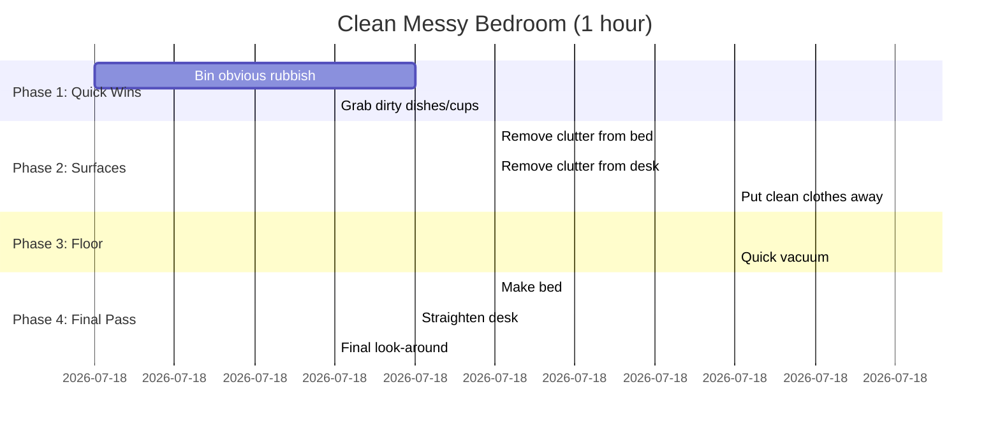
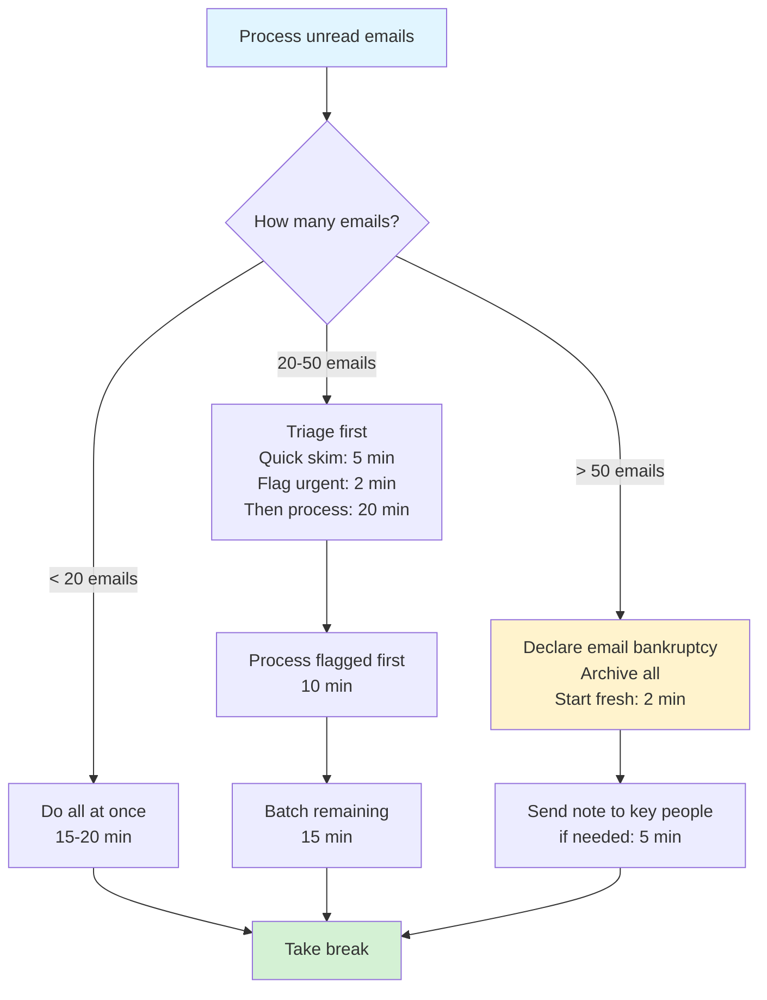
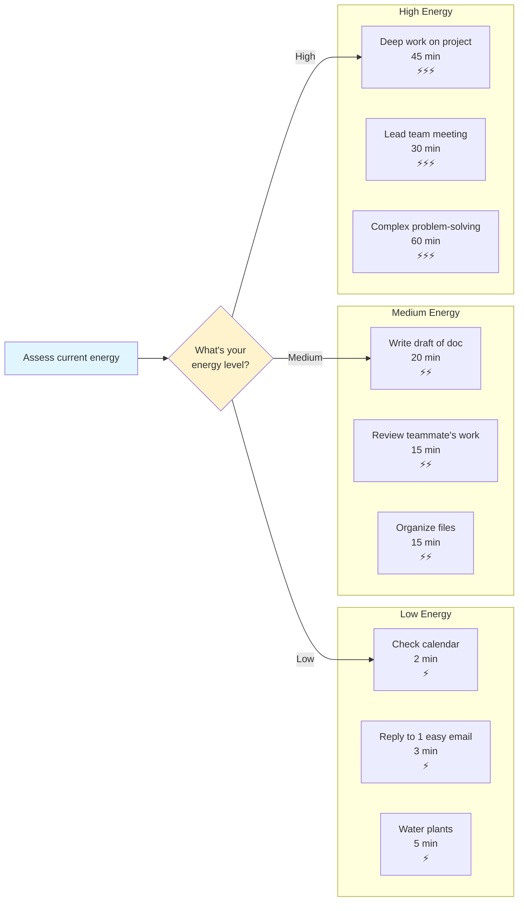

# Task Breakdown Patterns

## Overview

Task breakdowns help transform overwhelming tasks into manageable micro-steps with clear sequencing and time estimates.

## When to Use

- User says a task feels overwhelming or they don't know where to start
- User needs to see all the steps involved in something
- User mentions procrastination or executive dysfunction around a task
- User wants time estimates for planning

## Pattern: Linear Task Timeline

Use for tasks with a clear sequential order (cleaning, cooking, admin work).

[🎨 Edit Gantt Chart in mermaid.live](https://mermaid.live/edit#gantt%0A%20%20%20%20title%20Clean%20Messy%20Bedroom%20%281%20hour%29%0A%20%20%20%20dateFormat%20mm%3Ass%0A%20%20%20%20section%20Phase%201%3A%20Quick%20Wins%0A%20%20%20%20Bin%20obvious%20rubbish%20%20%20%20%20%20%20%20%20%20%20%3A00%3A00%2C%2004%3A00%0A%20%20%20%20Grab%20dirty%20dishes%2Fcups%20%20%20%20%20%20%20%20%3A04%3A00%2C%2003%3A00%0A%20%20%20%20section%20Phase%202%3A%20Surfaces%0A%20%20%20%20Remove%20clutter%20from%20bed%20%20%20%20%20%20%20%3A07%3A00%2C%2005%3A00%0A%20%20%20%20Remove%20clutter%20from%20desk%20%20%20%20%20%20%3A12%3A00%2C%2005%3A00%0A%20%20%20%20Put%20clean%20clothes%20away%20%20%20%20%20%20%20%20%3A17%3A00%2C%2008%3A00%0A%20%20%20%20section%20Phase%203%3A%20Floor%0A%20%20%20%20Pick%20up%20items%20from%20floor%20%20%20%20%20%20%3A25%3A00%2C%2010%3A00%0A%20%20%20%20Quick%20vacuum%20%20%20%20%20%20%20%20%20%20%20%20%20%20%20%20%20%20%3A35%3A00%2C%2008%3A00%0A%20%20%20%20section%20Phase%204%3A%20Final%20Pass%0A%20%20%20%20Make%20bed%20%20%20%20%20%20%20%20%20%20%20%20%20%20%20%20%20%20%20%20%20%20%3A43%3A00%2C%2005%3A00%0A%20%20%20%20Straighten%20desk%20%20%20%20%20%20%20%20%20%20%20%20%20%20%20%3A48%3A00%2C%2004%3A00%0A%20%20%20%20Final%20look-around%20%20%20%20%20%20%20%20%20%20%20%20%20%3A52%3A00%2C%2003%3A00%0A)

**Key features:**
- Starts with easiest/"quick win" tasks to build momentum
- Groups related micro-tasks into phases
- Shows realistic time estimates (not "it should only take 10 minutes")
- Each step is 3-10 minutes maximum

## Pattern: Branching Task Breakdown

Use for tasks with multiple possible approaches or conditional steps.

[🎨 Edit Flowchart in mermaid.live](https://mermaid.live/edit#flowchart%20TD%0A%20%20%20%20Start%5BProcess%20unread%20emails%5D%20--%3E%20Check%7BHow%20many%20emails%3F%7D%0A%20%20%20%20Check%20--%3E%7C%3C%2020%20emails%7C%20Batch%5BDo%20all%20at%20once%3Cbr%2F%3E15-20%20min%5D%0A%20%20%20%20Check%20--%3E%7C20-50%20emails%7C%20Triage%5BTriage%20first%3Cbr%2F%3EQuick%20skim%3A%205%20min%3Cbr%2F%3EFlag%20urgent%3A%202%20min%3Cbr%2F%3EThen%20process%3A%2020%20min%5D%0A%20%20%20%20Check%20--%3E%7C%3E%2050%20emails%7C%20Declare%5BDeclare%20email%20bankruptcy%3Cbr%2F%3EArchive%20all%3Cbr%2F%3EStart%20fresh%3A%202%20min%5D%0A%0A%20%20%20%20Batch%20--%3E%20Done%5BTake%20break%5D%0A%20%20%20%20Triage%20--%3E%20Process%5BProcess%20flagged%20first%3Cbr%2F%3E10%20min%5D%0A%20%20%20%20Process%20--%3E%20Remaining%5BBatch%20remaining%3Cbr%2F%3E15%20min%5D%0A%20%20%20%20Remaining%20--%3E%20Done%0A%20%20%20%20Declare%20--%3E%20Notify%5BSend%20note%20to%20key%20people%3Cbr%2F%3Eif%20needed%3A%205%20min%5D%0A%20%20%20%20Notify%20--%3E%20Done%0A%0A%20%20%20%20style%20Start%20fill%3A%23e1f5ff%0A%20%20%20%20style%20Done%20fill%3A%23d4f1d4%0A%20%20%20%20style%20Declare%20fill%3A%23fff3cd%0A)

**Key features:**
- Acknowledges different scenarios require different approaches
- Includes the "give yourself permission to not do it perfectly" option
- Shows decision points clearly
- Gives time estimates for each path

## Pattern: Energy-Aware Task Sequence

Use when user mentions energy levels, burnout, or needs to pace themselves.

[🎨 Edit Flowchart in mermaid.live](https://mermaid.live/edit#flowchart%20LR%0A%20%20%20%20subgraph%20Low%20Energy%0A%20%20%20%20%20%20%20%20L1%5BCheck%20calendar%3Cbr%2F%3E2%20min%3Cbr%2F%3E%E2%9A%A1%5D%0A%20%20%20%20%20%20%20%20L2%5BReply%20to%201%20easy%20email%3Cbr%2F%3E3%20min%3Cbr%2F%3E%E2%9A%A1%5D%0A%20%20%20%20%20%20%20%20L3%5BWater%20plants%3Cbr%2F%3E5%20min%3Cbr%2F%3E%E2%9A%A1%5D%0A%20%20%20%20end%0A%0A%20%20%20%20subgraph%20Medium%20Energy%0A%20%20%20%20%20%20%20%20M1%5BWrite%20draft%20of%20doc%3Cbr%2F%3E20%20min%3Cbr%2F%3E%E2%9A%A1%E2%9A%A1%5D%0A%20%20%20%20%20%20%20%20M2%5BReview%20teammate%27s%20work%3Cbr%2F%3E15%20min%3Cbr%2F%3E%E2%9A%A1%E2%9A%A1%5D%0A%20%20%20%20%20%20%20%20M3%5BOrganize%20files%3Cbr%2F%3E15%20min%3Cbr%2F%3E%E2%9A%A1%E2%9A%A1%5D%0A%20%20%20%20end%0A%0A%20%20%20%20subgraph%20High%20Energy%0A%20%20%20%20%20%20%20%20H1%5BDeep%20work%20on%20project%3Cbr%2F%3E45%20min%3Cbr%2F%3E%E2%9A%A1%E2%9A%A1%E2%9A%A1%5D%0A%20%20%20%20%20%20%20%20H2%5BLead%20team%20meeting%3Cbr%2F%3E30%20min%3Cbr%2F%3E%E2%9A%A1%E2%9A%A1%E2%9A%A1%5D%0A%20%20%20%20%20%20%20%20H3%5BComplex%20problem-solving%3Cbr%2F%3E60%20min%3Cbr%2F%3E%E2%9A%A1%E2%9A%A1%E2%9A%A1%5D%0A%20%20%20%20end%0A%0A%20%20%20%20Start%5BAssess%20current%20energy%5D%20--%3E%20Choose%7BWhat%27s%20your%3Cbr%2F%3Eenergy%20level%3F%7D%0A%20%20%20%20Choose%20--%3E%7CLow%7C%20L1%0A%20%20%20%20Choose%20--%3E%7CMedium%7C%20M1%0A%20%20%20%20Choose%20--%3E%7CHigh%7C%20H1%0A%0A%20%20%20%20style%20Start%20fill%3A%23e1f5ff%0A%20%20%20%20style%20Choose%20fill%3A%23fff3cd%0A)

**Key features:**
- Sorts tasks by energy cost, not just priority
- Gives permission to match tasks to current capacity
- Includes actual time estimates
- Uses clear energy indicators (⚡)

## Language Guidelines

**Use compassionate, neurodivergent-friendly language:**

✅ DO:
- "Quick win tasks to build momentum"
- "If this feels like too much, try..."
- "Take a 5-minute break after this"
- "This is the minimum viable version"
- "You can skip/modify this if needed"

❌ DON'T:
- "This should only take..."
- "Just do it"
- "Stop procrastinating"
- "It's easy"
- "Anyone can..."

## Time Estimate Guidelines

**Be realistic and generous:**
- Add buffer time (if something takes 10 minutes, say 15)
- Include transition time between tasks
- Account for getting started (the hardest part)
- Remember: estimates are not deadlines

**Example format:**
- "Sort laundry: 7 min" (not "5 min" even if that's technically enough)
- "Clear desk: 10 min + 2 min to find a home for mystery items"
- "Write email: 5 min to draft, 2 min to edit, 1 min to send"
