# Time-Boxing & Focus Sessions

## Overview

Time-boxing patterns help make time visible, create structure for open-ended work, and combat time blindness through visual boundaries and built-in breaks.

## When to Use

- User mentions time blindness or losing track of time
- User needs structure for open-ended work
- User struggles with "I'll just work until it's done" (leads to burnout)
- User asks how to use Pomodoro or time-blocking
- User needs help focusing or starting focused work
- User mentions working too long without breaks

## Pattern: Pomodoro Technique Breakdown

Use when user wants to try Pomodoro or needs structured focus time.


[🎨 Edit Flowchart in mermaid.live](https://mermaid.live/edit#flowchart%20LR%0A%20%20%20%20Start%5BChoose%20ONE%20task%5D%20--%3E%20Set%5BSet%20timer%3Cbr%2F%3E25%20minutes%5D%0A%20%20%20%20%0A%20%20%20%20Set%20--%3E%20Work%5BWork%20on%20task%3Cbr%2F%3ENo%20switching%3Cbr%2F%3ENo%20checking%20phone%5D%0A%20%20%20%20%0A%20%20%20%20Work%20--%3E%20Timer%7BTimer%20done%3F%7D%0A%20%20%20%20%0A%20%20%20%20Timer%20--%3E%7CYes%7C%20Break1%5BTake%205%20min%20break%3Cbr%2F%3EStand%20up%3Cbr%2F%3EMove%20around%3Cbr%2F%3EGet%20water%5D%0A%20%20%20%20Timer%20--%3E%7CGot%20distracted%3F%7C%20Restart%5BThat%27s%20okay%21%3Cbr%2F%3ERestart%20timer%3Cbr%2F%3ETry%20again%5D%0A%20%20%20%20%0A%20%20%20%20Break1%20--%3E%20Count%7BCompleted%3Cbr%2F%3E4%20rounds%3F%7D%0A%20%20%20%20%0A%20%20%20%20Count%20--%3E%7CNo%7C%20Set%0A%20%20%20%20Count%20--%3E%7CYes%7C%20LongBreak%5BTake%2030%20min%20break%3Cbr%2F%3ELeave%20workspace%3Cbr%2F%3EDo%20something%20different%5D%0A%20%20%20%20%0A%20%20%20%20LongBreak%20--%3E%20Done%5BYou%20did%204%20rounds%21%3Cbr%2F%3EThat%27s%202%20hours%3Cbr%2F%3Eof%20focused%20work.%3Cbr%2F%3ECelebrate%21%5D%0A%20%20%20%20%0A%20%20%20%20Restart%20--%3E%20Work%0A%20%20%20%20%0A%20%20%20%20style%20Start%20fill%3A%23e1f5ff%0A%20%20%20%20style%20Work%20fill%3A%23fff3cd%0A%20%20%20%20style%20Break1%20fill%3A%23d4f1d4%0A%20%20%20%20style%20LongBreak%20fill%3A%23d4f1d4%0A%20%20%20%20style%20Done%20fill%3A%23d4f1d4%0A)


**Key modifications for ADHD:**
- ONE task only (write it down before starting)
- Permission to restart if distracted
- Mandatory breaks (not optional)
- Physical movement in breaks
- Celebration after 4 rounds
- No guilt about needing to restart

**If 25 minutes feels too long:** Try 15-minute work blocks with 3-minute breaks instead.

## Pattern: Time-Blocked Day

Use when user needs to plan their day with realistic time boundaries.

```mermaid
gantt
    title Tuesday Work Day (Time-blocked)
    dateFormat HH:mm
    section Morning Routine
    Wake up & coffee               :done, 08:00, 30m
    Quick planning                 :done, 08:30, 10m
    section Deep Work Block 1
    Focus: Draft proposal          :active, 08:40, 50m
    Break & movement               :09:30, 10m
    Focus: Continue proposal       :09:40, 50m
    section Mid-day
    Lunch & rest                   :10:30, 45m
    Light admin tasks              :11:15, 30m
    section Meetings
    Team standup                   :11:45, 30m
    1:1 with manager               :12:15, 30m
    section Deep Work Block 2
    Break & reset                  :12:45, 15m
    Focus: Review designs          :13:00, 45m
    section Wrap Up
    Reply to key emails            :13:45, 30m
    Update tomorrow's plan         :14:15, 15m
    Done for the day!              :milestone, 14:30, 0m
```

[🎨 Edit Gantt Chart in mermaid.live](https://mermaid.live/edit#gantt%0A%20%20%20%20title%20Tuesday%20Work%20Day%20%28Time-blocked%29%0A%20%20%20%20dateFormat%20HH%3Amm%0A%20%20%20%20section%20Morning%20Routine%0A%20%20%20%20Wake%20up%20%26%20coffee%20%20%20%20%20%20%20%20%20%20%20%20%20%20%20%3Adone%2C%2008%3A00%2C%2030m%0A%20%20%20%20Quick%20planning%20%20%20%20%20%20%20%20%20%20%20%20%20%20%20%20%20%3Adone%2C%2008%3A30%2C%2010m%0A%20%20%20%20section%20Deep%20Work%20Block%201%0A%20%20%20%20Focus%3A%20Draft%20proposal%20%20%20%20%20%20%20%20%20%20%3Aactive%2C%2008%3A40%2C%2050m%0A%20%20%20%20Break%20%26%20movement%20%20%20%20%20%20%20%20%20%20%20%20%20%20%20%3A09%3A30%2C%2010m%0A%20%20%20%20Focus%3A%20Continue%20proposal%20%20%20%20%20%20%20%3A09%3A40%2C%2050m%0A%20%20%20%20section%20Mid-day%0A%20%20%20%20Lunch%20%26%20rest%20%20%20%20%20%20%20%20%20%20%20%20%20%20%20%20%20%20%20%3A10%3A30%2C%2045m%0A%20%20%20%20Light%20admin%20tasks%20%20%20%20%20%20%20%20%20%20%20%20%20%20%3A11%3A15%2C%2030m%0A%20%20%20%20section%20Meetings%0A%20%20%20%20Team%20standup%20%20%20%20%20%20%20%20%20%20%20%20%20%20%20%20%20%20%20%3A11%3A45%2C%2030m%0A%20%20%20%201%3A1%20with%20manager%20%20%20%20%20%20%20%20%20%20%20%20%20%20%20%3A12%3A15%2C%2030m%0A%20%20%20%20section%20Deep%20Work%20Block%202%0A%20%20%20%20Break%20%26%20reset%20%20%20%20%20%20%20%20%20%20%20%20%20%20%20%20%20%20%3A12%3A45%2C%2015m%0A%20%20%20%20Focus%3A%20Review%20designs%20%20%20%20%20%20%20%20%20%20%3A13%3A00%2C%2045m%0A%20%20%20%20section%20Wrap%20Up%0A%20%20%20%20Reply%20to%20key%20emails%20%20%20%20%20%20%20%20%20%20%20%20%3A13%3A45%2C%2030m%0A%20%20%20%20Update%20tomorrow%27s%20plan%20%20%20%20%20%20%20%20%20%3A14%3A15%2C%2015m%0A%20%20%20%20Done%20for%20the%20day%21%20%20%20%20%20%20%20%20%20%20%20%20%20%20%3Amilestone%2C%2014%3A30%2C%200m%0A)


**Key features:**
- Realistic work hours (6.5 hours, not 8+)
- Breaks built in, not optional
- Meetings grouped when possible
- Deep work protected in blocks
- "Done for the day" boundary
- Buffer between activities

**Rule of thumb:** Never schedule more than 5 hours of focused work per day.

## Pattern: Focus Session Preparation

Use when user has trouble starting focused work or needs a launch sequence.


[🎨 Edit Flowchart in mermaid.live](https://mermaid.live/edit#flowchart%20TD%0A%20%20%20%20Start%5BTime%20for%20focus%20work%5D%20--%3E%20Check%7BDo%20you%20have%3Cbr%2F%3Eenough%20energy%3F%7D%0A%20%20%20%20%0A%20%20%20%20Check%20--%3E%7CNo%7C%20Skip%5BPick%20a%20low-energy%20task%3Cbr%2F%3Einstead%2C%20or%20rest%3Cbr%2F%3EFocus%20work%20requires%20fuel%5D%0A%20%20%20%20Check%20--%3E%7CNot%20sure%7C%20Quick%5BTry%20a%2015-min%20session%3Cbr%2F%3ESee%20how%20it%20feels%5D%0A%20%20%20%20Check%20--%3E%7CYes%7C%20Prep%5BPrepare%20environment%5D%0A%20%20%20%20%0A%20%20%20%20Prep%20--%3E%20Setup%5BSetup%20checklist%3A%3Cbr%2F%3E%E2%9C%93%20Phone%20on%20Do%20Not%20Disturb%3Cbr%2F%3E%E2%9C%93%20Water%20bottle%20filled%3Cbr%2F%3E%E2%9C%93%20Snack%20if%20needed%3Cbr%2F%3E%E2%9C%93%20Timer%20ready%3Cbr%2F%3E%E2%9C%93%20Task%20clearly%20defined%5D%0A%20%20%20%20%0A%20%20%20%20Setup%20--%3E%20Clear%5BClear%20your%20head%3A%3Cbr%2F%3E2%20min%20brain%20dump%3Cbr%2F%3EWrite%20down%20distractions%3Cbr%2F%3Efor%20later%5D%0A%20%20%20%20%0A%20%20%20%20Clear%20--%3E%20Start1%5BStart%20timer%5D%0A%20%20%20%20Start1%20--%3E%20Work%5BBegin%20work%3Cbr%2F%3EFocus%20on%20ONE%20thing%5D%0A%20%20%20%20%0A%20%20%20%20Work%20--%3E%20Mid%7BHalfway%20check-in%7D%0A%20%20%20%20Mid%20--%3E%7CGoing%20well%7C%20Keep%5BKeep%20going%3Cbr%2F%3EYou%27re%20doing%20great%5D%0A%20%20%20%20Mid%20--%3E%7CStruggling%7C%20Adjust%5BAdjust%3A%3Cbr%2F%3ETake%202-min%20stretch%3Cbr%2F%3ERestate%20goal%3Cbr%2F%3EContinue%20or%20stop%5D%0A%20%20%20%20%0A%20%20%20%20Keep%20--%3E%20End%5BTimer%20done%21%5D%0A%20%20%20%20Adjust%20--%3E%20Decision%7BContinue%3Cbr%2F%3Eor%20stop%3F%7D%0A%20%20%20%20Decision%20--%3E%7CStop%7C%20Early%5BStopped%20early%3Cbr%2F%3Eand%20that%27s%20okay%3Cbr%2F%3EYou%20showed%20up%5D%0A%20%20%20%20Decision%20--%3E%7CContinue%7C%20End%0A%20%20%20%20%0A%20%20%20%20End%20--%3E%20Break%5BTake%20your%20break%3Cbr%2F%3EYou%20earned%20it%5D%0A%20%20%20%20Early%20--%3E%20Break%0A%20%20%20%20%0A%20%20%20%20style%20Check%20fill%3A%23fff3cd%0A%20%20%20%20style%20Work%20fill%3A%23e1f5ff%0A%20%20%20%20style%20Break%20fill%3A%23d4f1d4%0A%20%20%20%20style%20Early%20fill%3A%23d4f1d4%0A)


**Pre-focus ritual matters:**
- Reduces activation energy
- Creates consistent cue
- Removes barriers
- Acknowledges energy check
- Permission to stop if not working

## Pattern: Daily Energy Mapping

Use when user wants to plan their day around natural energy patterns.

```mermaid
flowchart LR
    subgraph Morning["🌅 Morning (8am-11am)<br/>Peak Energy ⚡⚡⚡"]
        M1[Deep work tasks<br/>Creative work<br/>Hard decisions<br/>Complex problems]
    end
    
    subgraph Midday["☀️ Midday (11am-2pm)<br/>Medium Energy ⚡⚡"]
        D1[Meetings<br/>Collaborative work<br/>Moderate tasks<br/>Light admin]
    end
    
    subgraph Afternoon["🌤️ Afternoon (2pm-4pm)<br/>Lower Energy ⚡"]
        A1[Routine tasks<br/>Email responses<br/>Organizing<br/>Light reading]
    end
    
    subgraph Evening["🌙 Evening (4pm-6pm)<br/>Variable Energy ⚡ or ⚡⚡"]
        E1[Social activities<br/>Exercise<br/>Personal projects<br/>OR rest]
    end
    
    Morning --> Midday --> Afternoon --> Evening
    
    Note[Track your patterns<br/>for 1 week to find<br/>YOUR energy rhythm] -.-> Morning
    
    style Morning fill:#fef3c7
    style Midday fill:#fed7aa
    style Afternoon fill:#fecaca
    style Evening fill:#ddd6fe
```



[🎨 Edit Flowchart in mermaid.live](https://mermaid.live/edit#flowchart%20LR%0A%20%20%20%20subgraph%20Morning%5B%22%F0%9F%8C%85%20Morning%20%288am-11am%29%3Cbr%2F%3EPeak%20Energy%20%E2%9A%A1%E2%9A%A1%E2%9A%A1%22%5D%0A%20%20%20%20%20%20%20%20M1%5BDeep%20work%20tasks%3Cbr%2F%3ECreative%20work%3Cbr%2F%3EHard%20decisions%3Cbr%2F%3EComplex%20problems%5D%0A%20%20%20%20end%0A%20%20%20%20%0A%20%20%20%20subgraph%20Midday%5B%22%E2%98%80%EF%B8%8F%20Midday%20%2811am-2pm%29%3Cbr%2F%3EMedium%20Energy%20%E2%9A%A1%E2%9A%A1%22%5D%0A%20%20%20%20%20%20%20%20D1%5BMeetings%3Cbr%2F%3ECollaborative%20work%3Cbr%2F%3EModerate%20tasks%3Cbr%2F%3ELight%20admin%5D%0A%20%20%20%20end%0A%20%20%20%20%0A%20%20%20%20subgraph%20Afternoon%5B%22%F0%9F%8C%A4%EF%B8%8F%20Afternoon%20%282pm-4pm%29%3Cbr%2F%3ELower%20Energy%20%E2%9A%A1%22%5D%0A%20%20%20%20%20%20%20%20A1%5BRoutine%20tasks%3Cbr%2F%3EEmail%20responses%3Cbr%2F%3EOrganizing%3Cbr%2F%3ELight%20reading%5D%0A%20%20%20%20end%0A%20%20%20%20%0A%20%20%20%20subgraph%20Evening%5B%22%F0%9F%8C%99%20Evening%20%284pm-6pm%29%3Cbr%2F%3EVariable%20Energy%20%E2%9A%A1%20or%20%E2%9A%A1%E2%9A%A1%22%5D%0A%20%20%20%20%20%20%20%20E1%5BSocial%20activities%3Cbr%2F%3EExercise%3Cbr%2F%3EPersonal%20projects%3Cbr%2F%3EOR%20rest%5D%0A%20%20%20%20end%0A%20%20%20%20%0A%20%20%20%20Morning%20--%3E%20Midday%20--%3E%20Afternoon%20--%3E%20Evening%0A%20%20%20%20%0A%20%20%20%20Note%5BTrack%20your%20patterns%3Cbr%2F%3Efor%201%20week%20to%20find%3Cbr%2F%3EYOUR%20energy%20rhythm%5D%20-.-%3E%20Morning%0A%20%20%20%20%0A%20%20%20%20style%20Morning%20fill%3A%23fef3c7%0A%20%20%20%20style%20Midday%20fill%3A%23fed7aa%0A%20%20%20%20style%20Afternoon%20fill%3A%23fecaca%0A%20%20%20%20style%20Evening%20fill%3A%23ddd6fe%0A)


**Your energy patterns may differ:**
- Night owls: Peak may be evening
- After lunch dip: Common and valid
- Medication timing: Affects energy windows
- Sleep quality: Changes daily patterns

**How to use:**
1. Track energy for 1 week (simple 1-3 rating each hour)
2. Notice patterns
3. Schedule accordingly
4. Adjust as needed

## Pattern: Work Sprint Planning

Use when user has a specific time-limited work session planned.


[🎨 Edit Flowchart in mermaid.live](https://mermaid.live/edit#flowchart%20TD%0A%20%20%20%20Sprint%5B2-Hour%20Work%20Sprint%5D%20--%3E%20Before%5BBefore%20starting%3A%3Cbr%2F%3EDefine%20success%5D%0A%20%20%20%20%0A%20%20%20%20Before%20--%3E%20Goal%5BWhat%20would%20make%3Cbr%2F%3Ethis%20sprint%20worthwhile%3F%3Cbr%2F%3EWrite%20it%20down%5D%0A%20%20%20%20%0A%20%20%20%20Goal%20--%3E%20Realistic%7BIs%20this%20realistic%3Cbr%2F%3Efor%202%20hours%3F%7D%0A%20%20%20%20%0A%20%20%20%20Realistic%20--%3E%7CNo%7C%20Reduce%5BCut%20scope%20in%20half%3Cbr%2F%3EBetter%20to%20finish%3Cbr%2F%3Esomething%20than%3Cbr%2F%3Enothing%5D%0A%20%20%20%20Realistic%20--%3E%7CYes%7C%20Structure%5BStructure%20the%20sprint%5D%0A%20%20%20%20Reduce%20--%3E%20Structure%0A%20%20%20%20%0A%20%20%20%20Structure%20--%3E%20Blocks%5BBreak%20into%20blocks%3A%3Cbr%2F%3E0-45min%3A%20Main%20work%3Cbr%2F%3E45-50min%3A%20Break%3Cbr%2F%3E50-90min%3A%20Continue%3Cbr%2F%3E90-95min%3A%20Break%3Cbr%2F%3E95-120min%3A%20Finish%20up%5D%0A%20%20%20%20%0A%20%20%20%20Blocks%20--%3E%20Start%5BSet%20timer%20%26%20start%5D%0A%20%20%20%20%0A%20%20%20%20Start%20--%3E%20Execute%5BWork%20the%20plan%5D%0A%20%20%20%20%0A%20%20%20%20Execute%20--%3E%20End%7BSprint%20complete%7D%0A%20%20%20%20%0A%20%20%20%20End%20--%3E%7CFinished%20goal%7C%20Win%5BCelebrate%21%3Cbr%2F%3EYou%20did%20it%5D%0A%20%20%20%20End%20--%3E%7CMade%20progress%7C%20Good%5BProgress%20is%20success%3Cbr%2F%3ENot%20finishing%20is%20okay%5D%0A%20%20%20%20End%20--%3E%7CStruggled%7C%20Learn%5BWhat%20got%20in%20the%20way%3F%3Cbr%2F%3EAdjust%20next%20time%3Cbr%2F%3EYou%20still%20showed%20up%5D%0A%20%20%20%20%0A%20%20%20%20style%20Goal%20fill%3A%23e1f5ff%0A%20%20%20%20style%20Win%20fill%3A%23d4f1d4%0A%20%20%20%20style%20Good%20fill%3A%23d4f1d4%0A%20%20%20%20style%20Learn%20fill%3A%23fff3cd%0A)


**Important mindset shifts:**
- Progress = success (not just completion)
- Finishing ≠ working well
- Struggle = data for next time
- Showing up = worthy of recognition

## Pattern: Break Structure

Use when user forgets breaks or doesn't know what to do during breaks.


[🎨 Edit Flowchart in mermaid.live](https://mermaid.live/edit#flowchart%20LR%0A%20%20%20%20Working%5BWorking...%5D%20--%3E%20Break%7BBreak%20time%21%7D%0A%20%20%20%20%0A%20%20%20%20Break%20--%3E%7C5-min%20break%7C%20Short%5BShort%20Break%20Menu%3A%3Cbr%2F%3EPick%20ONE%20thing%5D%0A%20%20%20%20Break%20--%3E%7C15-30%20min%20break%7C%20Long%5BLong%20Break%20Menu%3A%3Cbr%2F%3EPick%202-3%20things%5D%0A%20%20%20%20%0A%20%20%20%20Short%20--%3E%20S1%5BStand%20%26%20stretch%3Cbr%2F%3EWalk%20to%20window%3Cbr%2F%3EGet%20water%3Cbr%2F%3EPet%20your%20pet%3Cbr%2F%3EClose%20eyes%3Cbr%2F%3ELook%20outside%5D%0A%20%20%20%20%0A%20%20%20%20Long%20--%3E%20L1%5BGo%20outside%3Cbr%2F%3EEat%20a%20snack%3Cbr%2F%3EMove%20your%20body%3Cbr%2F%3ECall%20a%20friend%3Cbr%2F%3ERead%20something%20fun%3Cbr%2F%3ELie%20down%5D%0A%20%20%20%20%0A%20%20%20%20S1%20--%3E%20Back1%5BTimer%20set%3F%3Cbr%2F%3ECome%20back%20when%20ready%5D%0A%20%20%20%20L1%20--%3E%20Back2%5BTimer%20set%3F%3Cbr%2F%3ECome%20back%20when%20ready%5D%0A%20%20%20%20%0A%20%20%20%20Back1%20--%3E%20Next%5BNext%20work%20block%5D%0A%20%20%20%20Back2%20--%3E%20Next%0A%20%20%20%20%0A%20%20%20%20style%20Break%20fill%3A%23d4f1d4%0A%20%20%20%20style%20Short%20fill%3A%23fff3cd%0A%20%20%20%20style%20Long%20fill%3A%23fef3c7%0A)


**Break guidelines:**
- Breaks are NOT for chores
- Breaks are NOT for scrolling phone (usually makes you more tired)
- Breaks ARE for actual rest
- Physical movement helps more than screens
- Going outside > staying at desk

## Language Guidelines

**Use time-aware, permission-giving language:**

✅ DO:
- "Set a timer to make time visible"
- "If 25 minutes feels too long, try 15"
- "You can stop early if it's not working"
- "Breaks are mandatory, not optional"
- "Track your energy to work WITH your brain"
- "Progress counts, even without finishing"

❌ DON'T:
- "Just focus for longer"
- "You should be able to do 8 hours"
- "Breaks are for later"
- "Keep pushing through"
- "Everyone else can focus longer"

## Time Estimate Tips

When creating time-boxed plans:
- Start with LESS time than you think you need
- Account for startup time (5-10 min to get into flow)
- Build in 5-min buffers between blocks
- Plan for 60-70% of available time, not 100%
- Include breaks in the total time calculation
- Remember: 4 hours of focused work = full day
