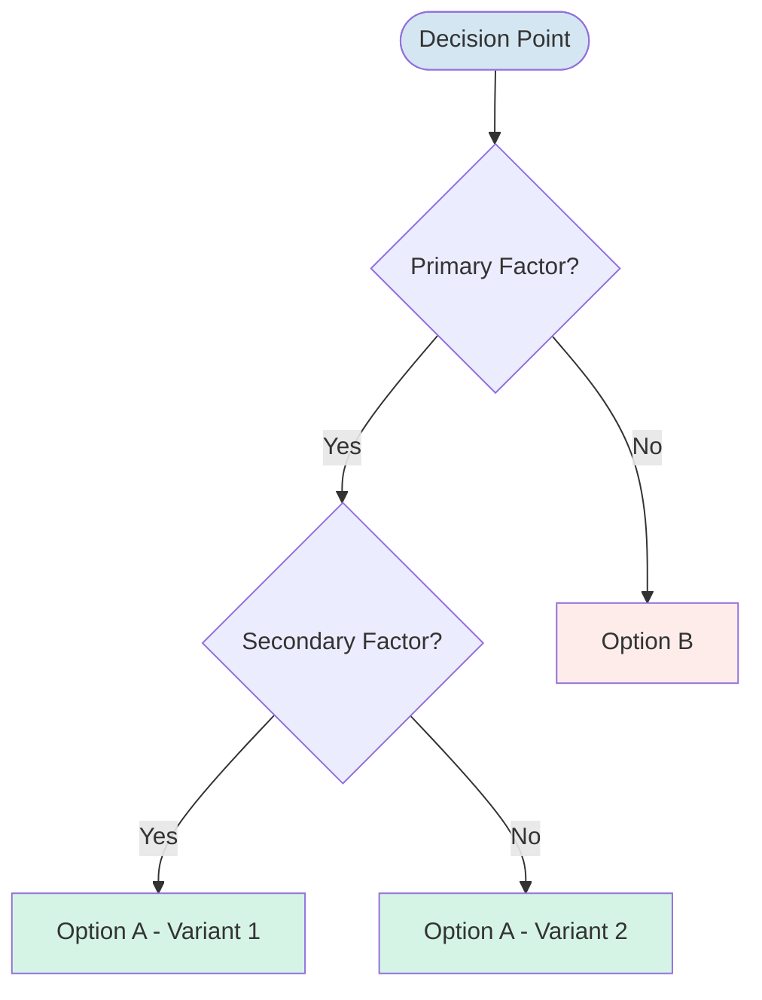
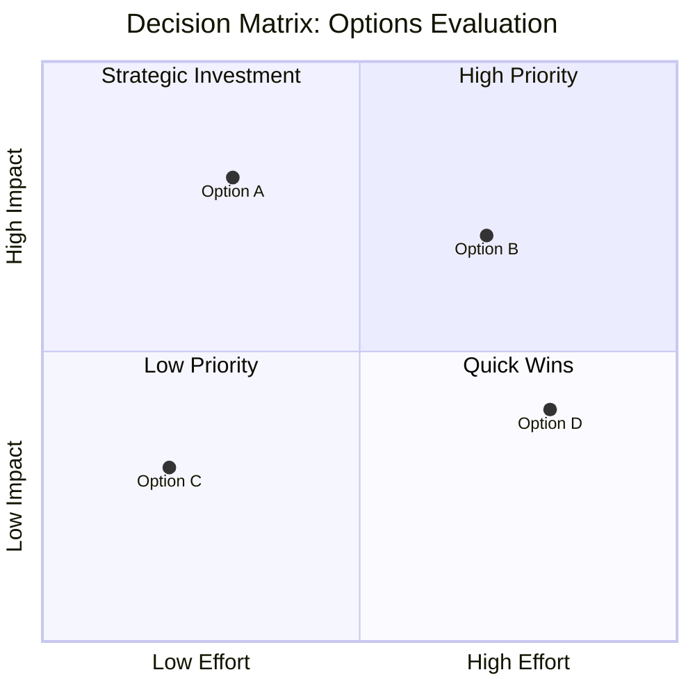

# Neurotypical Decision Tree Templates

## Binary Decision Tree

[🎨 Edit Flowchart in mermaid.live](https://mermaid.live/edit#flowchart%20TD%0A%20%20%20%20Question%28%5BDecision%20Point%5D%29%20--%3E%20Factor1%7BPrimary%20Factor%3F%7D%0A%20%20%20%20Factor1%20--%3E%7CYes%7C%20Factor2%7BSecondary%20Factor%3F%7D%0A%20%20%20%20Factor1%20--%3E%7CNo%7C%20OptionB%5BOption%20B%5D%0A%20%20%20%20Factor2%20--%3E%7CYes%7C%20OptionA1%5BOption%20A%20-%20Variant%201%5D%0A%20%20%20%20Factor2%20--%3E%7CNo%7C%20OptionA2%5BOption%20A%20-%20Variant%202%5D%0A%0A%20%20%20%20style%20Question%20fill%3A%23d4e6f1%0A%20%20%20%20style%20OptionA1%20fill%3A%23d5f4e6%0A%20%20%20%20style%20OptionA2%20fill%3A%23d5f4e6%0A%20%20%20%20style%20OptionB%20fill%3A%23fdecea%0A)

## Weighted Decision Matrix

[🎨 Edit Diagram in mermaid.live](https://mermaid.live/edit#quadrantChart%0A%20%20%20%20title%20Decision%20Matrix%3A%20Options%20Evaluation%0A%20%20%20%20x-axis%20Low%20Effort%20--%3E%20High%20Effort%0A%20%20%20%20y-axis%20Low%20Impact%20--%3E%20High%20Impact%0A%20%20%20%20quadrant-1%20High%20Priority%0A%20%20%20%20quadrant-2%20Strategic%20Investment%0A%20%20%20%20quadrant-3%20Low%20Priority%0A%20%20%20%20quadrant-4%20Quick%20Wins%0A%0A%20%20%20%20Option%20A%3A%20%5B0.3%2C%200.8%5D%0A%20%20%20%20Option%20B%3A%20%5B0.7%2C%200.7%5D%0A%20%20%20%20Option%20C%3A%20%5B0.2%2C%200.3%5D%0A%20%20%20%20Option%20D%3A%20%5B0.8%2C%200.4%5D%0A)

**Characteristics:**
- Standard decision theory approach
- Efficient visual layout
- Professional color schemes
- Assumes rational decision-making process
