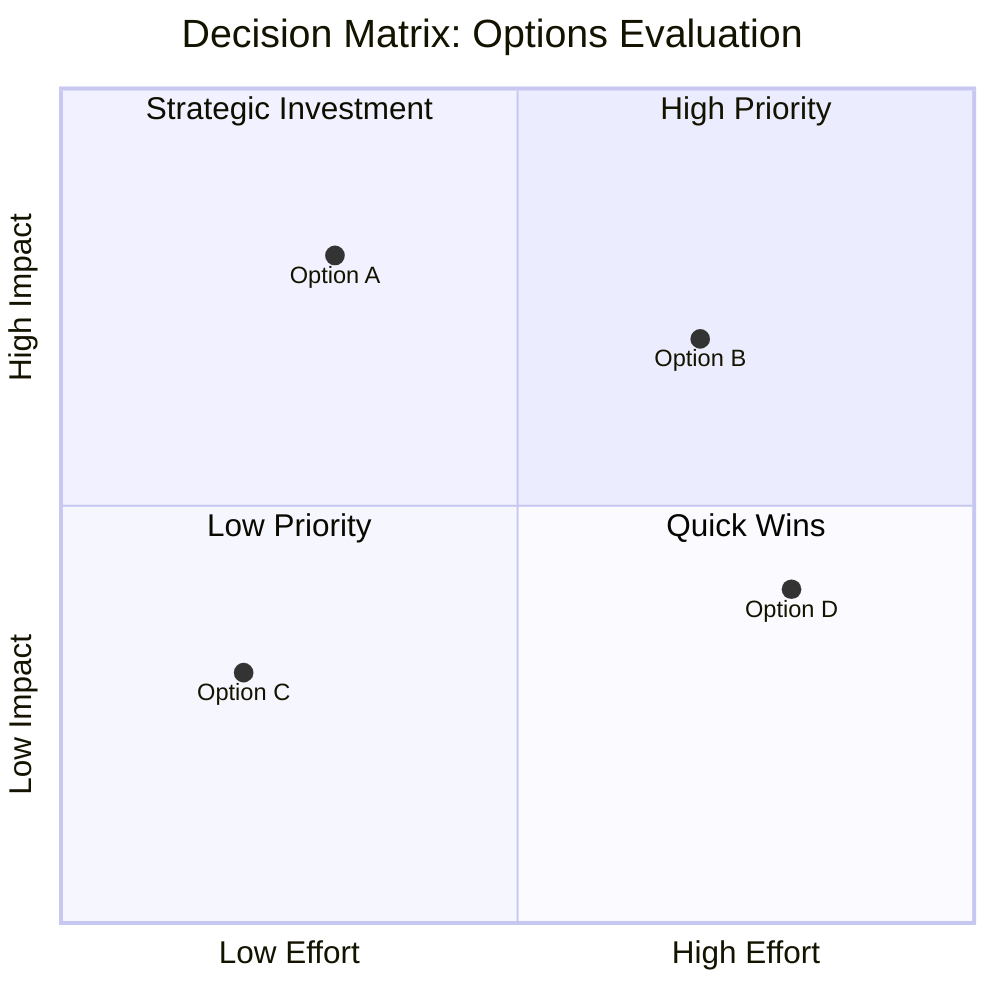

# Neurotypical Decision Tree Templates

## Binary Decision Tree

## Weighted Decision Matrix

**Characteristics:**
- Standard decision theory approach
- Efficient visual layout
- Professional color schemes
- Assumes rational decision-making process
