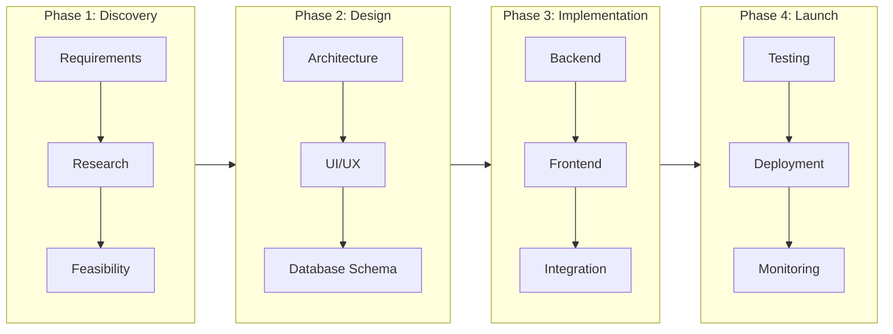
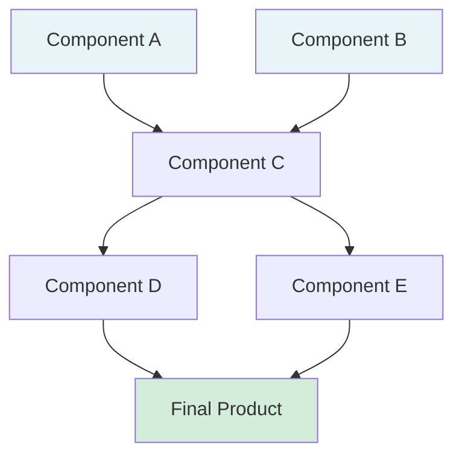

# Neurotypical Project Map Templates

## Project Phase Map

## Dependency Diagram

**Characteristics:**
- Clear phase separation
- Dependency relationships explicit
- Standard project management format
- Assumes sequential execution capability
