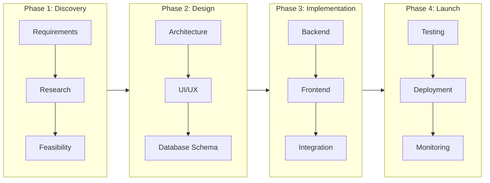
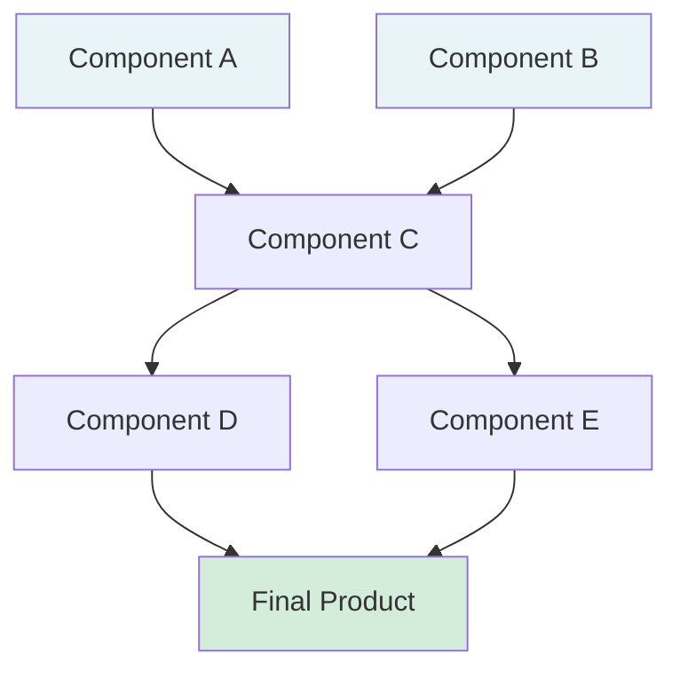

# Neurotypical Project Map Templates

## Project Phase Map

[🎨 Edit Flowchart in mermaid.live](https://mermaid.live/edit#flowchart%20LR%0A%20%20%20%20subgraph%20Phase1%5BPhase%201%3A%20Discovery%5D%0A%20%20%20%20%20%20%20%20A1%5BRequirements%5D%20--%3E%20A2%5BResearch%5D%0A%20%20%20%20%20%20%20%20A2%20--%3E%20A3%5BFeasibility%5D%0A%20%20%20%20end%0A%0A%20%20%20%20subgraph%20Phase2%5BPhase%202%3A%20Design%5D%0A%20%20%20%20%20%20%20%20B1%5BArchitecture%5D%20--%3E%20B2%5BUI%2FUX%5D%0A%20%20%20%20%20%20%20%20B2%20--%3E%20B3%5BDatabase%20Schema%5D%0A%20%20%20%20end%0A%0A%20%20%20%20subgraph%20Phase3%5BPhase%203%3A%20Implementation%5D%0A%20%20%20%20%20%20%20%20C1%5BBackend%5D%20--%3E%20C2%5BFrontend%5D%0A%20%20%20%20%20%20%20%20C2%20--%3E%20C3%5BIntegration%5D%0A%20%20%20%20end%0A%0A%20%20%20%20subgraph%20Phase4%5BPhase%204%3A%20Launch%5D%0A%20%20%20%20%20%20%20%20D1%5BTesting%5D%20--%3E%20D2%5BDeployment%5D%0A%20%20%20%20%20%20%20%20D2%20--%3E%20D3%5BMonitoring%5D%0A%20%20%20%20end%0A%0A%20%20%20%20Phase1%20--%3E%20Phase2%20--%3E%20Phase3%20--%3E%20Phase4%0A)

## Dependency Diagram

[🎨 Edit Diagram in mermaid.live](https://mermaid.live/edit#graph%20TB%0A%20%20%20%20A%5BComponent%20A%5D%20--%3E%20C%5BComponent%20C%5D%0A%20%20%20%20B%5BComponent%20B%5D%20--%3E%20C%0A%20%20%20%20C%20--%3E%20D%5BComponent%20D%5D%0A%20%20%20%20C%20--%3E%20E%5BComponent%20E%5D%0A%20%20%20%20D%20--%3E%20F%5BFinal%20Product%5D%0A%20%20%20%20E%20--%3E%20F%0A%0A%20%20%20%20style%20A%20fill%3A%23e8f4f8%0A%20%20%20%20style%20B%20fill%3A%23e8f4f8%0A%20%20%20%20style%20F%20fill%3A%23d4edda%0A)

**Characteristics:**
- Clear phase separation
- Dependency relationships explicit
- Standard project management format
- Assumes sequential execution capability
