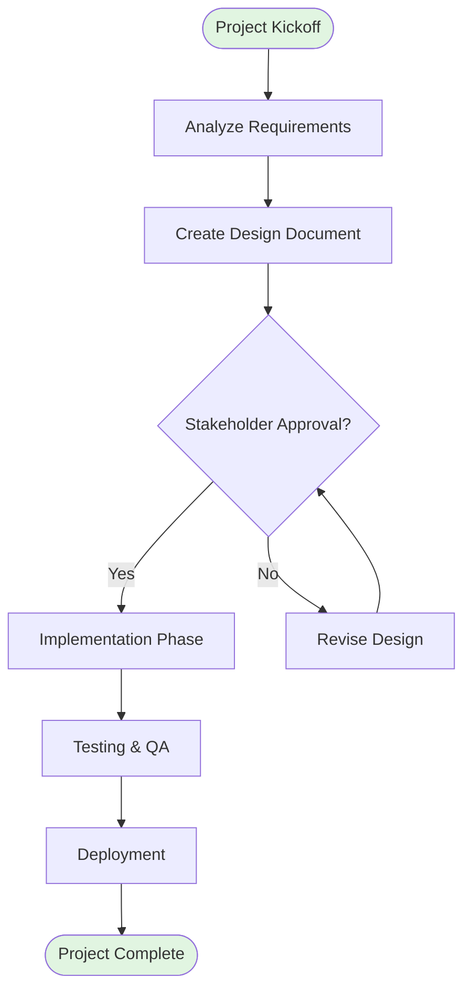

# Neurotypical Task Breakdown Templates

## Linear Timeline (Standard Granularity)

```mermaid
gantt
    title Project Implementation - Week View
    dateFormat HH:mm
    axisFormat %H:%M

    section Planning
    Requirements gathering     :09:00, 30m
    Architecture design       :09:30, 45m

    section Development
    Core implementation       :10:15, 60m
    Integration              :11:15, 45m

    section Testing
    Unit tests               :12:00, 30m
    Integration tests        :12:30, 30m
```

**Characteristics:**
- 15-60 minute tasks
- Standard time estimates
- Efficient information density
- 5-7 sections maximum
- Direct language

## Flowchart (Decision-Oriented)

**Characteristics:**
- Clear decision points
- Standard workflow notation
- Professional presentation style
- Compact layout

## Usage Notes

**When to use neurotypical mode:**
- Professional presentations
- Team collaboration
- Stakeholder communication
- Standard project planning
- Users without executive dysfunction

**Time estimates:**
- Use actual expected duration
- No buffer (trust user time management)
- Round to 15-minute increments
